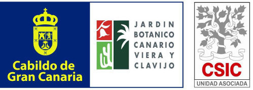
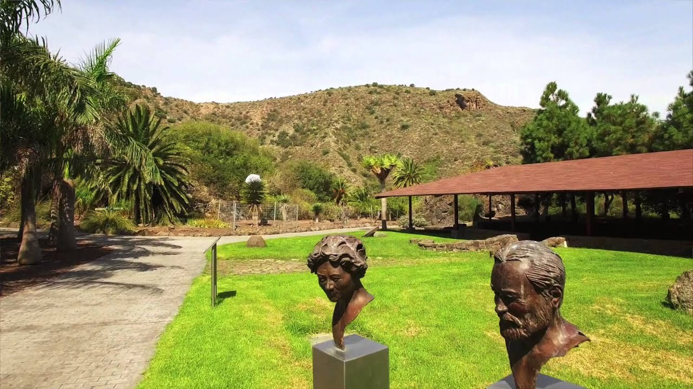

# Jardín Botánico Canario Viera y Clavijo

The [Canarian Botanical Garden ​"Viera y Clavijo"](http://www.jardincanario.org/) - associated with the CSIC is part of the Cabildo de Gran Canaria, which is the local administration dealing with matters of environment, conservation and management of the biodiversity of the island of Gran Canaria.

This center is dedicated to the conservation and management of the terrestrial Canarian Flora through three large areas of action: research, [environmental education](http://www.jardincanario.org/en/educacion-ambiental "Environmental education") (including dissemination) and the maintenance and exhibition of [living collections of terrestrial plants](http://www.jardincanario.org/en/planta-viva "Planta viva") , especially endemic species from the Canary Islands. and Macaronesia, but also from areas of the planet that maintain floristic connections with the Canary Islands.

To carry out our mission, the Botanical Garden ​"Viera y Clavijo" generates and manages up-to-date multi-disciplinary knowledge that is applied to the conservation and management of the terrestrial flora and the territory of Gran Canaria and the Canary Islands, within the competencies of the Council of the Cabildo to which it belongs. It periodically publishes the [Macaronesian Botanical](http://www.jardincanario.org/en/botanica-macaronesica "Macaronesian Botany") magazine , which provides news about the flora of the Macaronesian archipelagos.

Visit [Jardín Botánico Canario Viera y Clavijo's website.](http://www.jardincanario.org/)

Located in: 35017 Las Palmas de Gran Canaria, Las Palmas, Spain.

### Associated WFO Contacts:

- Juli Caujapé-Castells (Council Member)

<!--LATLON: 12.1,1212.1  -->