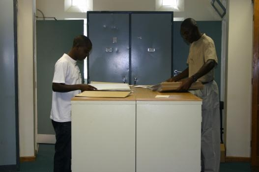

## National Botanical Research Institute, National Herbarium of Namibia

The National Herbarium, known by its acronym WIND, is a section within the National Botanical Research Institute.

Working in the WIND herbarium.

WIND was established in 1953 and houses important collections such as collections from M.A.N. Müller, R.J. Rodin and W. Giess amongst others.

Namibia has a total of 4,196 indigenous taxa and WIND currently houses a collection of approximately 95,000 specimens. Reference material used for identification includes the Prodromus einer Flora von Südwestafrika, A Checklist of Namibian Indigenous & Naturalised Plants, Flora of southern Africa and Flora Zambesiaca.

WIND has migrated from the Specimen Database (SPMNBD) to Botanical Research and Herbarium Management System ([BRAHMS](http://herbaria.plants.ox.ac.uk/bol/)) database. The complete collection was encoded as part of the now-ended regional Southern African Botanical Diversity Network (SABONET) project. This has contributed to the easy retrieval of data thus enabling the provision of information in the form of checklists, distribution maps, etc.

Visit [National Botanical Research Institute, National Herbarium of Namibia's website.](http://www.nbri.org.na/sections/herbarium)

Located in: Windhoek, Namibia

### Associated WFO Contacts:

-   [Frances Chase](mailto:) (Council Member)
-   [Esmerialda Strauss](mailto:) (Council Member, Technical Working Group Member)