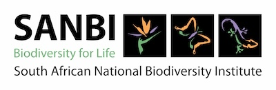

## South African National Biodiversity Institute

The [South African National Biodiversity Institute (SANBI)](https://www.sanbi.org/) contributes to South Africa's sustainable development by facilitating access to biodiversity data, generating information and knowledge, building capacity, providing policy advice, and showcasing and conserving biodiversity in its national botanical and zoological gardens.

The King Protea (Protea cynaroides) at Kirstenbosh.

### What SANBI does

The South African National Biodiversity Institute (SANBI) leads and coordinates research, and monitors and reports on the state of biodiversity in South Africa. The institute provides knowledge and information, gives planning and policy advice and pilots best-practice management models in partnership with stakeholders. SANBI engages in ecosystem restoration and rehabilitation, leads the human capital development strategy of the sector and manages the National Botanical and Zoological Gardens as ​'windows' to South Africa's biodiversity for enjoyment and education.

### SA's vast biological diversity

South Africa is one of the most biologically diverse countries in the world, after Indonesia and Brazil. Our country is surrounded by 2 oceans, occupies only about 2% of the world's land area, but is home to nearly: 6% of the world's plants; 7% of the reptiles, birds and mammals and 15% of known coastal marine species. Our country is comprised of 9 biomes (unique vegetation landscapes), 3 of which have been declared global biodiversity hotspots.

### The importance of SA's biodiversity

Biodiversity richness is one of South Africa's greatest assets. Biodiversity in terms of landscapes, ecosystems and species -- the web of natural life -- provides goods and services vital for human well-being and the survival of the planet. Goods and services such as water purification, grazing, eco-tourism, fisheries, sources of medicine, energy, food, healthy soils, pollination, carbon sinks, clean air and production of oxygen, etc. Unfortunately our biodiversity, as is the case on the globe, is under threat. Some of these threats include ecosystem destruction and accompanying species extinction through human activity, climate change, and invasive alien species.

### SANBI's role in biodiversity education

Knowledge of biodiversity leads to better understanding, to better management, and thus to better conservation and protection of our biological resources. SANBI is a dedicated national biodiversity institution that bridges science, knowledge, policy and implementation -- a unique entity considered to be global best practice.

### The e‑Flora of South Africa

The e‑Flora of South Africa project was initiated in 2013 to support conservation efforts. Data are accessible on the [Biodiversity Advisor](https://biodiversityadvisor.sanbi.org/) and enables quick and efficient access to baseline information that will benefit downstream applications such as conservation activities, provincial stewardship programs, spatial‑, land-use- and protected area plans, invasive species management, ecosystem delimitation, education, tourism, research and more. The e‑Flora of South Africa was created by aggregating existing floristic and taxonomic information from various sources. It will be maintained according to updates captured in the [South African National Plant Checklist](https://www.sanbi.org/biodiversity/foundations/biosystematics-collections/biosystematics-collections-policies/checklist-policy/).

Visit the [e‑Flora of South Africa's website](https://www.sanbi.org/biodiversity/foundations/biosystematics-collections/e-flora/).

Visit [South African National Biodiversity Institute's website.](https://www.sanbi.org/)

Located in: Pretoria, South Africa

[+](https://about.worldfloraonline.org/consortium-members/south-african-national-biodiversity-institute# "Zoom in")[-](https://about.worldfloraonline.org/consortium-members/south-african-national-biodiversity-institute# "Zoom out")

[Leaflet](https://leafletjs.com/ "A JS library for interactive maps") | Map data © [OpenStreetMap](https://www.openstreetmap.org/) contributors, [CC-BY-SA](https://creativecommons.org/licenses/by-sa/2.0/), Imagery © [Mapbox](https://www.mapbox.com/)

### Associated WFO Contacts:

-   [Brenda Daly](mailto:) (Technical Working Group Member)
-   [Ronell Klopper](mailto:r.klopper@sanbi.org.za) (TEN Focal)
-   [Marianne Le Roux](mailto:contact@worldfloraonline.org) (Council Member, TEN Focal, Technical Working Group Member)

### Associated Taxonomic Expert Networks (TENs):

-   [Asphodelaceae - subfamily Alooideae](https://about.worldfloraonline.org/tens/alooideae)
-   [Bruniaceae](https://about.worldfloraonline.org/tens/bruniaceae)
-   [Fabaceae - Legume Phylogeny Working Group: Taxonomy](https://about.worldfloraonline.org/tens/fabaceae)