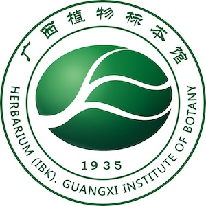

## Guangxi Institute of Botany, Guangxi Zhuang Autonomous Region and Chinese Academy of Sciences

The Herbarium (IBK) of Guangxi Institute of Botany, Guangxi Zhuang Autonomous Region and Chinese Academy of Sciences was established in 1935. It has a collection of more than 600,000 higher plant specimens at home and abroad, including about 12,000 species and about 7,000 type specimens, and more than 70% of the specimens have been digitized and realized online sharing. Its specimens are mainly collected from the karst area of south China, southwest China, and also the United States, the United Kingdom, Japan, Indonesia, New Zealand, Vietnam and other countries. The taxa with abundant specimens include Lauraceae, Ebenaceae, Gesneriaceae, Theaceae, Actinidiaceae, Fabaceae, Cycadaceae, etc. 

IBK has been committed to finding out the plant resources in Guangxi, providing important support for relevant scientific research, biodiversity protection, development and utilization of plant resources in Guangxi and even China. In order to create a special herbarium with karst characteristics, IBK is focusing on karst plants, with a collection of more than 10,000 specimens every year. IBK is the herbarium with the largest collection of plant specimens from karst areas of Guangxi in China, and has an irreplaceable position in the field of karst plant research.

Visit [Guangxi Institute of Botany, Guangxi Zhuang Autonomous Region and Chinese Academy of Sciences's website.](http://ibk.gxib.cn/)

Located in: Guangxi, Guilin, Yanshan
