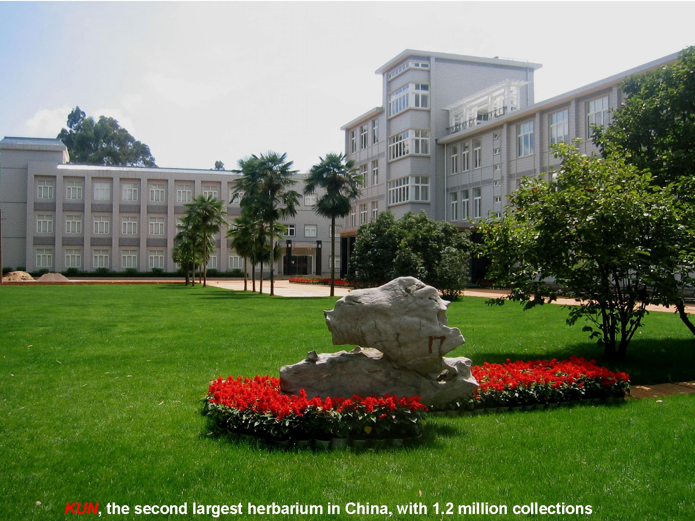

## Kunming Institute of Botany, Chinese Academy of Sciences

[Kunming Institute of Botany (KIB)](http://english.kib.cas.cn/) is an important research institute that is directly affiliated to the Chinese Academy of Sciences (CAS) and dedicated to research in the fields of Botany and Phytochemistry. It is committed to exploration of the world of plants, to generating knowledge about them and developing their sustainable use to benefit people. 

KIB was originally called the Yunnan Provincial Institute of Agricultural and Forestry Botany, which was co-founded in July 1938 by Jingsheng Biology Institute and Yunnan State Department of Education. In April 1950, it was affiliated to CAS and renamed CAS Institute of Systematic Botany Kunming Station. In April 1959, the Kunming Institute of Botany of the Chinese Academy of Sciences (KIB/CAS) was constituted with the approval of the National Science Authority. 

KIB has 550 staff in total, including two CAS academicians, 10 recipients of awards from the National Science Fund for Distinguished Young Scholars, and three winners of prizes from the National Natural Science Foundation--Outstanding Youth Foundation. There are also seven successful national candidates for the Ten Million New Century Talents Project, 15 winners of special government awards issued by the State Council, two successful candidates for the Young and Middle-aged Leading Scientists, Engineers and Innovators Program, one for the Thousand Talents Program for Foreign Experts, four for the Thousand Talents Program for Young Outstanding Scientists, 26 for the Hundred-Talents Program (CAS), 21 for the Youth Innovation Promotion Association (YIPA) Program, 111 for the Dawn of West China Talent Training Program, one for the Yunnan Leading Scientists, Engineers and Innovators Program, and 14 for the Recruitment Program of High-level Experts of Yunnan Province. In addition, one KIB team has been selected to join the International Partnership for Innovation Program and three teams have joined the Innovative Team of Yunnan Province Program. 

In recent years, KIB has been actively involved in diverse kinds of national scientific projects and obtained remarkable results. From 2011 to 2015, the institute received research funds totaling 62.5 million USD, for initiatives and awards including six major national scientific research projects, two National Key Technology R&D projects, three Basic Science and Technology Special Programs, three National Major Scientific and Technological Special Projects for Significant New Drugs Development, four National Science Fund for Distinguished Young Scholars awards, and 32 National Natural Science Foundation of China (major program) awards. 

Visit [Kunming Institute of Botany, Chinese Academy of Sciences's website.](http://www.kib.cas.cn/)

Located in: Kunming, China

### Associated WFO Contacts:

-   [Li De-zhu](mailto:) (Council Member)