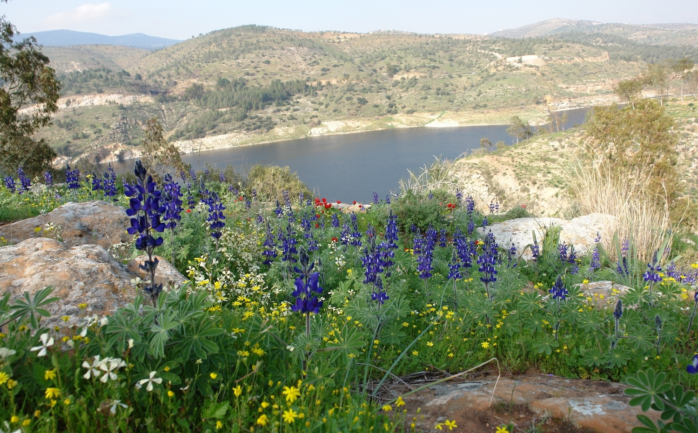
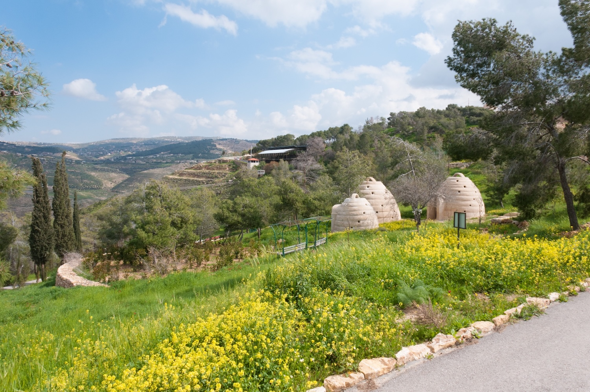

## Royal Botanic Garden, Jordan

The Royal Botanic Garden of Jordan (RBG) is a non-profit organization, founded in 2008. It is located in Tal Al-Rumman, just north of Amman, overlooking King Talal water reservoir.

The Botanic Garden covers 180 hectares, with more than 300 m of elevation change within its boundaries and a variety of soil types, allowing the possibility of hosting approximately a quarter of the plant species that grow naturally in Jordan. Tal Al-Rumman has been declared by the Ministry of Environment as an Environmentally important site in 2014. The site is in the initial stages of a master plan development, with the construction of phases one and two: embodying twenty representative pocket gardens.

The RBG ethos is to practice and advocate biodiversity conservation at the whole-ecosystems level. Two key premises guide our work:

-   The first is habitat-based conservation, such that we consider all biogeographic conditions, the complete watershed area, soil condition and exposure to the element.
-   The second premise is that people are an integral part of the biotic whole. In contrast to many conservation approaches, the RBG does not exclude human livelihood from the restoration process.

The Royal Botanic Garden at Tal Al-Rumman, Jordan © The Royal Botanic Garden, Jordan

The Garden is intended to function as a giant demonstration site, showcasing sustainable water management, green energies, grazing control, and environmentally compatible income generation. Every strategy used at the RBG should be replicable nation wide.

Our work is divided into four main components:

1.  Scientific research: The RBG aims to become an internationally recognized research facility for all aspects of biodiversity in arid-land environments.
2.  Biodiversity conservation: We are re-creating five Jordanian habitats, alongside designed spaces landscaped with native plants.
3.  Sustainable living: We will be a demonstration site for sustainable land use, water harvesting practices, and eco-living.
4.  Education: We will be raising awareness and disseminating sound results of our research on Jordan's biodiversity to the public.

The Royal Botanic Garden at Tal Al-Rumman, Jordan © Royal Botanic Garden, Jordan

Visit [Royal Botanic Garden, Jordan's website.](https://royalbotanicgarden.org/)

Located in: Amman, Jordan

### Associated WFO Contacts:

-   [Mohammad Shahbaz](mailto:)
-   [Hatem Taifour](mailto:)