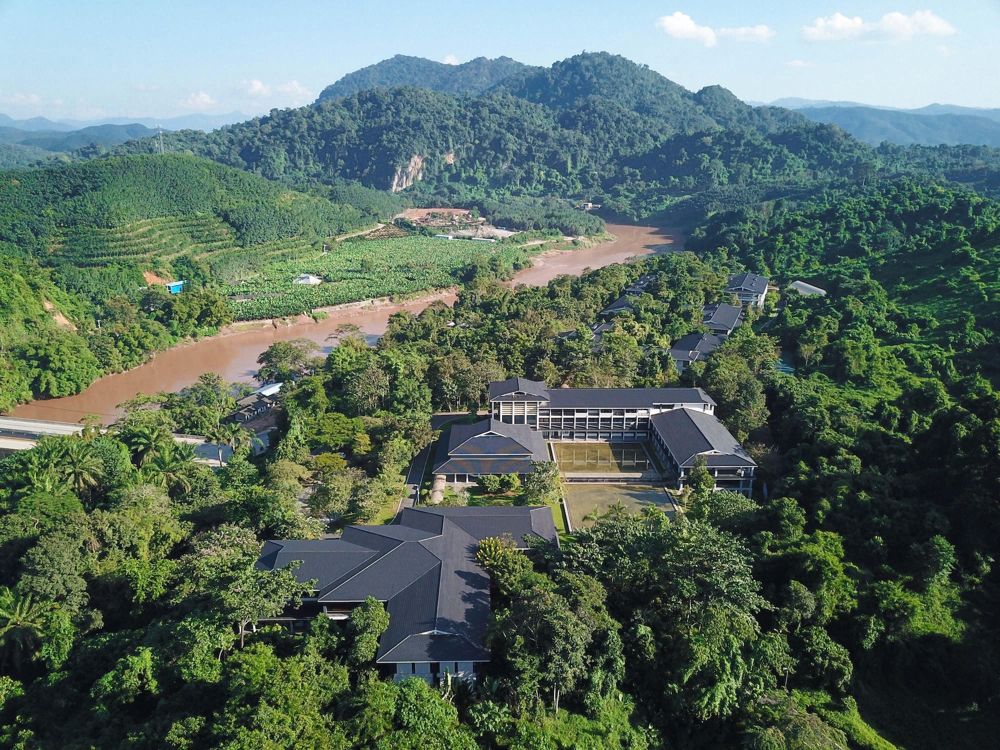
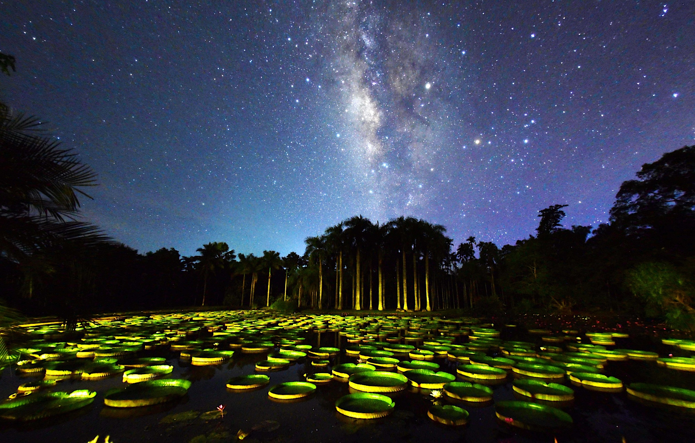
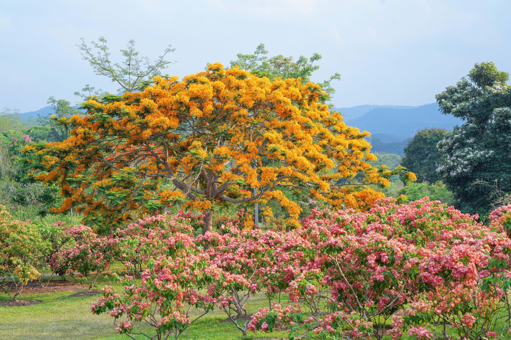

## Xishuangbanna Tropical Botanical Garden (XTBG)

The Xishuangbanna Tropical Botanical Garden (XTBG) of the Chinese Academy of Sciences (CAS) is one of the most important centres for tropical biodiversity science, plant conservation, and ecological research in Asia. Established in 1959 by the renowned Chinese botanist Cai Xitao, the garden was founded to explore tropical plant diversity and promote the sustainable use and conservation of tropical biological resources. Over more than six decades, XTBG has developed into a comprehensive scientific institution integrating botanical research, biodiversity conservation, living plant collections, ecological monitoring, environmental education, and international scientific collaboration. Today it serves as a major platform for tropical biodiversity research in China and an important hub for international cooperation in tropical ecology and conservation science.

Located in Xishuangbanna, in Yunnan Province, XTBG lies at the northern margin of tropical Asia where the floras of East Asia and Southeast Asia converge. This unique biogeographic position places the garden within one of the world's most diverse tropical regions and provides exceptional opportunities for studying plant evolution, ecosystem dynamics, and biodiversity conservation. XTBG covers approximately 1,125 hectares, making it one of the largest botanical gardens in Asia. Unlike most botanical gardens located in urban settings, XTBG is embedded within a natural rainforest landscape and protects about 250 hectares of primary tropical rainforest. This rare configuration allows the integration of in situ ecosystem conservation with ex situ plant collections, creating a unique rainforest botanical garden that functions as a large-scale living laboratory for tropical biodiversity research.

Research center

XTBG maintains one of the most extensive tropical plant collections in China, conserving more than 14,000 living plant taxa organized into 39 specialized plant collections including palms, bamboos, orchids, tropical fruit plants, medicinal plants, and ethnobotanical species. In recent years the garden has significantly expanded its plant diversity collections, registering over 10,700 new plant accessions within a three-year period. These collections include more than 2,200 rare and endangered plant species and over 400 nationally protected plant species in China, highlighting the garden's important role in safeguarding tropical plant diversity. Supporting these living collections is a strong scientific infrastructure, including the XTBG Herbarium (HITBC) which houses more than 300,000 preserved plant specimens representing over 19,000 species, including important type specimens and a growing fossil plant collection. The Tropical Plant Germplasm Bank, established in 1997, provides long-term conservation for tropical plant genetic resources with a design capacity of 150,000 seed accessions, making it one of China's most important facilities for tropical plant genetic resource conservation.

XTBG is a major centre for tropical ecological and biodiversity research in Asia, hosting more than 800 staff members including over 180 senior scientists and supporting a large community of graduate students and postdoctoral researchers. Research activities span a broad range of scientific fields including tropical forest ecology, plant evolution and systematics, conservation biology, plant--animal interactions, ecosystem functioning and global change, and sustainable use of plant resources. Long-term ecological research is supported through national observation platforms such as the Xishuangbanna Tropical Rainforest Ecosystem Research Station and the Ailao Mountain Forest Ecosystem Research Station, which provide long-term monitoring of biodiversity, climate change, and ecosystem processes. XTBG scientists have undertaken more than 2,200 research projects, published over 6,700 scientific papers, and received more than 110 national and provincial scientific awards, making significant contributions to global knowledge of tropical biodiversity and ecosystem functioning.

Giant waterlily pond in the evening

XTBG plays a leading role in biodiversity research across Southwest China and mainland Southeast Asia, managing the Southeast Asia Biodiversity Research Institute (SEABRI), an overseas research platform of the Chinese Academy of Sciences dedicated to biodiversity exploration, conservation research, and scientific capacity building across Southeast Asia. Through this platform and other international partnerships, XTBG promotes regional biodiversity surveys, discovery and documentation of new species, international collaborative research, training of young scientists, and cross-border biodiversity conservation initiatives, positioning it as an important gateway for biodiversity research between China and tropical Southeast Asia.

XTBG integrates scientific research with biodiversity education and public outreach, receiving millions of visitors each year and providing a wide range of environmental education programs aimed at improving public understanding of biodiversity conservation and sustainable development. As a graduate education base of the Chinese Academy of Sciences, XTBG currently hosts over 560 graduate students and more than 80 postdoctoral researchers and special research assistants, contributing to the training of the next generation of biodiversity scientists.

Looking toward the future, XTBG continues to strengthen its role as a global centre for tropical biodiversity science and conservation, actively contributing to the development of China's National Botanical Garden system while expanding international collaboration in biodiversity research, ecosystem monitoring, and plant conservation. With its unique rainforest landscape, extensive living collections, advanced research infrastructure, and strong international partnerships, XTBG serves as a key scientific platform for addressing global challenges related to biodiversity conservation, ecosystem resilience, and sustainable use of tropical plant resources, contributing to international initiatives aimed at documenting, understanding, and conserving plant diversity across the tropics.

Flower Garden

Visit [Xishuangbanna Tropical Botanical Garden (XTBG)'s website.](https://xtbg.cas.cn/)

Located in: China, Yunnan, Xishuangbanna Dai Autonomous Prefecture, Mengla County