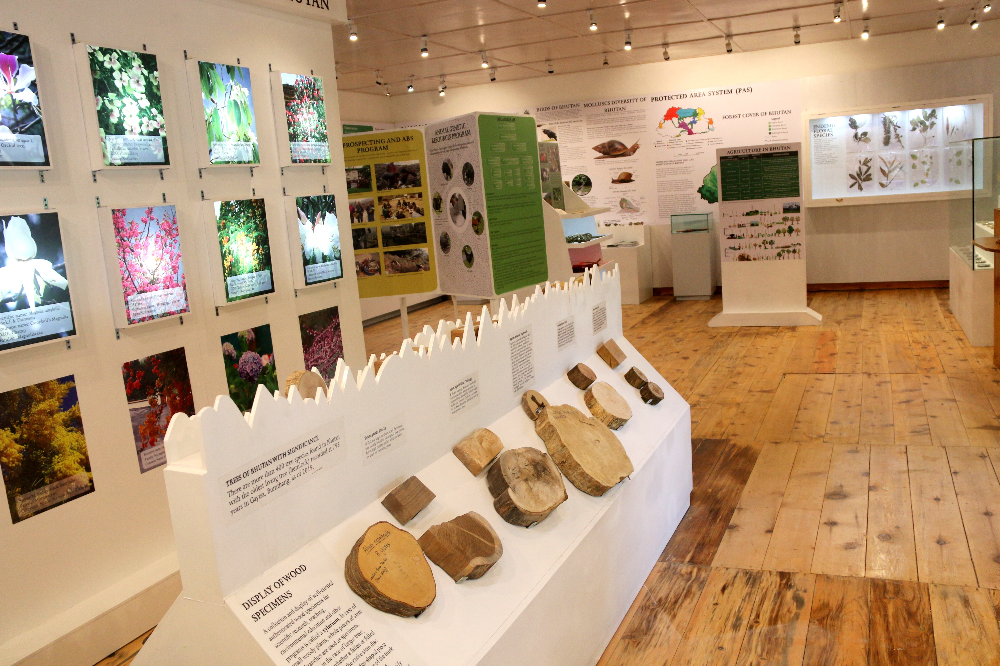
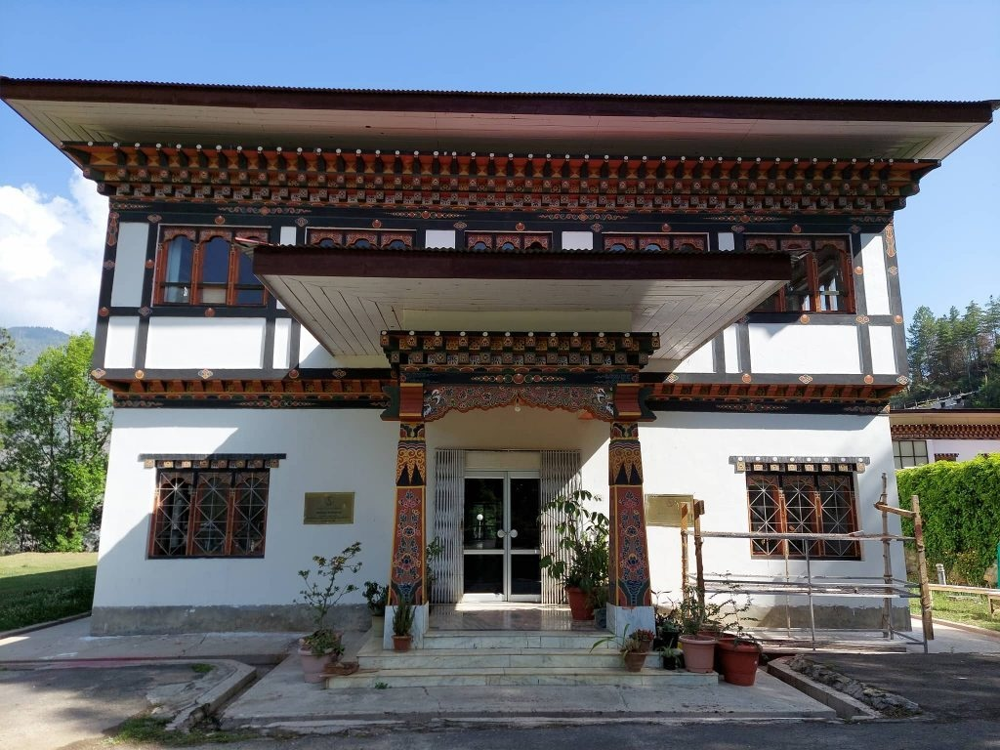
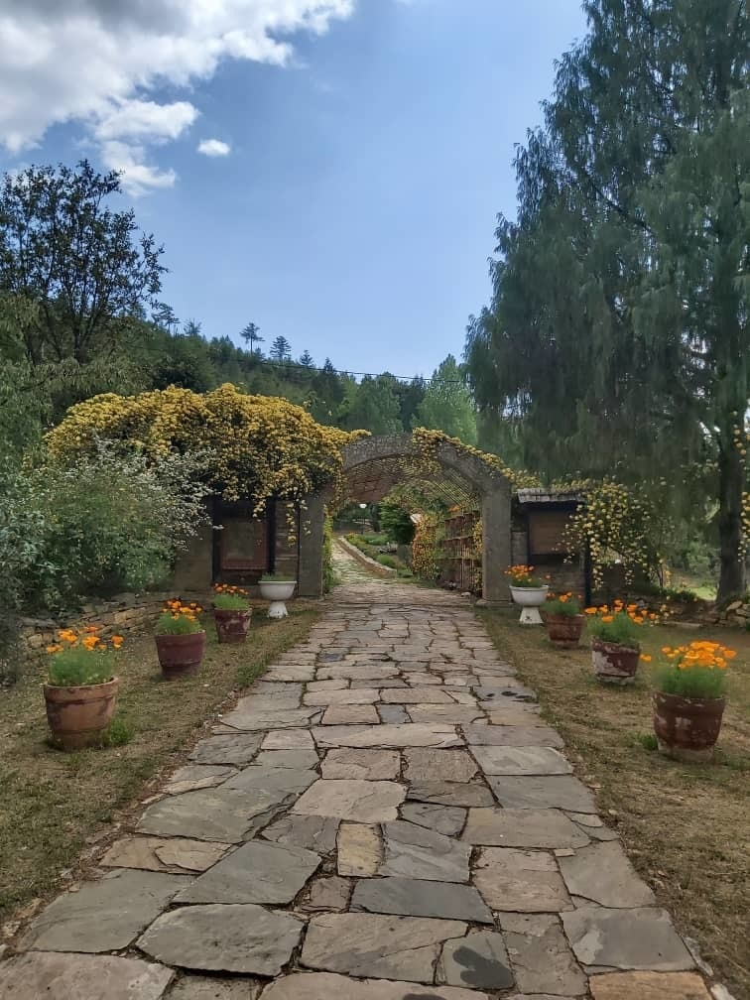

## National Biodiversity Centre

In recognition of the importance of biodiversity to humankind and to its own goal of environmentally sustainable development and due to the committed leadership in environmental conservation, Bhutan became party to and ratified the Convention on Biological Diversity (CBD) in 1995 by the 73rd session of the National Assembly. Bhutan also ratified the Nagoya Protocol on Access and Benefit Sharing (ABS) in 2012 by the 9th session of the 1st Parliament of Bhutan to enable meaningful ABS collaborations that will benefit the country and the people at large.

Thus, to implement the obligations of the CBD and coordinate the country's biodiversity conservation efforts, the National Biodiversity Centre (NBC) was established in 1998 as an non-departmental agency under the Ministry of Agriculture and Forests in Thimphu.

View of the Biodiversity Interpretation Centre located at the Royal Botanical Garden.

National Herbarium of Bhutan was established under NBC in 2003 and currently houses around 20,000 herbarium specimens. The Royal Botanical Garden Serbithang was established under the centre in 1999. These two programs serves as the country's floral reference centre and also provided plant taxonomic services.

View of the National Herbarium of Bhutan building

View of the Royal Botanical Garden Serbithang, Bhutan

Visit [National Biodiversity Centre's website.](https://nbc.gov.bt/)

Located in: Serbithang Thimphu Bhutan.