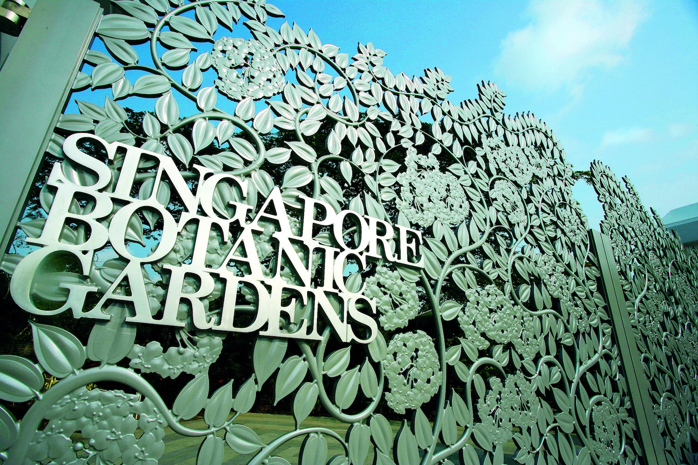

## Singapore Botanic Garden

The idea of a [national garden in Singapore](https://www.nparks.gov.sg/sbg) started in 1822 when Sir Stamford Raffles, the founder of modern Singapore and a keen naturalist, developed the first ​'Botanical and Experimental Garden' at Fort Canning. It was only in 1859 that the Gardens at its present site was founded and laid out in the English Landscape Movement's style by an Agri-Horticultural society. The Gardens was soon handed over to the British colonial government (in 1874) and a series of Kew-trained botanists saw the Gardens blossom into an important botanical institute over the following decades. Today, the Gardens is managed by the National Parks Board, a statutory board of the Singapore government.

In the early years, the Gardens played an important role in fostering agricultural development in Singapore and the region through collecting, growing, experimenting and distributing potentially useful plants. One of the earliest and most important successes was the introduction, experimentation and promotion of Para Rubber, *Hevea brasiliensis.* This became a major crop that brought great prosperity to the South East Asian region in the early 20th century. From 1928, the Gardens spearheaded orchid breeding and started its orchid hybridisation programme, facilitated by new in vitro techniques pioneered in its laboratories. In contemporary times, the Gardens also played a key role in Singapore's Garden City programme through the continual introduction of plants of horticultural and botanical interest.

With more than 150 years of history, the 82-hectare Gardens holds a unique and significant place in the history of Singapore and the region. Through the botanical and horticultural work carried out today, it will continue to play an important role as a leading tropical botanical institute, and an endearing place to all Singaporeans.

The Gardens has been inscribed as a UNESCO World Heritage Site at the 39th session of the World Heritage Committee (WHC) on 4 July 2015. The Gardens is the first and only tropical botanic garden on the UNESCO's World Heritage List. It is the first in Asia and the third botanic gardens inscribed in the world following Orto botanico di Padova and the Royal Botanic Gardens, Kew.

Visit [Singapore Botanic Garden's website.](https://www.nparks.gov.sg/sbg)

Located in: Singapore 259569

### Associated WFO Contacts:

-   [David Middleton](mailto:) (Council Member)
-   [Jana Škorničková](mailto:)

### Associated Taxonomic Expert Networks (TENs):

-   [Lowiaceae](https://about.worldfloraonline.org/tens/lowiaceae)