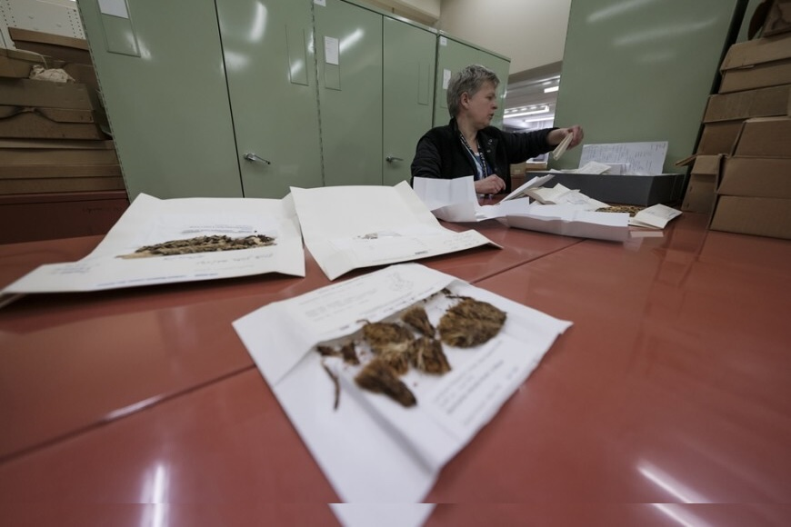

## Allan Herbarium, Landcare Research

The [Allan Herbarium](https://www.landcareresearch.co.nz/resources/collections/allan-herbarium) located in Christchurch, contains species from around the world but specialises in indigenous and exotic plants of the New Zealand region and the South Pacific.

There are over 620 000 specimens in the Allan Herbarium with 5000--8000 being added annually. Two-thirds of the specimens are of indigenous plants with the remainder divided between naturalised, cultivated, and foreign specimens. It also has specialist collections of seed, fruit, wood, plant leaf cuticle, liquid--preserved specimens, and microscope slides. The oldest samples are the 91 duplicate specimens collected by Joseph Banks and Daniel Solander during Captain James Cook's first voyage to New Zealand, 1769--1770.

The Allan Herbarium's main function is to collect and record the flora of New Zealand, and to make this information readily available to researchers, and regional and national authorities. The collections are used by systematists to classify and identify species accurately, by ecologists to determine historical distributions of species, by biosecurity managers to identify weeds, and by the general public (including botanical groups) for information on plants in New Zealand.

The Allan Herbarium (CHR) was founded in 1928 with the appointment of H. H. Allan as systematic botanist to the Plant Research Station, Palmerston North. The nucleus of the collection was formed by the donation of H. H. Allan's private collection and specimens from the old Biological Laboratory, Department of Agriculture. In 1936 the Plant Research Station was transferred to the Department of Scientific and Industrial Research, and was relocated to Wellington in 1937. In 1954 the Herbarium was relocated to Christchurch, before being moved to a purpose-built facility at Lincoln in 1960. Custodianship of the collection was transferred from DSIR Botany Division to Landcare Research in 1992. In 2001, it was named the Allan Herbarium to acknowledge the contributions of H. H. Allan to New Zealand botany.

Visit [Allan Herbarium, Landcare Research's website.](https://www.landcareresearch.co.nz/resources/collections/allan-herbarium)

Located in: Lincoln, New Zealand

### Associated WFO Contacts:

-   [Ilse Breitwieseral](mailto:) (Council Member)
-   [Aaron Wilton](mailto:) (Taxonomic Working Group Member, Technical Working Group Member)