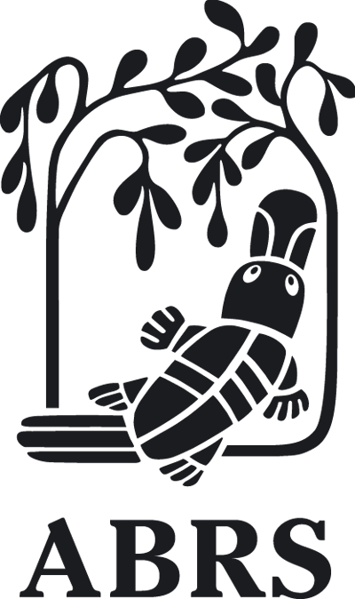

 
## Australian Biological Resources Study

The [Australian Biological Resources Study (ABRS)](https://www.environment.gov.au/science/abrs) provides national leadership and support for the discovery, naming and classification of Australia's living organisms. We do this because information on Australia's biodiversity, provided through taxonomy, underpins knowledge and decision-making across government, science and industry.

Australia is one of only 17 mega-diverse countries in the world, with a rich and unique biodiversity. An estimated eight percent of the world's plants and animals are Australian, yet only a fraction of these species are known to science. It is estimated that 75 percent of Australia's biodiversity remains to be discovered and described.

For over 40 years, the ABRS has been the national focal point for taxonomy and systematics, and a recognised world leader in helping to make taxonomic information widely available. The ABRS is responsible for facilitating taxonomic research and for producing and disseminating authoritative taxonomic information. Through these activities, the ABRS supports the science and decision-making essential for biodiversity conservation.

The ABRS achieves this through:

-   provision of grants and training schemes that fund taxonomic and related research;
-   development of strategic partnerships to document Australia's biodiversity, such as through the [Bush Blitz](https://www.environment.gov.au/science/abrs/bushblitz "Bush Blitz") species discovery program;
-   production of ABRS [publications](https://www.environment.gov.au/science/abrs/publications "ABRS Publications") and identification tools, which contain authoritative information about the naming and classification of Australia's diverse biota; and
-   providing taxonomic information and advice about scientific names for Australian organisms.

Visit [Australian Biological Resources Study's website.](https://www.environment.gov.au/science/abrs)

Located in: Canberra, Australia

### Associated WFO Contacts:

-   [Anne Fuchs](mailto:) (Technical Working Group Member)
-   [Anthony Whalen](mailto:) (Council Member, Taxonomic Working Group Member)