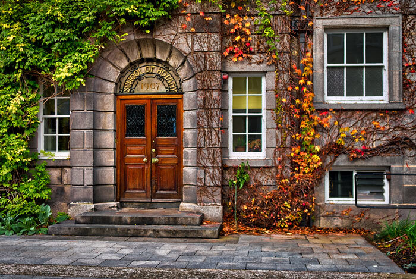
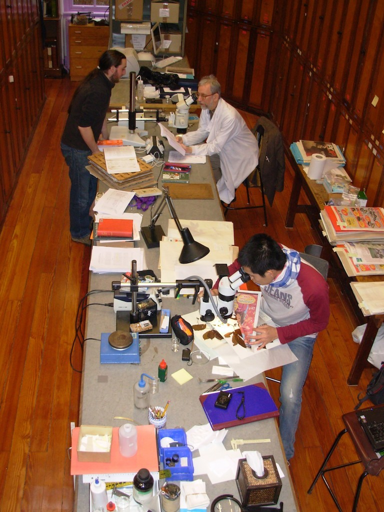
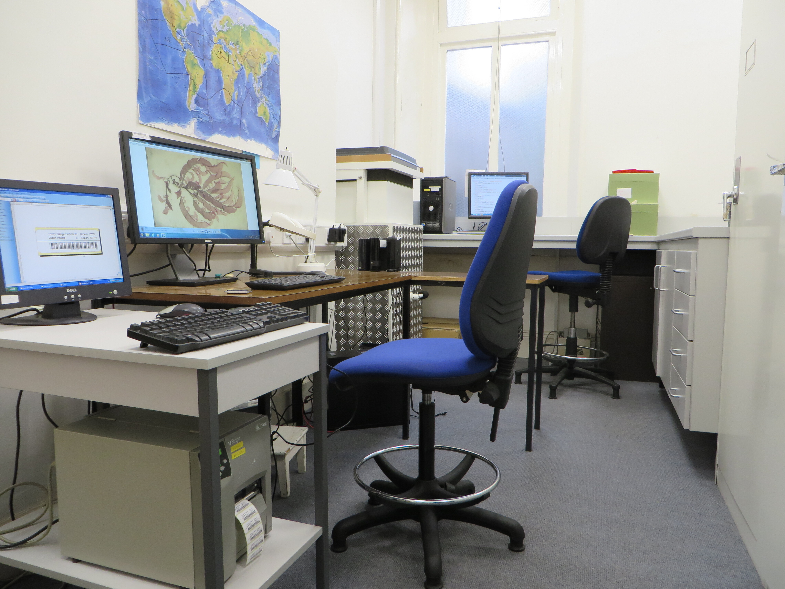

## Botany Department of Trinity College Dublin

Botany started in the University in 1711 with the current main Botany building mainly dating from 1907, the linked herbarium forming a slightly later extension. The TCD herbarium, of about 300,000 sheets, is the only one in Ireland to contain significant holdings of non-Irish material; these are based around the huge collections of great historic importance amassed by T. Coulter, W.H. Harvey, J.D. Hooker, A.F.G. Kerr, R. Spruce, P.B. Webb and later workers. The herbarium contains the only plant taxonomic teaching and research resource in Ireland.

Botany Department Trinity College, Dublin.

The herbarium's holdings are of significant taxonomic importance, as it holds a disproportionately large number of type specimens across all plant groups (including the biggest collection of algae in Ireland and one of the biggest of any University herbarium anywhere in the world). The herbarium also has a very large associated non-lending library separate from the main University Library's Huge Collection of 7,000,000+ items which include many historically interesting botanical works.

Floristic research and specimen identification at TCD herbarium.

The herbarium's role is to support research and teaching across all plant disciplines within TCD. It provides an identification service for all relevant research projects, houses relevant material collected on such projects, takes deposits from others which require to archive relevant material and deals with plant identification queries from the public.

Digitisation of TCD herbarium specimens.

The herbarium's staff are involved in a number of flora projects -- most notably the Flora of Ireland (the latest edition of that flora being produced by its staff), the Flora of Thailand and the World Flora Online (WFO).

Currently systematic and ecological work by the staff is centred in Europe (mainly Ireland but also the Canary Islands), Central and Southern America (Honduras and Venezuela) and S.E. Asia (Thailand and surrounding Countries).

The current Curator of the Herbarium (Professor J. Parnell) has made available to the WFO all the descriptions of plant material in the Irish Flora of which he is one of the authors. He also sits on the WFO Council and Taxonomic Working Group.

Visit [Botany Department of Trinity College Dublin's website.](https://www.tcd.ie/Botany)

Located in: Dublin, Ireland

### Associated WFO Contacts:

-   [Renata Camargo Asprino Pereira](mailto:) (TEN Focal)
-   [John Parnell](mailto:zoobot@tcd.ie) (Council Member, Taxonomic Working Group Member, Communications Working Group Member)

### Associated Taxonomic Expert Networks (TENs):

-   [Chrysobalanaceae](https://about.worldfloraonline.org/tens/chrysobalanaceae)