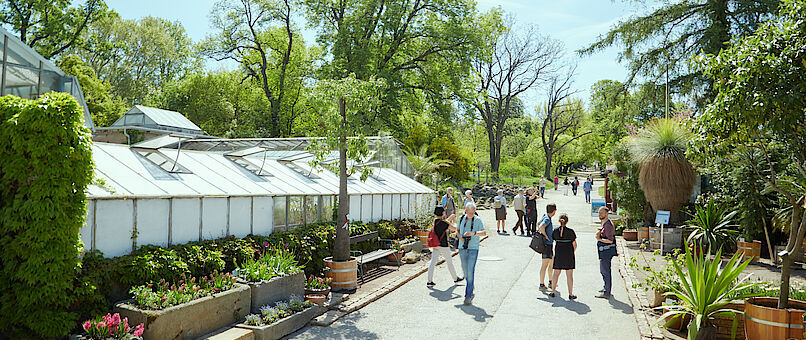

## Core Facility Botanical Garden of the University of Vienna

Our unique plant collection houses species threatened with extinction, exotic species and representatives of the local flora. Many of them are researched by scientists and used for the training of students. The groups of trees and meadows in the garden are a valuable habitat for wild animals. For our visitors, the garden is a place of relaxation and amazement.

Around 11,500 plant species from six continents grow in the Botanical Garden of the University of Vienna. The varied complex includes an English landscape garden with plants from the most important kinship circles, a collection of trees, a Pannonian steppe landscape, glass houses and much more.

Find out more at [http://www.botanik.univie.ac.a...](http://www.botanik.univie.ac.at/hbv)

The Botanical Garden is part of the Faculty of Life Sciences at the University of Vienna and cooperates with hundreds of scientific institutions worldwide. Plants from the extensive collections of the Botanical Garden are the focus of many scientific studies and species protection projects.

Visit [Core Facility Botanical Garden of the University of Vienna's website.](http://www.botanik.univie.ac.at/hbv)

Located in: Vienna, Austria

### Associated WFO Contacts:

-   [Michael Kiehn](mailto:) (Council Member, Taxonomic Working Group Member)