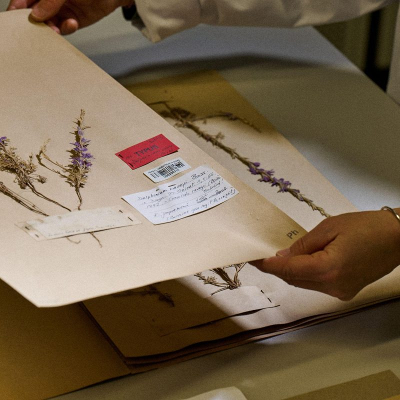
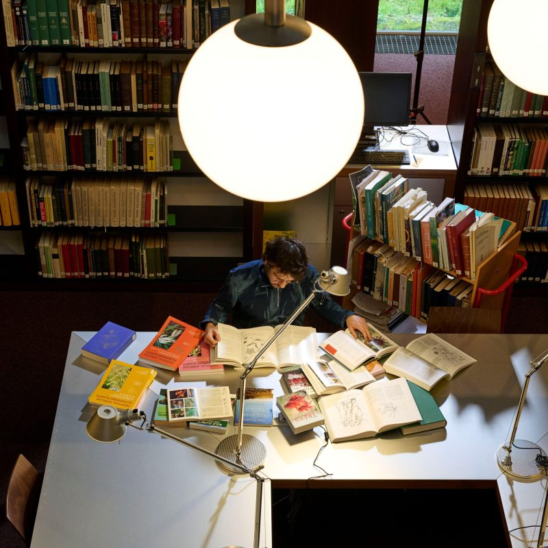
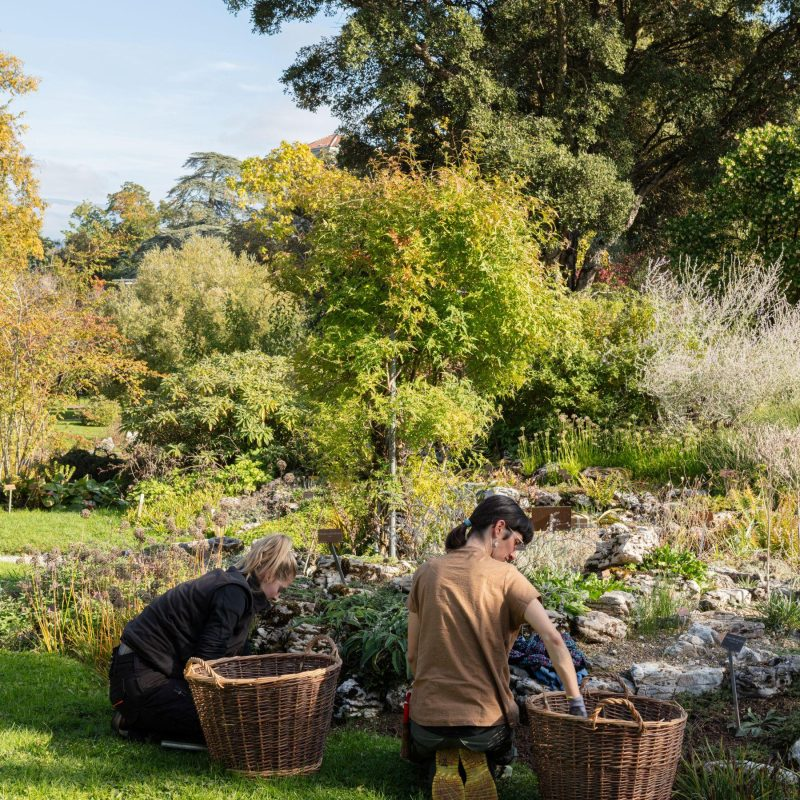
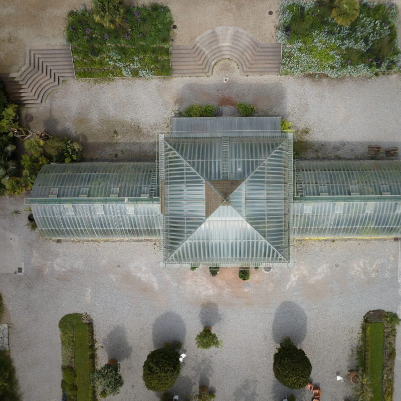
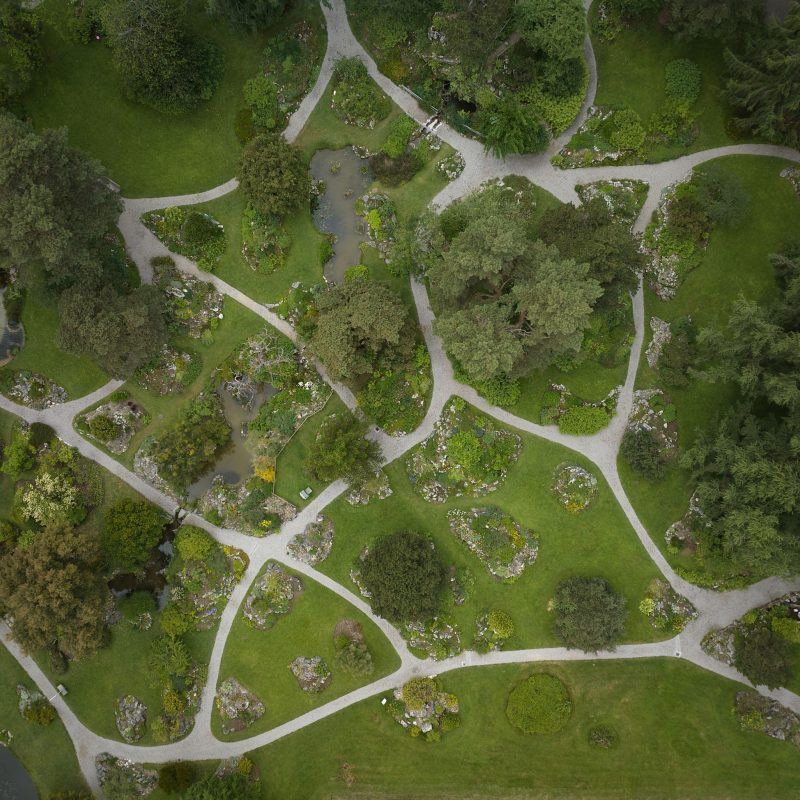
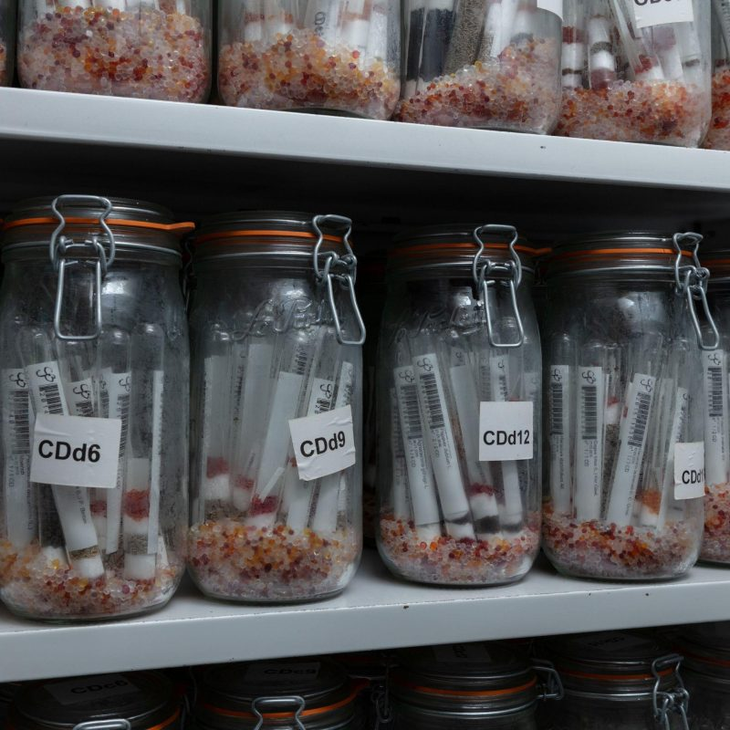

## Geneva Botanic Garden

As an international centre of excellence in botany, the Geneva Botanic Garden combines botanical science with the curation of its collections to gain a deeper understanding of the living world and support its preservation.

To fulfil its mission, it:

-   Advances scientific knowledge of plant and fungal biodiversity 
-   Preserves, enriches and showcases botanical and mycological collections of global significance 
-   Undertakes concrete actions to safeguard threatened species
-   Trains the next generation of botanists, scientists, and horticulturists
-   Inspires commitment to the protection of the diversity of life.

To find out more: [https://​www​.jardinb​otanique​gen​eve​.ch/](https://www.jardinbotaniquegeneve.ch/)

The Geneva Botanic Garden focuses on plant and fungal diversity. Its scientists work to identify, describe and classify species, trace their evolutionary history, map their habitats, record their distribution, assess threats, and implement concrete conservation actions. Its collections and research infrastructures lie at the hearth of this work, which is vital to safeguarding biodiversity.

Associated Taxonomic Expert Networks (TENs)

-   Aquifoliaceae
-   Sapotaceae

Visit [Geneva Botanic Garden's website.](https://www.jardinbotaniquegeneve.ch/)

Located in: Geneva, Switzerland

### Associated WFO Contacts:

-   [Laurent Gautier](mailto:)
-   [Nathalie Mivelaz-Tirabosco](mailto:) (Communications Working Group Member)
-   [Raoul Palese](mailto:) (Technical Working Group Member)
-   [Nicola Schoenenberger](mailto:nicola.schoenenberger@ville-ge.ch) (Council Member, Taxonomic Working Group Member, Communications Working Group Co-Chair)