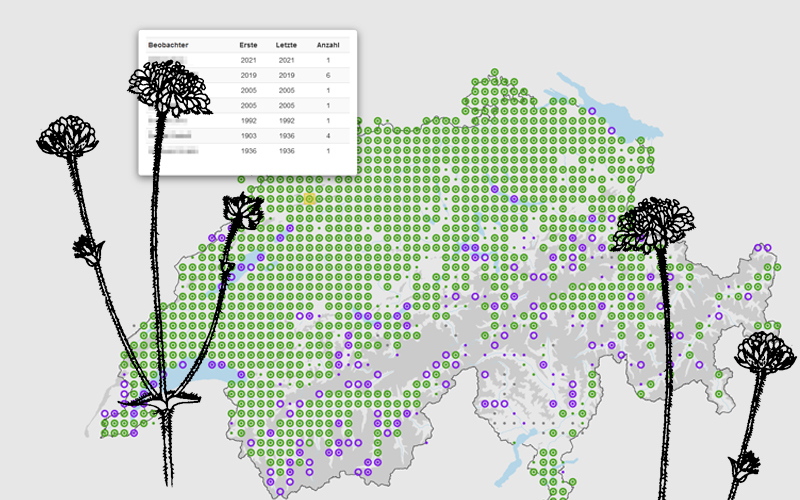
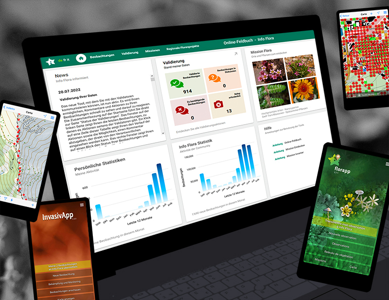
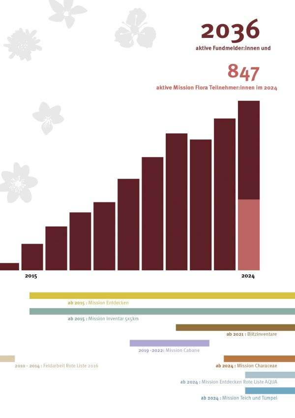
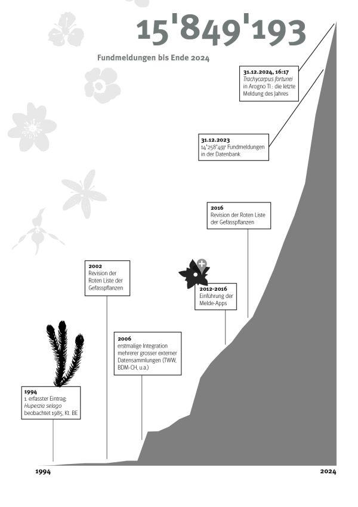
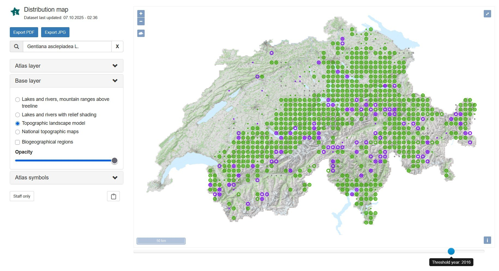

## InfoFlora

InfoFlora is:

-   is the competence center for [information on the wild plants](https://www.infoflora.ch/en/flora/search.html) of Switzerland.
-   collects [data on the Swiss flora](https://www.infoflora.ch/en/data/state-of-the-data.html) and displays the [distribution of species](https://atlas.infoflora.ch/en/) through various maps.
-   works with a network of volunteers and develops  [tools](https://www.infoflora.ch/en/get-involved/my-observations.html) (such as apps and identification keys ) for reporting botanical observations.
-   promotes knowledge of the Swiss flora through publications and [courses](https://www.infoflora.ch/en/training/courses.html).
-   supports the protection of native wild plants, for example through the [Red List of endangered species](https://www.infoflora.ch/en/species-conservation/lists.html), by contributing to the development of Switzerland's [ecological infrastructure](https://www.infoflora.ch/en/species-conservation/ecological-infrastructure.html) and by providing information on the [control of invasive neophytes](https://www.infoflora.ch/en/neophytes/neophytes.html).
-   is a non-profit [foundation](https://www.infoflora.ch/en/general/info-flora/foundation.html) with offices in Geneva, Bern and Lugano.
-   maintains, in collaboration with the cantons, a network of [regional Info Flora offices](https://www.infoflora.ch/de/allgemeines/regionalstelle.html) for local advisory services.
-   is recognised by the Federal Office for the Environment (FOEN) as the national data and information centre for the Swiss flora
-   closely collaborates with the other national data centres under  [​"InfoSpecies"](https://www.infoflora.ch/en/general/info-flora/info-species.html).

Visit [InfoFlora's website.](https://www.infoflora.ch/)

Located in: Switzerland