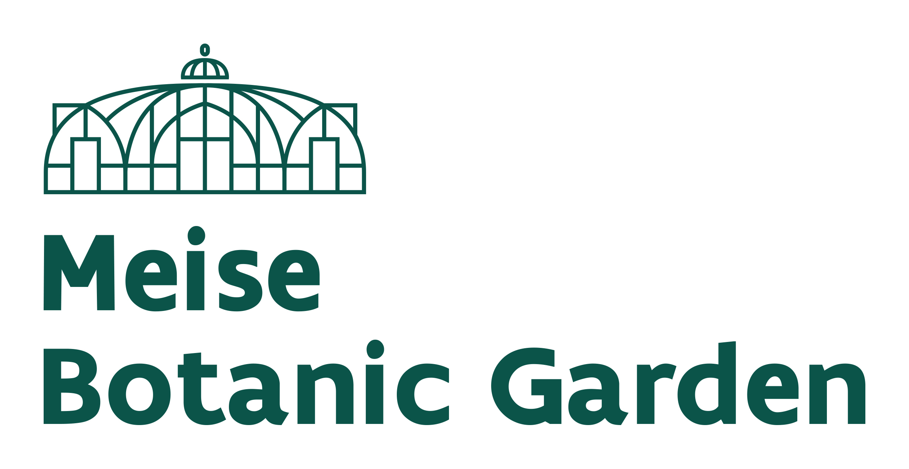
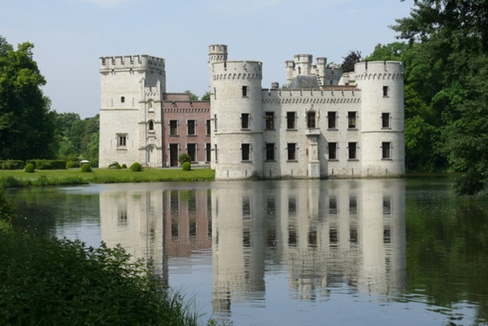
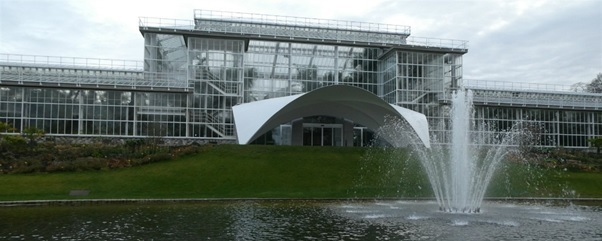

## Meise Botanic Garden

[Meise Botanic Garden](https://www.plantentuinmeise.be/) is an internationally renowned centre of excellence for plant diversity research, conservation, and documentation. Our mission is ​"Building a sustainable future through discovery, research, and conservation of plants".

With a living collection of 18,000 plant species, a garden of 92 hectare, a herbarium with 4 million preserved specimens, and an extensive botanical library, we are among the largest botanic gardens in the world.

Our science centres on collection-based research of plant diversity, evolution, ecology, and conservation. We study a wide range of taxonomic groups, including plants, algae, fungi, and lichens from Europe, Central Africa, Antarctica, and other parts of the world.

Meise Botanic Garden is dedicated to sharing its knowledge on plants and their environment with the research community, students, and the public.

Château de Bouchout © copyright Meise Botanic Garden

Our herbarium collections cover a wide range of plant groups: algae and diatoms; slime moulds and mushrooms; mosses, lichens, and ferns; gymnosperms and flowering plants. Apart from herbarium sheets, they also include tissue collections for genetic analyses, fluid-preserved collections for morphological research, a collection of dried fruits and seeds, microscopic preparations, a wood and bark collection, and historic museum collections.

Although collection items come from all over the world, the focus is on Belgium, south-western Europe and tropical Africa. Our collection is the world reference for Central Africa.

In recent years, 3 million objects have been digitized, which means we now have images and associated data that everyone can consult via the [virtual herbarium](https://www.botanicalcollections.be/#/en/home). 

Meise glasshouse complex © copyright Meise Botanic Garden

Visit [Meise Botanic Garden's website.](https://www.plantentuinmeise.be/en/home/)

Located in: Meise, Belgium

### Associated WFO Contacts:

-   [Marc Sosef](mailto:marc.sosef@botanicgardenmeise.be) (Taxonomic Working Group Member)
-   [Maarten Trekels](mailto:) (Council Member)
-   [Hilde Vanhoutte](mailto:directiesecretariaat@plantentuinmeise.be)
-   [Brecht Verstraete](mailto:) (TEN Focal)

### Associated Taxonomic Expert Networks (TENs):

-   [Rubiaceae](https://about.worldfloraonline.org/tens/rubiaceae)