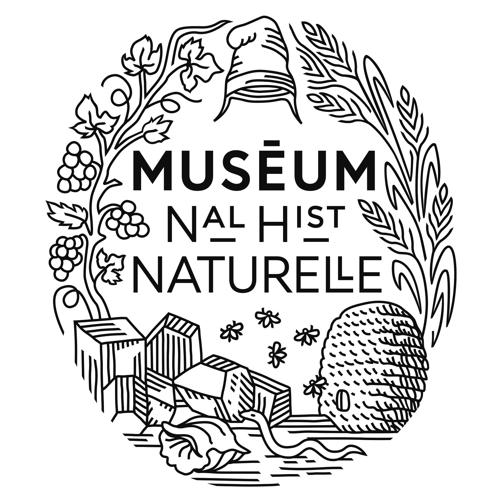
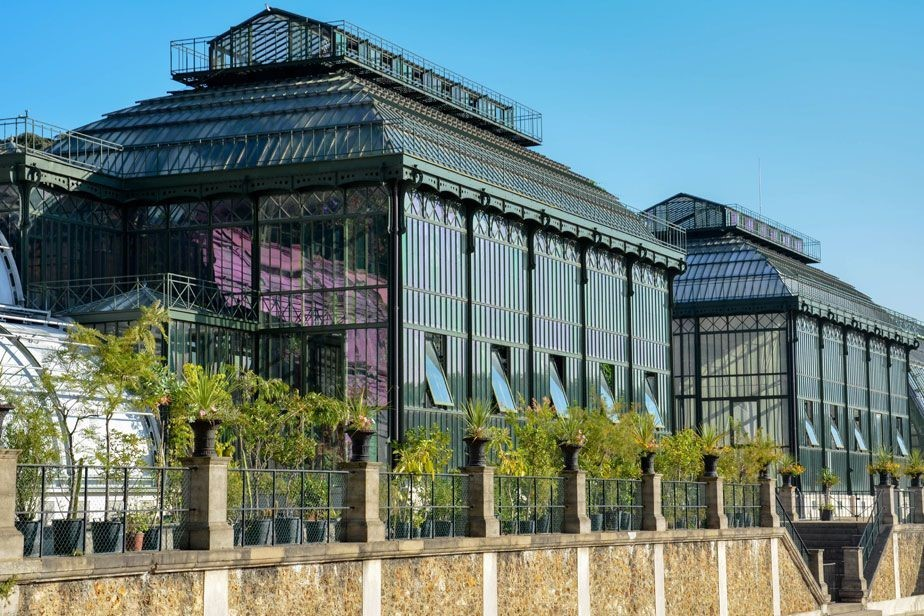
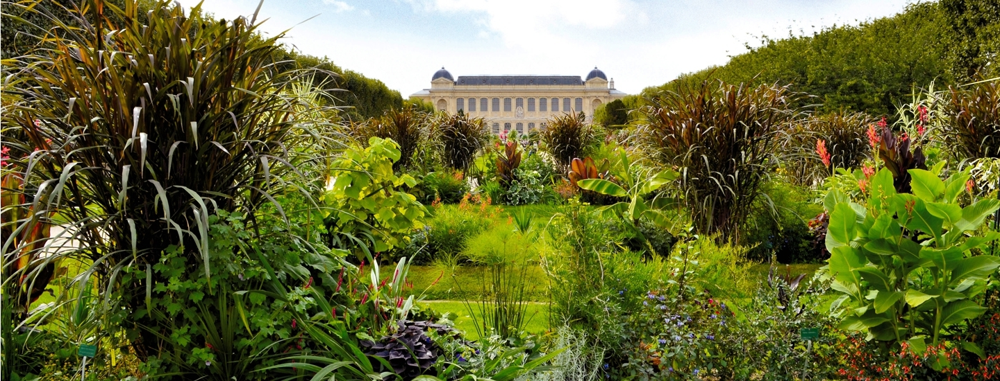

## Muséum National d'Histoire Naturelle

At the crossroad of the study of biological, geological and cultural diversity of the planet, and of the relations between human societies and nature, the Muséum National d'Histoire Naturelle deploys a unique synergy between research, expertise, collections, education and knowledge dissemination. 

Greenhouses of the Jardin des Plantes © Catherine Ficaja

Created in 1635, this national institution is composed of 13 sites in Paris and other regions in France. It is at the same time a research center, museum, and university. It mobilizes conservation, enrichment, valorization of its collections as well as dissemination of knowledge, applied and fundamental research, teaching, and world-class expertise. It also aims at reaching the wider public through communication and citizen-sciences initiatives. Its motto is ​'Fascinate to educate'

View of the Jardin des Plantes © Jérôme Munier

The institute employs 2685 persons (including 570 researchers) and trains around 400 students a year. It possesses 67 million specimens in its collections and exhibitions and welcomed 3.2 million visitors in 2019 in all of its 13 sites. 

Its dried plants collections constitute Herbarium P (and PC), amongst the richest in the world, which was entirely digitized in 2013, and of which all the images are [now available online](https://science.mnhn.fr/). Live plant collections are maintained across 5 botanical gardens: the Jardin des Plantes in Paris (temperate to tropical collections, fruit collections and seedbank), the Arboretum de Versailles-Chèvreloup (trees and woody plants, tropical and subtropical greenhouses), the Jardin Exotique du Val Rameh in Menton (Mediterranean and tropical plants), the Jardin Alpin de la Jaÿsinia in the French Alps (montane plants), and the Harmas de Fabre in southern France (Henri Fabre botanical and entomological collections). The living collections gather 50,000 accessions belonging to 20,000 taxa, cultivated on a total of 255 hectares.

Visit [Muséum National d'Histoire Naturelle's website.](https://www.mnhn.fr/)

Located in: Paris, France

### Associated WFO Contacts:

-   [Maïté Delmas](mailto:) (Council Member, Taxonomic Working Group Member)
-   [Thomas Haevermans](mailto:thomas.haevermans@mnhn.fr) (Taxonomic Working Group Co-Chair)
-   [Pete Lowry](mailto:) (Taxonomic Working Group Member)
-   [Visotheary Ung](mailto:) (Technical Working Group Member)

### Associated Taxonomic Expert Networks (TENs):

-   [Musaceae](https://about.worldfloraonline.org/tens/musaceae)
-   [Poaceae](https://about.worldfloraonline.org/tens/grassbase)