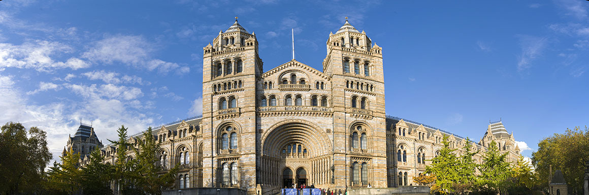

## Natural History Museum

The [Natural History Museum's](http://www.nhm.ac.uk/) 80 million specimens form the world's most important natural history collection.

The scientific community is using the collection to answer key questions about the past, present and future of the solar system, the geology of our planet and life on Earth.

Our 300 scientists work on earth and life sciences in our core research labs and library and archives. We are an acclaimed research institution, and publish over 700 scientific papers a year with international collaborators. Our 80 million specimens span 4.5 billion years, from the formation of the solar system to the present day.

The Museum's Botany collection holds an estimated six million specimens of bryophytes, ferns, seed plants and slime moulds from all over the world.

The botanical collection spans a period from the 17th century to the present and includes a number of historically important collections such as those of:

-   Sir Hans Sloane
-   Sir Joseph Banks
-   Charles Darwin

Visit [Natural History Museum's website.](http://www.nhm.ac.uk/)

Located in: London, UK

### Associated WFO Contacts:

-   [Sandra Knapp](mailto:s.knapp@nhm.ac.uk) (Council Member, TEN Focal, Taxonomic Working Group Member)
-   [Norman Robson](mailto:n.robson@nhm.ac.uk)

### Associated Taxonomic Expert Networks (TENs):

-   [Solanaceae - SolanaceaeSource.org](https://about.worldfloraonline.org/tens/solanaceaesource-org)