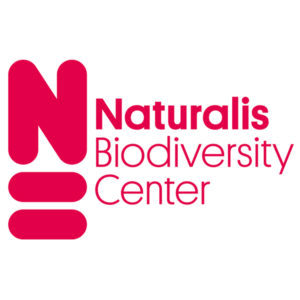

## Naturalis Biodiversity Center

Naturalis is the Dutch national research institute for biodiversity. With one of the largest natural history collections in the world, our labs and our biodiversity data, we offer a unique scientific infrastructure: a veritable time machine that enables scientists to map the biological and geological diversity of the past, present and future. Scientific biodiversity research is fundamental to the protection of the natural riches of our Earth.

Continually expanding the frontiers of knowledge is vital, including by documenting plant and animal species and the relationships between them over millions of years of evolution. Over 120 scientists at Naturalis are constantly working towards this aim. We develop new technologies that allow researchers to identify and monitor species much faster. In doing so, we make a major contribution to the fundamental knowledge that is crucial to preserving biodiversity.

Find out more at [https://​www​.nat​u​ralis​.nl/](https://www.naturalis.nl/)

We are Naturalis Biodiversity Center. Through our impressive collection, knowledge and data, we record all life on Earth. This is important, as our future depends on biodiversity. Everything in nature is connected, and balance is vitally important for its continued existence. Naturalis has a passion for nature. We research nature in order to preserve biodiversity. This is how we contribute to solutions for major, global issues involving climate, living environment, food supply and medicine.

Visit [Naturalis Biodiversity Center's website.](https://www.naturalis.nl/)

Located in: Leiden, Netherlands

### Associated WFO Contacts:

-   [Eric Smets](mailto:) (Council Member, Taxonomic Working Group Member)