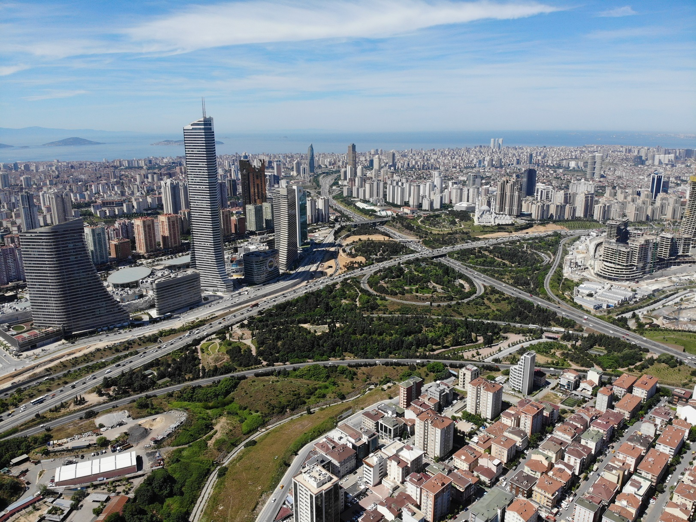

## Nezahat Gökyiğit Botanik Bahçesi (NGBB)

Mission Statement: Nezahat Gökyiğit Botanic Garden aims to disseminate information about plant life of the world to the Turkish people and to encourage them to use this knowledge wisely.

Ana Görev: Bahçemizin görevi, öncelikle Türk halkını, Türkiye ve Dünya bitkileri hakkında edinilmiş bilgiden haberdar etmek ve bu bilgiyi bilgece kullanmasına olanak sağlamaktır. 

Our vision is that the Nezahat Gökyiğit Botanic Garden will become as famous as the legendary ​'Hanging Gardens of Babylon'. 

Vizyonumuz: Nezahat Gökyiğit Botanik Bahçesi'ni Babil'in Asma Bahçeleri kadar ünlü yapmak.

Find out more at[http://​www​.ngbb​.org​.tr](http://www.ngbb.org.tr/)

A view of NGBB towards the Marmara Sea: an oasis in a motorway intersection amongst the high rise tower blocks of Istanbul city. NGBB'nin Marmara Denizi'ne doğru bir görünüşü: otoyol kavşağında, yüksek beton binaların arasında bir vaha.

### Contribution to WFO

The Nezahat Gökyiğit Botanic Garden is the first and only botanic garden in the world to be established in a motorway intersection.

Situated in a densely populated area of Istanbul it is surrounded by high rise tower blocks. NGBB is a member of the ​"*World Flora Online*" project. ​"Resimli Türkiye Florası," (*The Illustrated Flora of Turkey*) is a 30 volume fully iIllustrated Flora being prepared in NGBB by Turkish botanists and plant artists from all over Turkey. The first two volumes have already been published and work on 12 other volumes is underway with the aim of completion by 2030. See the web site <[www​.turkiye​flo​rasi​.org​.tr>....](http://www.turkiyeflorasi.org.tr/) has a diverse flora being a geographical bridge between the continents of Asia and Europe and plays an important role in the migration of many species in both directions. Here three major phytogeographic regions meet namely Euro-Siberian, Irano-Turanian and Mediterranean regions and it is also a cradle of many cultivated plants as wheat, lentil, chickpea and others as part of the fertile crescent. When the new Turkish flora is completed there will be approximately 11,000 species with 30% endemics, among the highest in the Temperate zone.

### WFO'ya katkımız

NGBB, Dünya'da bir otoyol kavşağında kurulmuş ilk ve halen tek botanik bahçesidir. Yoğun nüfusun bulunduğu yüksek binalarla çevrilidir.

NGBB, ​"Çevrimiçi Dünya Florası"nın bir üyesidir. ​"Resimli Türkiye Florası" projesi, ülkenin her köşesinden botanikçilerin ve bitki ressamlarının katkılarıyla hazırlanmaktadır. 30 cilt olarak plânlanmış olup, ilk iki cilt yayınlanmış ve halen 12 cilt üzerindeki çalışmalar devam etmektedir. Flora 2030'da tamamlanacaktır. İlgili veb sayfası şudur: <[www​.turkiye​flo​rasi​.org​.tr>....](http://www.turkiyeflorasi.org.tr/) olarak Asya ve Avrupa arasında yer alan Türkiye çok zengin bir floraya sahiptir. Bitkilerin her iki kıtaya doğru önemli bir göç yoludur ve üç bitki coğrafyası bölgesinin karşılaştığı bir yerdir. Bunlar Avrupa-Sibirya, İran-Turan ve Akdeniz Bitkicoğrafyası Bölgeleridir. Türkiye, aynı zamanda buğday, mercimek, nohut ve birçok başka tarım bitkisinin de beşiğidir. Resimli Türkiye Florası tamamlandığında yaklaşık 11.000 tür ve %30 endemizm oranı beklenmektedir ki bu rakamların ikisi de Ilıman Kuşak için en yüksek rakamlardan birisidir.

### Acknowledgement

*Resimli Türkiye Florası* (The Illustrated Flora of Turkey) is a project of *Flora Ara**ş**tırmaları Derne**ğ**i* (Flora Research Society) under the Patronage of the Presidency of the Republic of Turkey.

The headquarters of the project is the Nezahat Gökyiğit Botanic Garden. Both NGBB and the Illustrated Flora of Turkey project are fully sponsored by the Ali Nihat Gökyiğit Foundation.

### Teşekkür

Resimli Türkiye Florası, Flora Araştırmaları Derneği'nin, ​"Türkiye Cumhuriyeti Cumhurbaşkanlığının Himayelerinde" bir projesidir.

Flora Projesi'nin karargâhı Nezahat Gökyiğit Botanik Bahçesi'dir. Hem NGBB hem de Resimli Türkiye Florası Projesi, Ali Nihat Gökyiğit Vakfı'nın maddi ve manevi tam desteği ile yürütülmektedir.

Visit [Nezahat Gökyiğit Botanik Bahçesi (NGBB)'s website.](http://www.ngbb.org.tr/)

Located in: Istanbul, Turkey

### Associated WFO Contacts:

-   [Ogün Demir](mailto:) (Technical Working Group Co-Chair)
-   [Adil Güner](mailto:) (Council Member, Taxonomic Working Group Member)