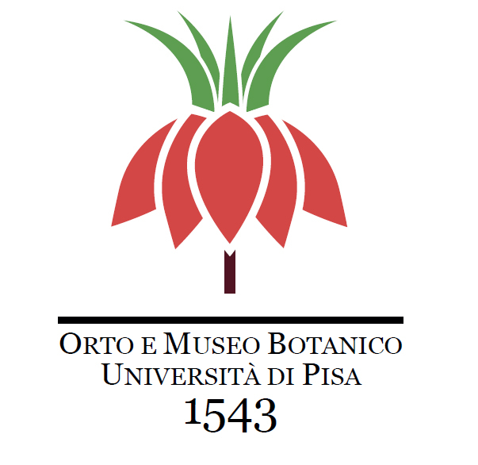
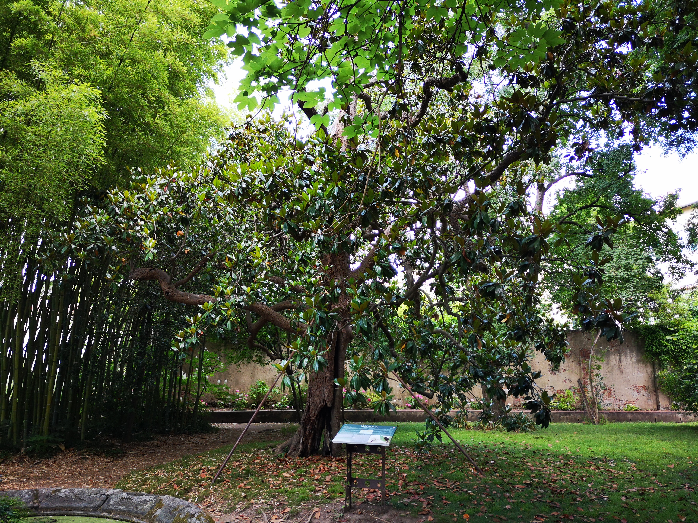
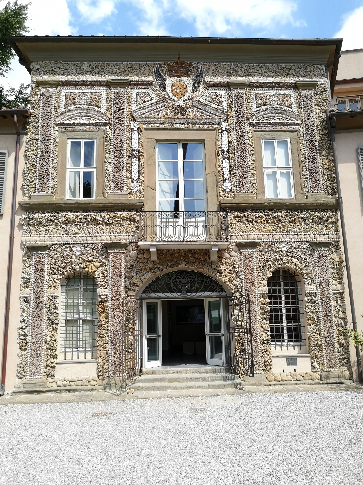
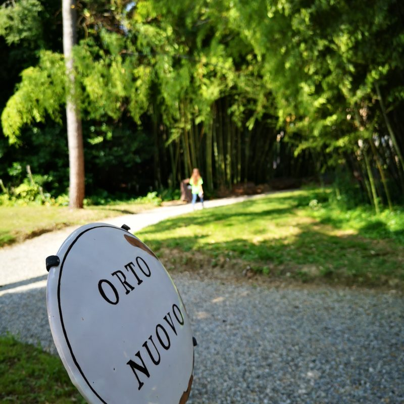
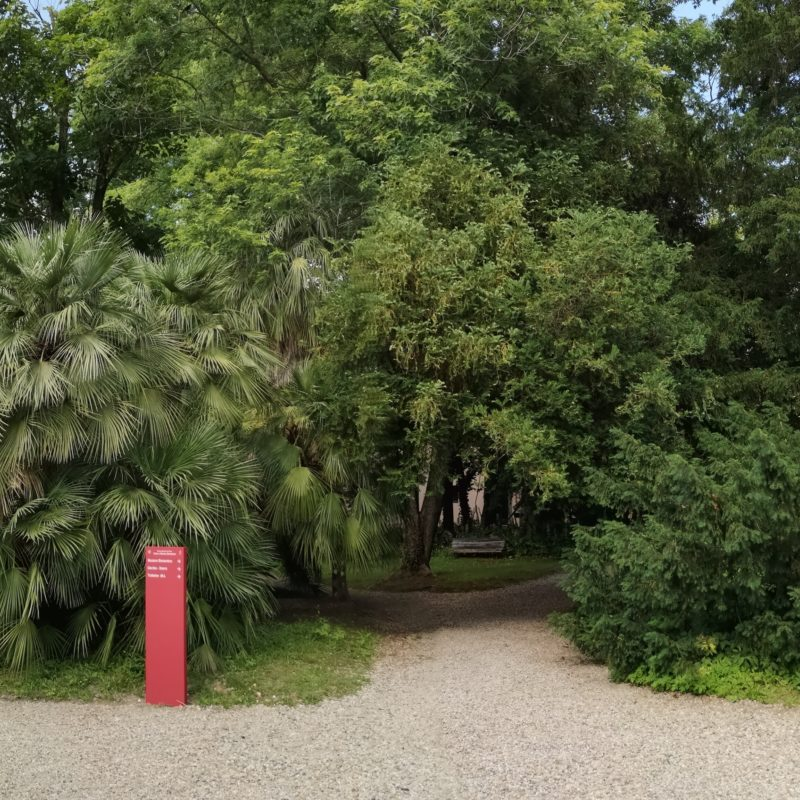
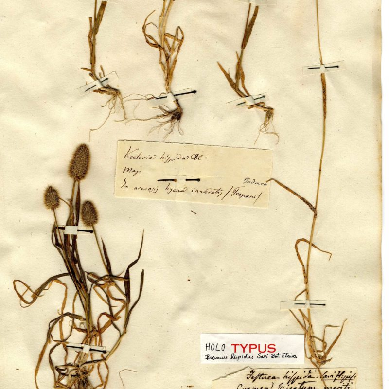
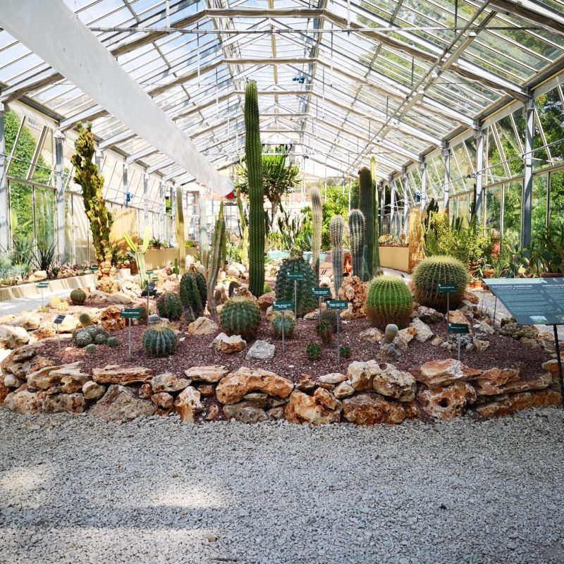
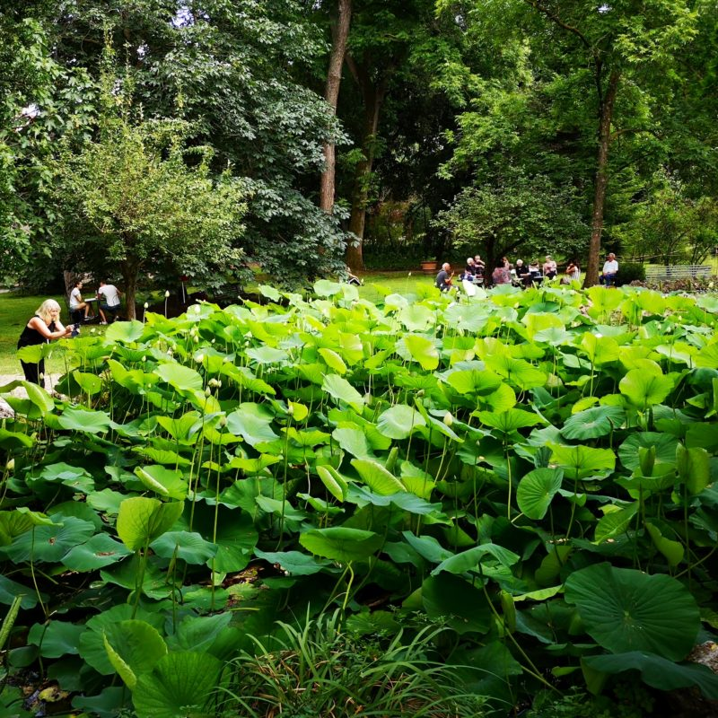
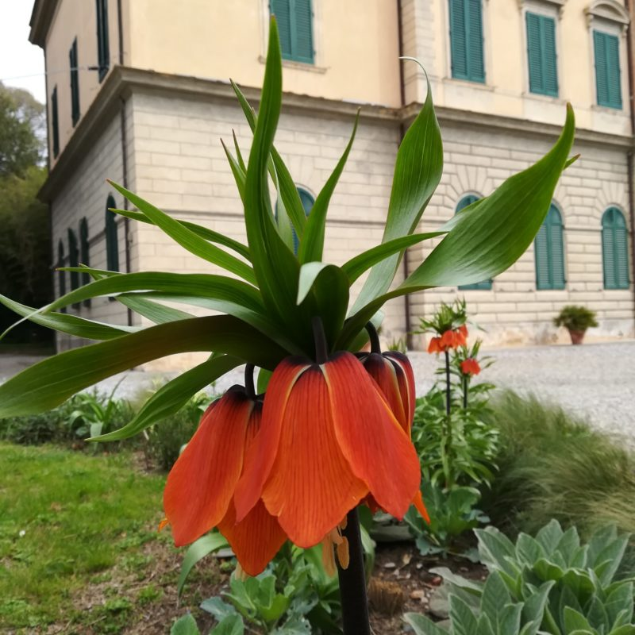

## Orto e Museo Botanico dell'Università di Pisa

The Botanic Garden of Pisa, founded in 1543 by Luca Ghini (1490-1556), is the first academic botanic garden in the world. Originally built on the banks of the river Arno, it was moved to the current site in 1591. According to historical criteria, it is currently organized in seven sectors, each one hosting thematic collections organized on a scientific basis. It houses more than 3,000 plants in about two hectares, including centuries-old trees, endangered species of conservation interests, taxa living in different types of habitats and climates.

Magnolia grandiflora planted in 1787. One of the oldest trees in Orto del Cedro. © Orto e Museo Botanico dell'Università di Pisa

The Garden hosts the Botanic Museum also known as the ​"Palazzo delle Conchiglie" (literally ​"Seashell's Palace") for the facade entirely decorated in grotesque style around 1752. The Museum preserves a collection of portraits of ancient botanist, the monumental entrance door to the gallery, as well as objects related to the teaching of botany, including valuable wax and plaster models and teaching tables. In the building in the centre of the Botanic Garden, accessible by scholars only by reservation, there is the Herbarium (international acronym PI) also virtually accessible by a multimedia station installed at Museum ([http://​erbario​.unipi​.it/it](http://erbario.unipi.it/it)). Currently, the Herbarium preserves about 350,000 specimens among dried plants, algae, mushrooms, mosses and lichens collected since the end of the eighteenth century.

The ​Palazzo delle Conchiglie. © Orto e Museo Botanico dell'Università di Pisa

The Botanic Garden and Museum of the University of Pisa primarily supports research, teaching and training activities of the University of Pisa. School teaching, the promotion of biodiversity conservation and the dissemination of botanical culture to a wider public are also main missions of the institution.

The Botanic Garden and Museum of Pisa is a member of the Botanic Gardens Conservation International and, since 2021, is the first Italian partner of the World Flora Online (WFO) consortium.

Images from Orto e Museo Botanico dell'Università di Pisa

Visit [Orto e Museo Botanico dell'Università di Pisa's website.](https://www.ortomuseobot.sma.unipi.it/en/)

Located in: Pisa, Italy

### Associated WFO Contacts:

-   [Lorenzo Peruzzi](mailto:) (Council Member, Taxonomic Working Group Member)