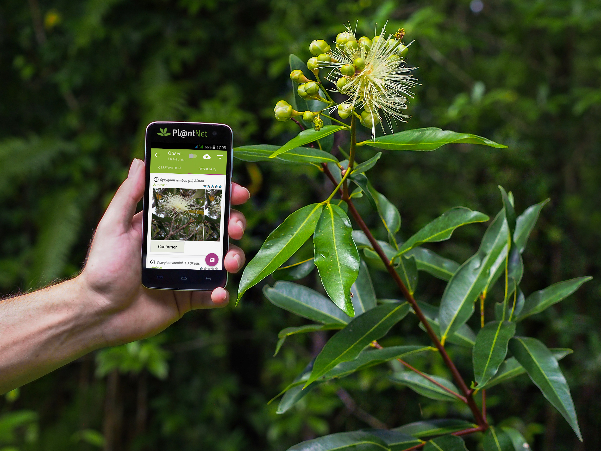

## Pl@ntNet: A Collaborative Platform for Plant Identification

Pl@ntNet is an innovative citizen science platform dedicated to plant identification and biodiversity documentation. Initiated in 2009, Pl@ntNet emerged from a collaborative effort by an open consortium of four French research institutions, including the Agricultural Research Centre for International Development (CIRAD), the National Institute for Research in Computer Science and Automation (INRIA), the National Institute for Agriculture, Food, and Environment (INRAE), and the National Research Institute for Sustainable development (IRD), with the support of Agropolis Fondation. The platform was created to bridge the gap between scientific research and public participation, aiming to harness the power of collective intelligence and AI to enhance the understanding and conservation of plant biodiversity.

© Chloe Glad

Pl@ntNet was one of the first biodiversity observatory in the world to use machine learning and citizen science to overcome the taxonomic gap. To achieve this objective, Pl@ntNet has made several major algorithmic and methodological contributions which enable its millions of users to identify plant species simply by uploading images on its web of mobile tools. This not only democratizes access to botanical knowledge but also contributes to the creation of a global database of plant observations, which can be used for scientific research, environmental monitoring, and conservation efforts. This platform has also been a pioneer in experimenting large-scale deep learning methods, for plant identification and plant species distribution. The open data collected by Pl@ntNet are integrated into the GBIF infrastructure.

Pl@ntNet was originally conceived as a scientific tool for monitoring plant biodiversity. But its societal impact now goes far beyond this objective alone. Since its beginning, Pl@ntNet has processed more than 1 billion of identification requests, submitted by more than 30 million people.

Pl@ntNet website: [https://​plant​net​.org/](https://plantnet.org/)

Pl@ntNet platform: [https://​iden​ti​fy​.plant​net​.org/fr](https://identify.plantnet.org/fr)

Located in: Montpellier (France)

### Associated WFO Contacts:

-   [Pierre Bonnet](mailto:) (Technical Working Group Co-Chair, Council Member)
-   [Alexis Joly](mailto:) (Technical Working Group Co-Chair)