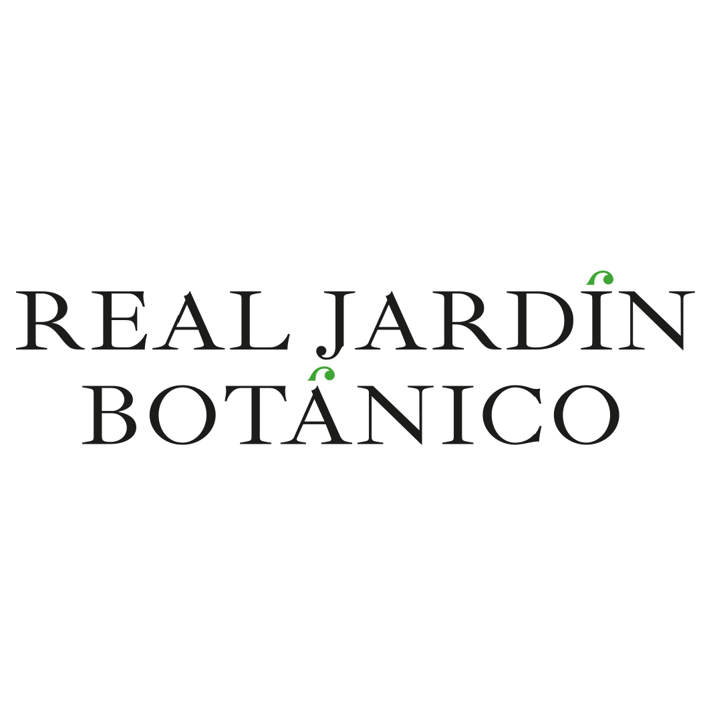
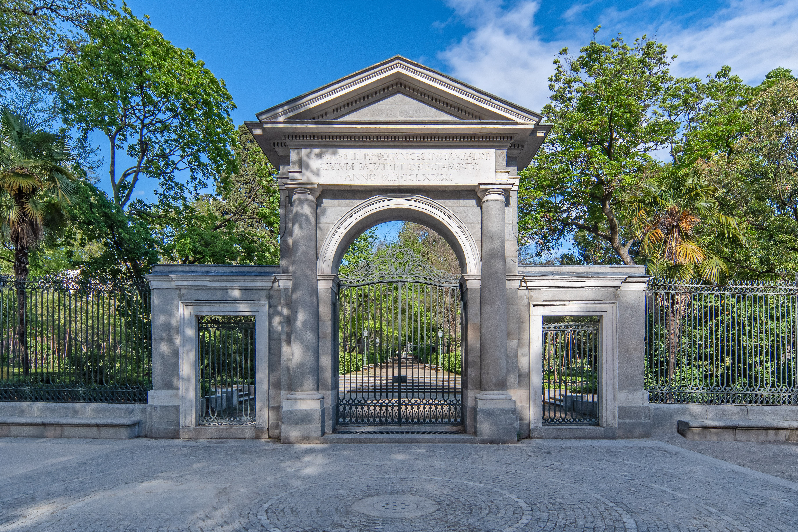
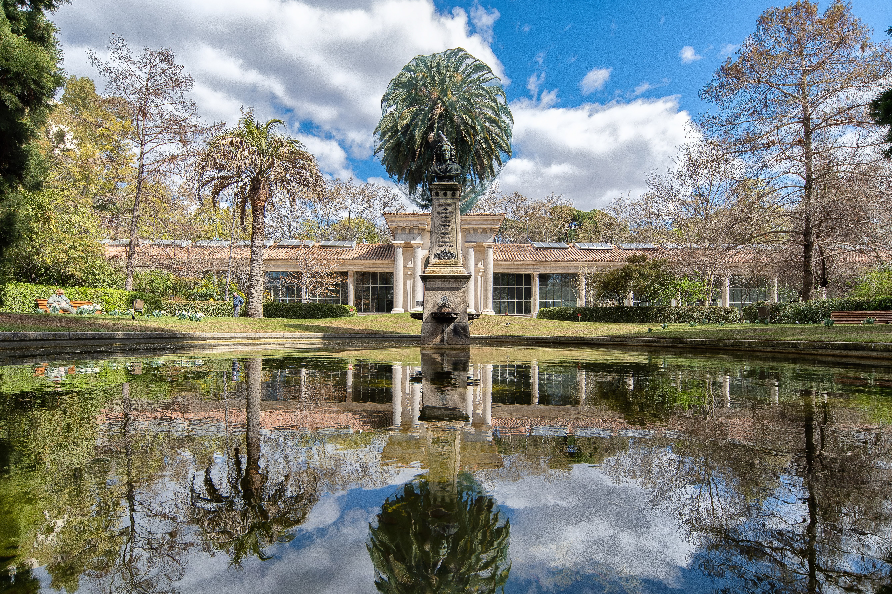
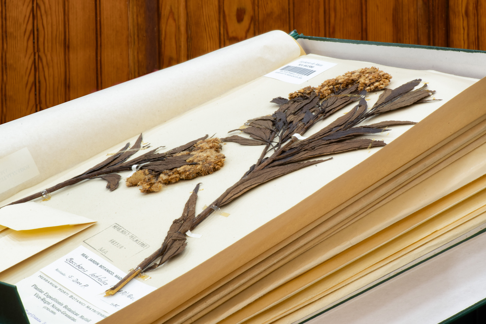
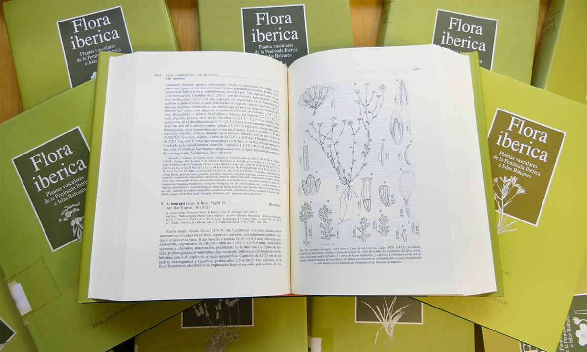
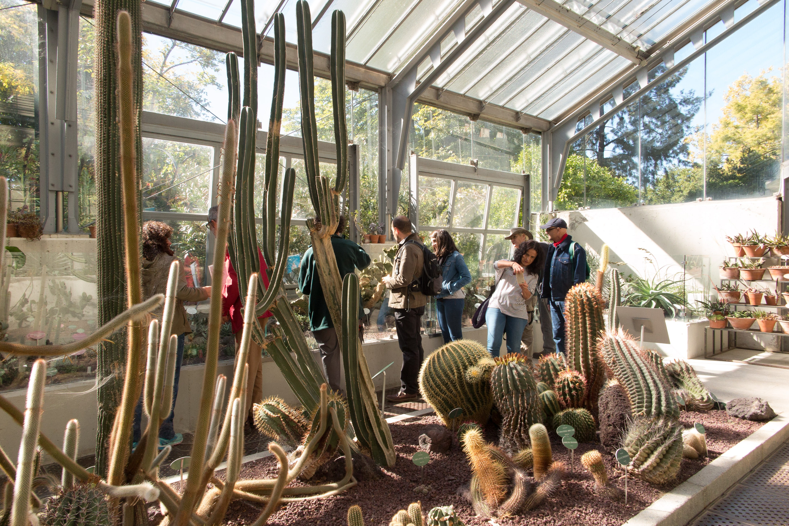
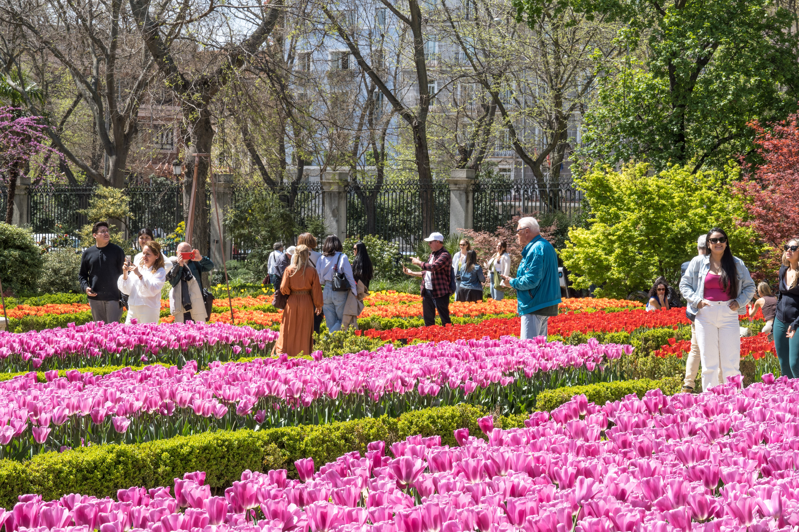

## Real Jardín Botánico CSIC

The Real Jardín Botánico (RJB-CSIC) is a scientific research institution that aims to serve as a reference centre for the study and protection of plant and fungal diversity worldwide. Located in the heart of Spain's capital, the RJB-CSIC offers visitors a harmonious blend of natural beauty, history, and science. This climatic sanctuary is both a hub of botanical research and a peaceful place, where visitors can wander among plant collections from all over the world.

Founded in 1755 during the reign of Fernando VI, the Real Jardín Botánico became a research institute under Consejo Superior de Investigaciones Científicas (CSIC) in 1939. It has been recognised as a Historic-Artistic Garden since 1942, and it is now protected under the Law 16/1985 on Spanish Historical Heritage. Furthermore, it forms part of the *Landscape of Light* in Madrid, which was inscribed as a UNESCO World Heritage Site in 2021 in recognition of its singular mixture of nature, science and culture.

Puerta Real © Antonello Dellanotte 2019.

Glorieta de Linneo © Antonello Dellanotte 2019.

MA Herbarium specimens © Antonello Dellanotte 2019.

RJB-CSIC's Molecular Laboratory © Antonello Dellanotte 2019.

The scientific staff at RJB-CSIC currently work around our core research facilities, i.e. the Herbarium MA, laboratories, library and archives. The Herbarium MA is a key component of the institution's scientific work. It houses over one million specimens, with a particular focus on plant and fungi species from the Mediterranean, Europe and the Americas, remarkably those collected during our historical expeditions.

Flora iberica

*Flora iberica* (1980--2021) has been the flagship project at the RJB-CSIC for many years. Its many achievements include publishing the first complete flora of vascular plants of the Iberian Peninsula and the Balearic Islands, as well as numerous related scientific works, and training many botanists in Spain and Portugal. The 21 plant collection expeditions organised by *Flora iberica* have also contributed to an unprecedented growth of the MA Herbarium, yielding between 5,000 and over 13,000 specimens per year. In total, *Flora iberica* enabled the cataloguing and description of 6,176 species of vascular plants (6,948 taxa belonging to 1,266 genera). In 2023, the project received a silver medal from OPTIMA, in recognition of the immense value of this work for Mediterranean botany over the 2019--2021 triennium.

Santiago Castroviejo's Greenhouse. © RJB-CSIC

Visitors admiring the tulip flowerbeds © RJB-CSIC.

Education and conservation lie at the heart of what we do. We regularly offer guided tours, workshops, and events so that all visitors, whether they are nature lovers, students, scholars or tourists, can deepen their understanding of plants and fungi. With its fountains, terraces, and historical architecture, the RJB-CSIC feels like an open-air museum, a place to stroll, observe, and breathe in the living art of nature.

The RJB-CSIC welcomes hundreds of thousands of curious visitors every year. In 2024, almost half a million people passed through its gates, further establishing it as a must-visit destination for those looking to appreciate our historical heritage, the beauty of plants and fungi, learn about science, and discover how natural resources are preserved.

Visit [Real Jardín Botánico CSIC's website.](https://rjb.csic.es/)

Located in: Plaza de Murillo no. 2, Madrid-28014, Spain

### Associated WFO Contacts:

-   [Alejandro Quintanar](mailto:) (TEN Focal)
-   [Ricarda Riina](mailto:)

### Associated Taxonomic Expert Networks (TENs):

-   [Putranjivaceae](https://about.worldfloraonline.org/tens/putranjivaceae)