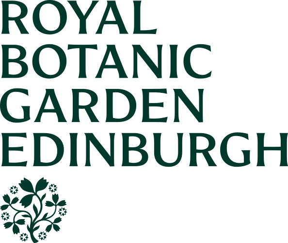
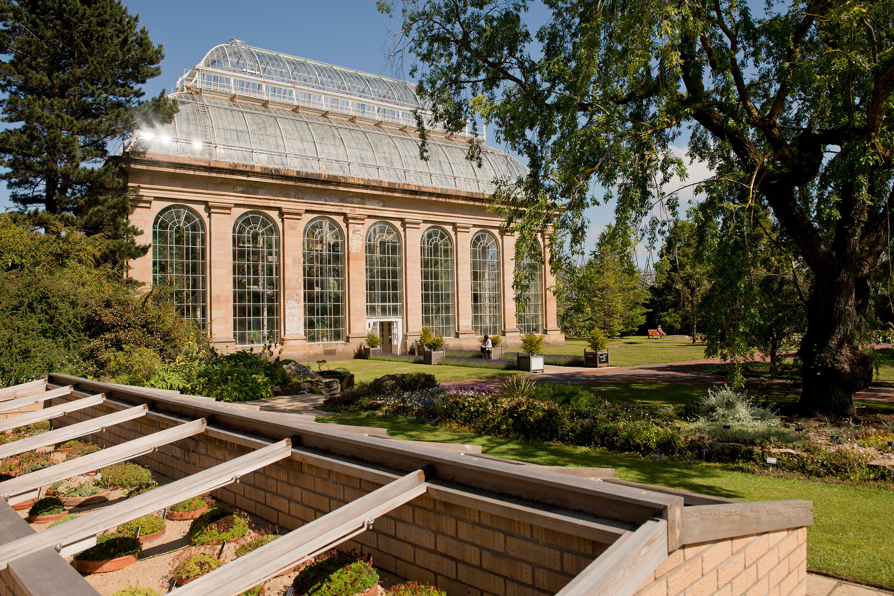
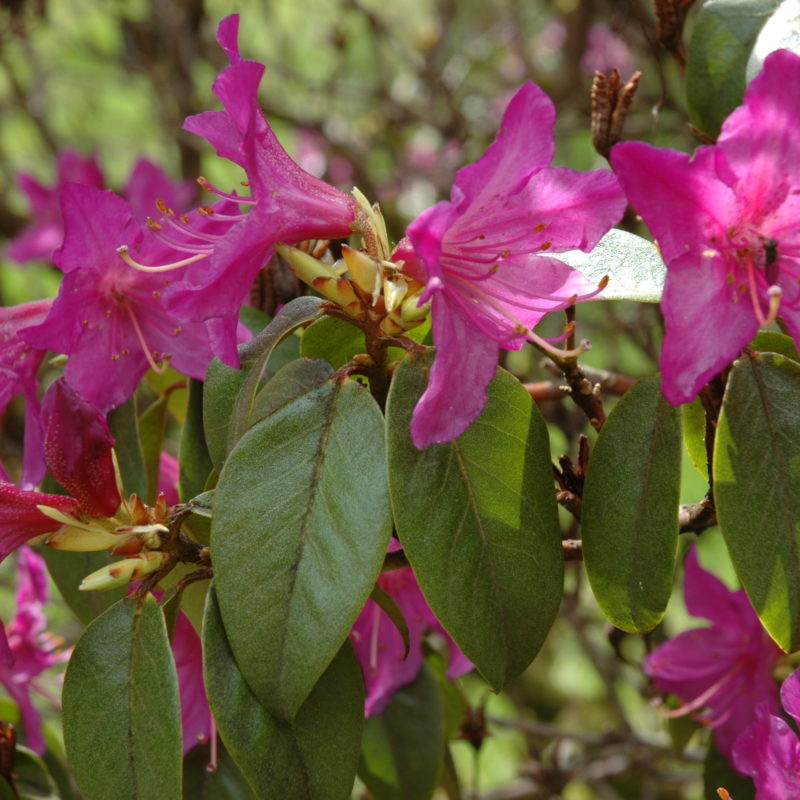
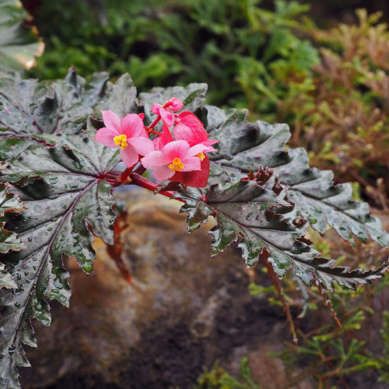
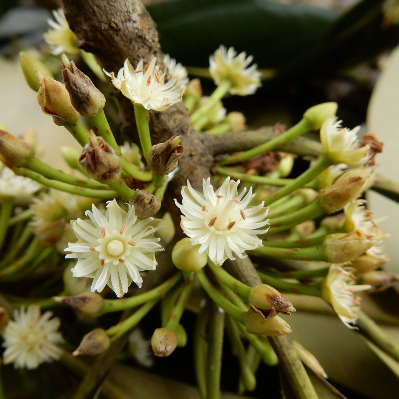
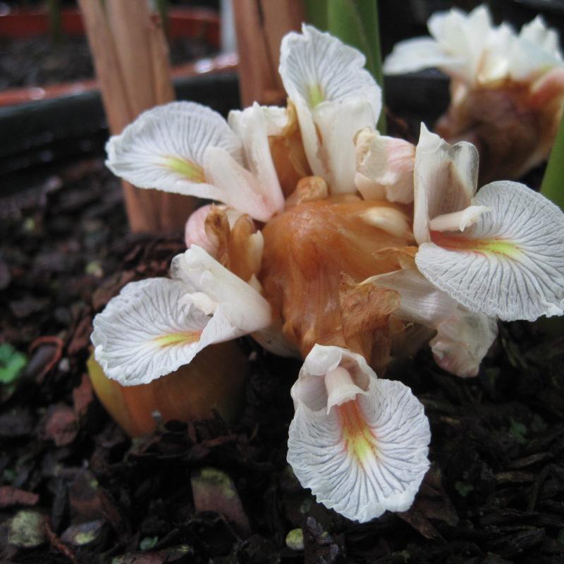
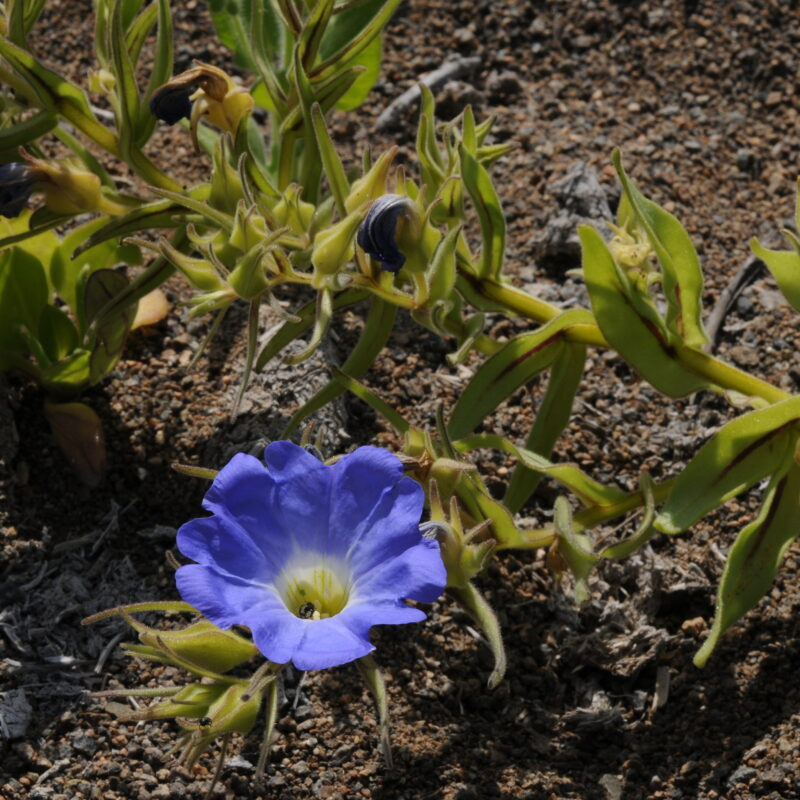
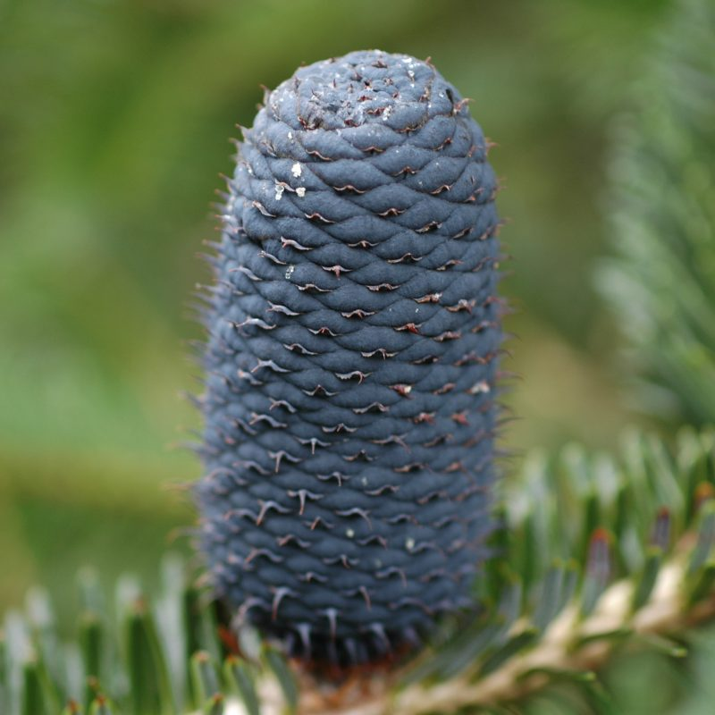

## Royal Botanic Garden Edinburgh

The Royal Botanic Garden Edinburgh (RBGE) is a leading international research organisation delivering knowledge, education, and plant conservation action around the world. 

In Scotland its four Gardens at Edinburgh, Benmore, Dawyck, and Logan attract nearly a million visitors each year. Its overall mission is to *Explore, Conserve and Explain the World of Plants for a Better Future*. Learn more at [www​.rbge​.org​.uk](http://www.rbge.org.uk/ "http://www.rbge.org.uk")

Royal Botanic Garden Edinburgh's Temperate Palm House was constructed in 1858. © Lynsey Wilson, Royal Botanic Garden Edinburgh

Responding to the Biodiversity Crisis and the Climate Emergency, RBGE's scientific programme of world-class biodiversity research underpins the conservation and sustainable use of the world's plant resources. This research is closely aligned with the Global Strategy for Plant Conservation (GSPC) 2020 Targets and the Convention on Biological Diversity (CBD) Aichi Biodiversity Targets. RBGE was one of the four organizations which founded the World Flora Online (WFO) in 2012, and continues to play a leading role in growing, shaping, and supporting this vitally important international initiative.

The herbarium at Royal Botanic Garden Edinburgh is home to 3 million preserved specimens. © Lynsey Wilson, Royal Botanic Garden Edinburgh.

In addition to active participation on WFO Working Groups and Council, RBGE provides the TEN Manager who coordinates the expert curation of the WFO's Taxonomic Backbone, and other staff lead TENs providing information for plant groups including Begoniaceae (begonias), Ericaceae (heathers), Gesneriaceae (African violets), Solanaceae (nightshades), Zingiberaceae (gingers), three families of tropical trees Dipterocarpaceae, Sapotaceae, Irvingiaceae, and all the world's conifers.

Edinburgh's core groups

RBGE is a charity and a non-departmental public body sponsored and supported through grant-in-aid by the Scottish Government's Environment and Forestry Directorate. RBGE is led by Regius Keeper Simon Milne, and governed by a Board of Trustees appointed by Scottish Ministers. RBGE is a member of the SEFARI collective of publicly funded research institutions, and pleased to acknowledge financial support from the the players of the People's Postcode Lottery.

Visit [Royal Botanic Garden Edinburgh's website.](https://www.rbge.org.uk/)

Located in: Edinburgh, Scotland, UK

### Associated WFO Contacts:

-   [Hannah Atkins](mailto:hatkins@rbge.org.uk) (TEN Focal)
-   [Alan Elliott](mailto:aelliott@rbge.org.uk) (TEN Focal, TEN Manager)
-   [David Harris](mailto:dharris@rbge.org.uk) (TEN Focal)
-   [Mark Hughes](mailto:mhughes@rbge.org.uk) (TEN Focal)
-   [Roger Hyam](mailto:) (Technical Working Group Member)
-   [Michael Möller](mailto:) (TEN Focal)
-   [Mark Newman](mailto:mnewman@rbge.org.uk) (TEN Focal)
-   [Colin Pendry](mailto:) (Taxonomic Working Group Member)
-   [Axel Poulsen](mailto:) (TEN Focal)
-   [Tiina Särkinen](mailto:t.sarkinen@rbge.org.uk) (TEN Focal)
-   [Philip Thomas](mailto:pthomas@rbge.org.uk) (TEN Focal)
-   [Mark Watson](mailto:) (Council Co-Chair, Taxonomic Working Group Co-Chair)
-   [Peter Wilkie](mailto:pwilkie@rbge.org.uk) (TEN Focal)

### Associated Taxonomic Expert Networks (TENs):

-   [Begoniaceae - Begonia Resource Centre](https://about.worldfloraonline.org/tens/begonia-resource-centre)
-   [Conifers](https://about.worldfloraonline.org/tens/conifers)
-   [Dipterocarpaceae - Forestry Research Programme Dipterocarpaceae Database](https://about.worldfloraonline.org/tens/forestry-research-programme-dipterocarpaceae-data-base)
-   [Ericaceae Taxonomic Expert Network](https://about.worldfloraonline.org/tens/ericaceae-resource-centre)
-   [Gesneriaceae](https://about.worldfloraonline.org/tens/gesneriaceae)
-   [Irvingiaceae](https://about.worldfloraonline.org/tens/irvingiaceae)
-   [Papaveraceae - Tribe Papaverae](https://about.worldfloraonline.org/tens/papaveraceae_tribe_papaverae)
-   [Putranjivaceae](https://about.worldfloraonline.org/tens/putranjivaceae)
-   [Sapotaceae Resource Centre](https://about.worldfloraonline.org/tens/sapotaceae-resource-centre)
-   [Solanaceae - SolanaceaeSource.org](https://about.worldfloraonline.org/tens/solanaceaesource-org)
-   [Zingiberaceae Resource Centre](https://about.worldfloraonline.org/tens/zingiberaceae-resource-centre)