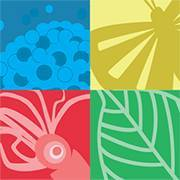

## Species2000/Catalogue of Life

Species 2000 is an autonomous federation of taxonomic database custodians, involving taxonomists throughout the world. Our goal is to collate a uniform and validated index to the world's known species (plants, animals, fungi and microbes). Species 2000 is registered as a not-for-profit company limited by guarantee (registered in England No. 3479405)

Species 2000 began as a joint programme between [CODATA](http://www.codata.org/) (International Council for Science: Committee on Data for Science and Technology), [IUBS](http://www.iubs.org/) (International Union of Biological Sciences) and the [IUMS](http://www.iums.org/) (International Union of Microbiological Societies) in the early 1990's. In 1996 eighteen taxonomic database organisations agreed to convert Species 2000 into a legal entity as the vehicle for developing the global Species 2000 programme. It is an associate participant in the Global Biodiversity Information Facility ( [GBIF](http://www.gbif.org/) ); a data provider to EC [LifeWatch](http://lifewatch.eu/) ; and is recognised by the United Nations Environment Program ( [UNEP](http://www.unep.org/) ) and the Convention on Biological Diversity ( [CBD](http://www.cbd.int/) ).\
Species 2000 is a partner of the Consortium of European Taxonomic Facilities ([CETAF](http://cetaf.org/)) and works with their community on the construction of an authoritative taxonomic index of species: Catalogue of Life.

Species 2000 has a distributed Secretariat: the administrative office and staff are hosted and sponsored by [Naturalis Biodiversity Center](http://www.naturalis.nl/en/) in the Netherlands, the Editorial Office is hosted and sponsored by the [Illinois Natural History Survey](http://wwx.inhs.illinois.edu/) in the USA, and the Data managers are hosted by [FIN](http://www.fin.ph/) (the FishBase Information and Research Group, Inc.) in the Philippines. 

The Species 2000 and Integrated Taxonomic Information System ( [ITIS](http://www.itis.gov/) ) product, the [Catalogue of Life](http://www.catalogueoflife.org/) is the most comprehensive and authoritative global index of species currently available. It consists of a single integrated species checklist and taxonomic hierarchy. The Catalogue holds essential information on the names, relationships and distributions of over 1.6 million species. This figure continues to rise as information is compiled from diverse sources around the world. More information about the collaboration between Species 2000 and ITIS can be found under [Organisation](http://www.catalogueoflife.org/content/contributors#4) on the Catalogue of Life Website 

[Catalogue of Life](http://www.catalogueoflife.org/col/), latest monthly edition

[Catalogue of Life Annual Checklist](http://www.catalogueoflife.org/annual-checklist/2017/)

Visit [Species2000/Catalogue of Life's website.](http://www.catalogueoflife.org/)

Located in: Leiden, Netherlands

### Associated WFO Contacts:

-   [Olaf Banki](mailto:) (Taxonomic Working Group Member, Technical Working Group Member)
-   [Donald Holbern](mailto:) (Council Member)
-   [Peter Schalk](mailto:) (Council Member)