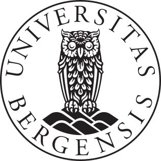

## The Department of Natural History at the University Museum of Bergen

The museum collects, preserves, researches, and shares knowledge about our cultural and natural heritage. Through research and collection management, we ensure that artefacts, photographs, archives, and natural history collections are safeguarded for future generations while also being used to generate new knowledge.

Find out more at [https://www4.uib.no/en/university-museum-of-bergen](https://www4.uib.no/en/university-museum-of-bergen)

The museum is home to several beautiful and biodiverse research and exhibition gardens. The Museum Garden is located adjacent to the museum buildings in central Bergen, while the Arboretum and the Bergen Botanical Garden are located at Milde.

Visit [https://www4.uib.no/en/university-museum-of-bergen/the-university-gardens](https://www4.uib.no/en/university-museum-of-bergen/the-university-gardens)

Located in: Bergen, Norway

### Associated WFO Contacts:

-   [Michael Pirie](mailto:) (Council Member)

### Associated Taxonomic Expert Networks

-   [Annonaceae Taxonomic Expert Network](https://about.worldfloraonline.org/tens/annonaceae)
-   [Ericaceae Taxonomic Expert Network](https://about.worldfloraonline.org/tens/ericaceae-resource-centre)