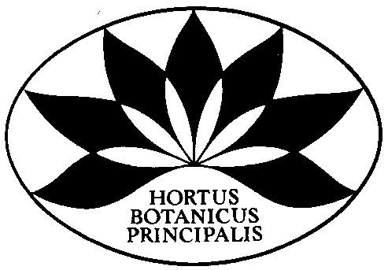

## Tsitsin Main Botanical Garden

Founded in 1945 the Main Botanical Garden is one of the largest botanical gardens in Europe. In 1991, the Garden was renamed after Academician Nikolai Vasilyevich Tsitsin (1898-1980), an outstanding botanist, geneticist and breeder, twice Hero of Socialist Labour, laureate of the Lenin and State Prizes, who led the Garden from the day of its foundation for 35 years.\
The garden covers an area of​331.49 hectares; its collection includes than 18 thousand named plants and are considered a national treasure of Russia. GBS RAS is a unique scientific institution. As a scientific centre, GBS RAS conducts fundamental and applied research in the field of botany and environmental protection. 

Find out more at [http://​www​.gbsad​.ru](http://www.gbsad.ru/)

Visit [Tsitsin Main Botanical Garden's website.](http://www.gbsad.ru/)

Located in: Moscow, Russia

### Associated WFO Contacts:

-   [Misha Ignatov](mailto:) (Council Member)