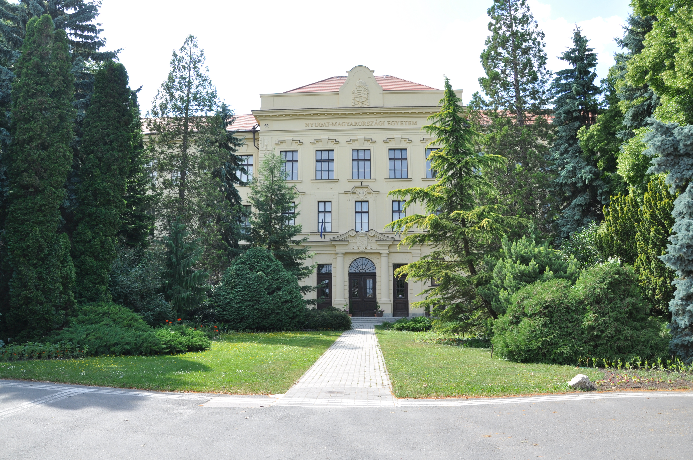
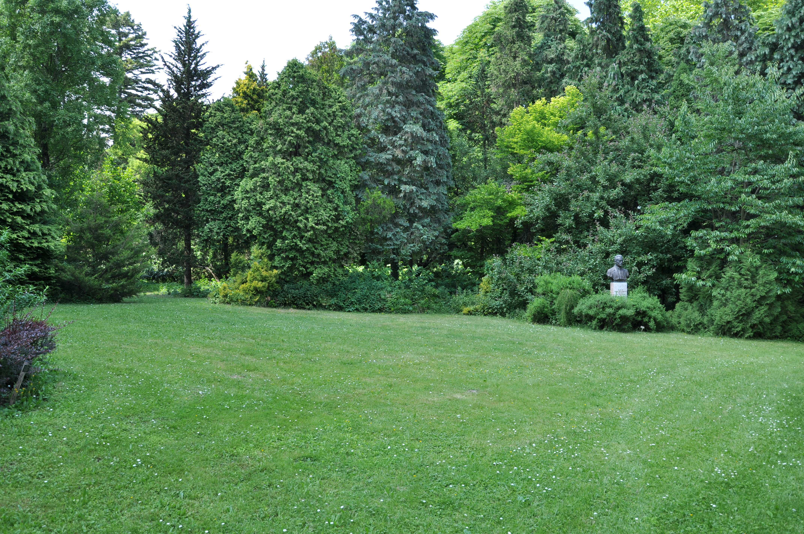
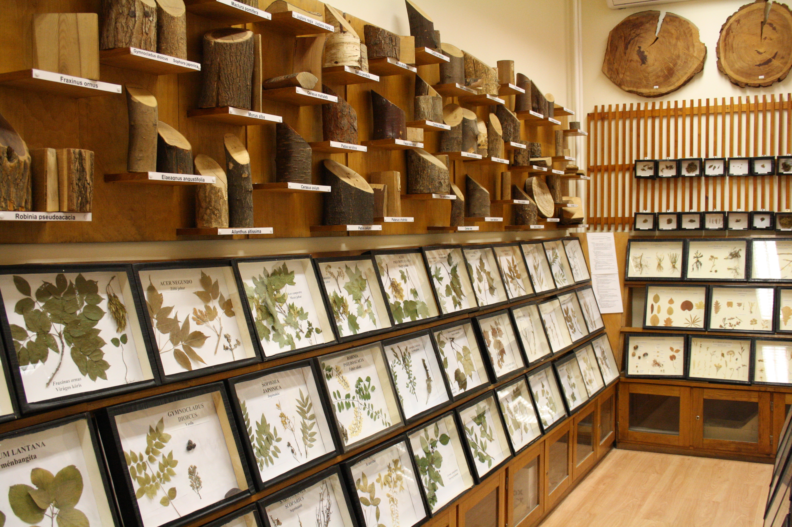

## University of Sopron

Entrance of the University © Soproni Egytem

The predecessor of the University of Sopron was founded in 1735 in Banská Štiavnica (today Slovakia). The institution moved to its present location in Sopron in 1918. The university buildings are housed in a 17-hectare botanical garden, which construction began in 1923. There are about 1,600 dendrotaxa in the botanical garden. The Department of Botany primarily serves the education of forest engineering and nature conservation engineering, which is also assisted by a herbarium. One of the main research areas of the department is the recording of the distribution data of vascular plant species in Hungary in the Central European flora mapping system. A grid square map database of about 2,400 plant species has been built, containing more than 1.1 million records ([http://​flo​raat​lasz​.uni​-sopron​.hu](https://floraatlasz.uni-sopron.hu/)). The other main research area is the study on taxonomic, area geographic, ecological and conservation biological aspects of dendrotaxa in Hungary.

Detail of the Botanical Garden © Soproni Egyetem

Herbarium of Institute of Botany and Nature Conservation © Soproni Egyetem

Visit [University of Sopron's website.](http://uni-sopron.hu/)

Located in: Sopron, Hungary

### Associated WFO Contacts:

-   [Bartha Denes](mailto:bartha.denes@uni-sopron.hu) (Council Member, Taxonomic Working Group Member)