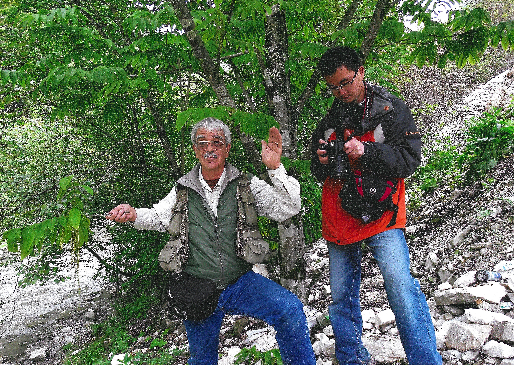
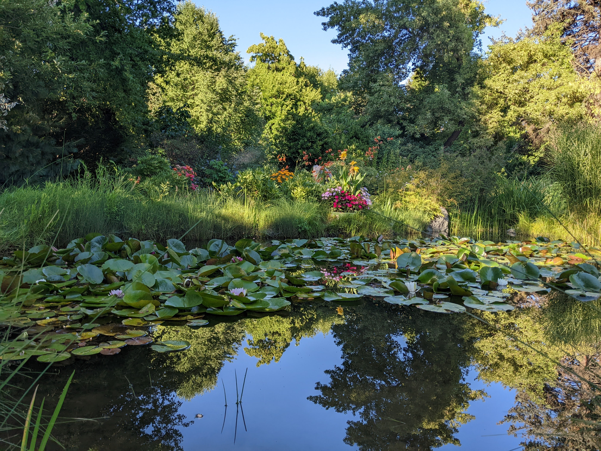
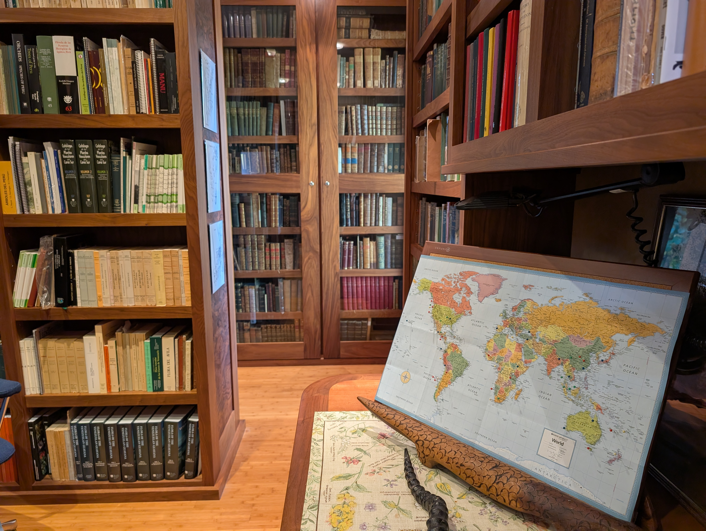
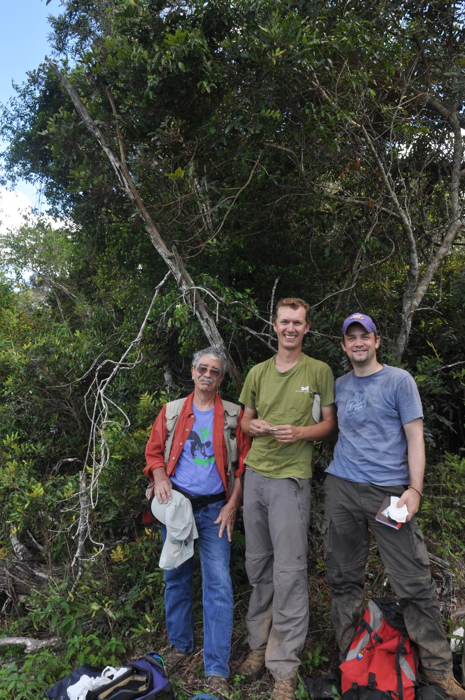

## Flora of the World Foundation

[*Flora of the World*](https://floraoftheworld.org/)  is dedicated to documenting the diversity of flowering plant families in their native environments, with a special focus on global biodiversity hotspots. Through the combined use of digital imagery and carefully collected physical specimens, the project aims to capture the morphological, ecological, and geographic context of the world's flowering plants. The project also aims to record botanical garden inventories worldwide.

### Our History

*Flora of the World* was founded by the late [Dr. Christopher Davidson](https://annals.mobot.org/index.php/annals/article/view/858/731) (1944--2022), an Idaho-born botanist and passionate advocate for global plant exploration and conservation. Over more than 25 years, Dr. Davidson and his wife, Sharon Christoph, traveled to 45 countries---many of them multiple times---to document flowering plants *in situ* and to support botanical research and conservation efforts around the world.

Dr. Christopher Davidson collecting *Pterocarya macroptera*  (Juglandaceae; [*Boufford, et al. 43722*](https://floraoftheworld.org/occurrences/e62f8b2f-e563-3253-9162-48093564bf09)) in China, together with Dr. Yun-Dong Gao.

In addition to his field-based work, Dr. Davidson played a significant role in advancing botanical education and conservation in Idaho. He founded the [Idaho Botanical Garden](https://www.idahobotanicalgarden.org/) (Boise, Idaho, USA), creating a community resource dedicated to plant conservation, public engagement, and education. Dr. Davidson and Sharon Christoph also privately own two botanical gardens---one in Boise and one in McCall (Idaho, USA)---which serve as living collections that reflect their shared commitment to safeguarding and celebrating plant diversity.

Private, family-owned botanical garden in Boise (Idaho, USA)

### Our Collection

Today, the *Flora of the World* database includes:

-   232,000+ digital images, with more than 80,000 additional images awaiting processing
-   13,000+ documented occurrences, most paired with herbarium specimens held in collections worldwide
-   Verified observations spanning 480 families, 4,524 genera, and more than 6,000 species

Each occurrence is represented by an average of 14 detailed photographs, capturing key diagnostic features, habitat context, and morphological variation. This level of documentation makes *Flora of the World* an exceptional resource for taxonomists, ecologists, conservation biologists, and educators.

### Supporting Research & Conservation

To enrich this photographic record, Dr. Davidson also built an exceptional private library of natural history, botanical, and rare books that provides essential taxonomic and ecological context. A long-term goal of the project is to integrate this library with the digital image database, broadening its value as a research and educational tool.

Botanical library established by Dr. Christopher Davidson to support the *Flora of the World* project.

*Flora of the World* has been made possible through the collaboration of plant collectors, herbaria, and botanical institutions worldwide. To acknowledge and highlight these vital contributions, the project provides:

-   Individual collector profiles (e.g., [Dr. Davidson](https://floraoftheworld.org/persons/1b9d6e6e-b26a-3167-938b-15db6eb6ddb4)), linked to documented occurrences and associated publications
-   A [publication](https://floraoftheworld.org/publications) database showcasing research that incorporates *Flora of the World* data or has been conducted in collaboration with our team
-   [Institutional](https://floraoftheworld.org/institutions) webpages dedicated to partner herbaria, gardens, and research organizations, recognizing their contributions and helping connect their work to a global audience

These features underscore our commitment to transparency, collaboration, and accessibility within the global botanical community.

### Keeping the Mission Alive

In 2024, the [Dr. Christopher Davidson Endowed Chair in Botany](https://unbridled.boisestate.edu/story/boise-state-names-prof-sven-buerki-first-davidson-endowed-chair-of-botany/) was established at[Boise State University](https://www.boisestate.edu/) (Idaho, USA), creating a lasting home for the mission Dr. Davidson began. This endowed position advances botanical education, research, and international collaborations.

The inaugural Davidson Chair is Associate Professor [Sven Buerki](https://floraoftheworld.org/persons/79d98357-8e57-370f-98b9-15077cb31df5), whose prior research at the Royal Botanic Gardens, Kew, and the Natural History Museum in London focused on plant collecting, systematics, and the evolution of flowering plants---especially within biodiversity hotspots. His work has contributed to the formal classification of one plant family, four genera, and 33 species.

Dr. Buerki participated in numerous field expeditions with Dr. Davidson and Sharon Christoph, forming a close scientific partnership and friendship. Continuing this mission is both a professional commitment and a personal honor.

Drs. Christopher Davidson, Martin Callmander, and Sven Buerki standing in front of *Podonephelium davidsonii* in New Caledonia

### Our Contribution to World Flora Online and the Broader Community

By providing high-quality, field-based documentation of flowering plants---including material from remote, vulnerable, and under-studied regions---*Flora of the World* directly supports the shared vision of creating an accessible, and scientifically robust global flora.

Our images, herbarium specimens, and associated metadata contribute to:

-   taxonomic research and species discovery
-   conservation assessments and Red List evaluations
-   botanical garden curation and collection management
-   public education and outreach

Through our ongoing collaboration with World Flora Online and partner institutions, *Flora of the World* aims to advance plant science and help safeguard the planet's botanical diversity for generations to come. By sharing data, expertise, and a deep commitment to global collaboration, we seek to inspire greater appreciation, understanding, and stewardship of plant life worldwide.

Visit [Flora of the World Foundation's website.](http://floraoftheworld.org/)

Located in: Boise, Idaho, USA