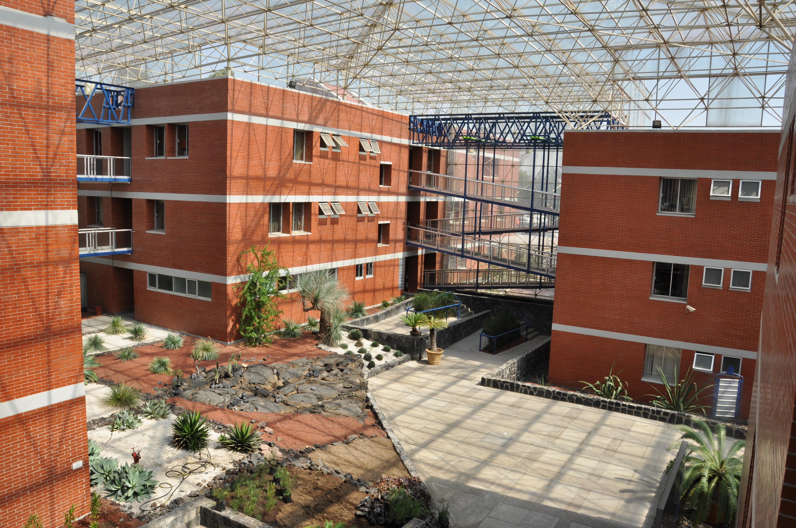
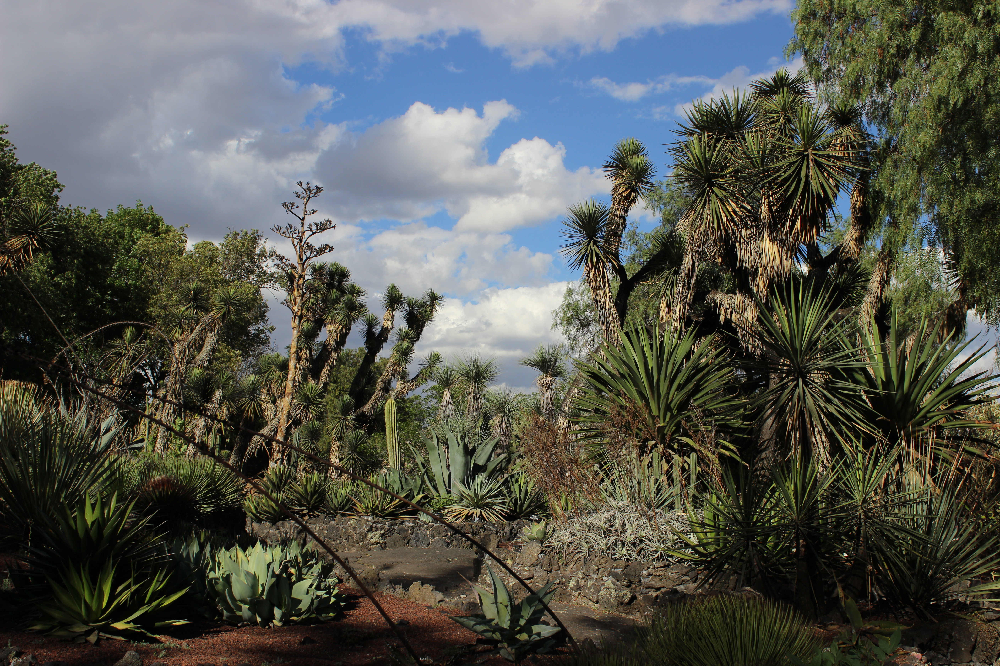
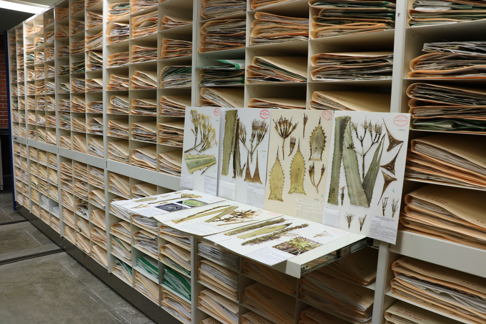

## Instituto de Biología, Universidad Nacional Autónoma de México (UNAM)

The Biology Institute of the Mexico's Autonomous National University in Mexico City consists of the Botany and Zoology Departments in the central buildings (Figure 1), next to its Botanical Garden (Figure 2), and nearby a natural-history museum in the Pabellón Nacional de la Biodiversidad. In addition, it includes two field stations on either coast of Mexico. The National Herbarium of Mexico (MEXU), with over 1.5 million herbarium specimens and growing (Figure 3), belongs to the Botany Department and is housed also in the central buildings. Research focuses on diversity, systematics, evolution and genomics, as well as geographic distribution and conservation of plant and fungus species.

Central buildings of the Biology Institute, with the Botany Department and the National Herbarium of Mexico (MEXU). © UNAM

Drought-adapted plants at the Botanical Garden of the Biology Institute. © UNAM

The Botany Department has its origin in a similar department at the Instituto Médico Nacional, founded in 1888 and already with an herbarium. In 1915, the Instituto Médico Nacional was fused with two museums, and that new institution was transformed in 1929 into UNAM's Biology Institute. The staff of the Botany Department consists currently of 26 research fellows and 24 academic technicians. Research is centered largely around the collections of the National Herbarium of Mexico (MEXU), which is the largest botanical collection in Mexico, one of the largest in the Neotropics, and of international scope. The vascular plants' section does not only contain the standard herbarium specimens, but also subcollections of fruits and seeds, wood, DNA samples, and historical items. In addition to vascular plants, there are collections of bryophytes (liverworts, hornworts and mosses), algae, fungi, and lichens.

The digitalization of all specimens is still in progress, but a large number can already be consulted at UNAM's Datos Abiertos ([https://​datosa​bier​tos​.unam​.mx/​b​i​o​d​i​v​e​r​s​idad/](https://datosabiertos.unam.mx/biodiversidad/)) and IBdata ([https://​www​.ibda​ta​.aba​co3​.org/​w​e​b​/​c​o​l​e​c​c​i​o​n​e​s.php](https://www.ibdata.abaco3.org/web/colecciones.php)). The Botany Department is participating in several important flora projects, in particular *Flora Mesoamericana* ([http://​www​.mobot​.org/​m​o​b​o​t/fm/](http://www.mobot.org/mobot/fm/)), *Flora del Valle de Tehuacán-Cuicatlán* ([http://​www​.ibi​olo​gia​.unam​.mx/​F​lora/](http://www.ibiologia.unam.mx/Flora/)), and recently the creation of an electronic flora project covering all of Mexico, called *eFloraMEX* ([https://​eflo​ramex​.ib​.unam​.mx/](https://efloramex.ib.unam.mx/)).

The National Herbarium of Mexico (MEXU) with over 1.5 million herbarium specimens. © UNAM

Visit [Instituto de Biología, Universidad Nacional Autónoma de México (UNAM)'s website.](https://ib.unam.mx/)

Located in: Ciudad de México (CDMX)