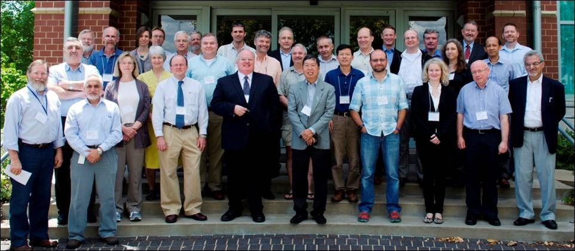
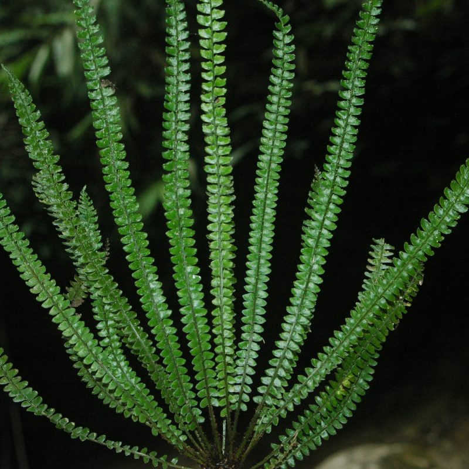
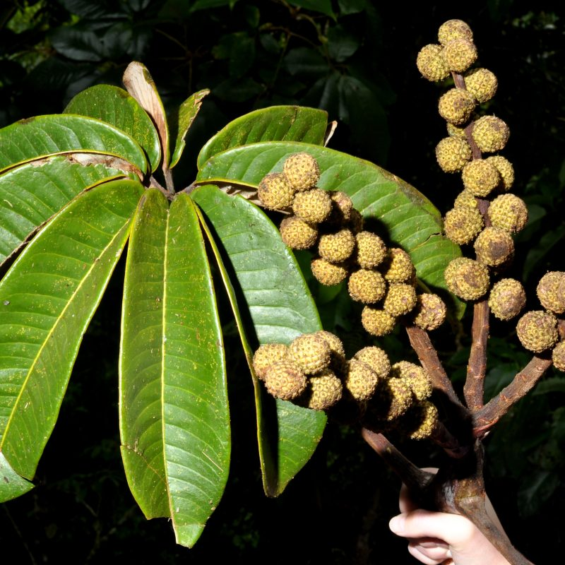
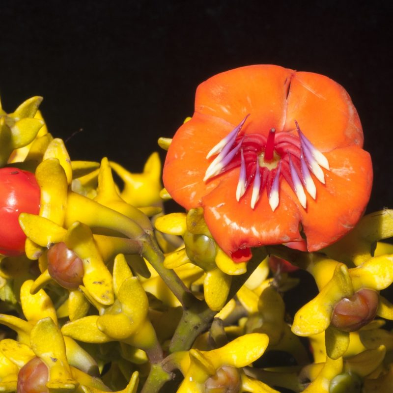

## Missouri Botanical Garden

__The oldest continually operating botanical garden in the United States, the Missouri Botanical Garden was founded and opened to the public in 1859 and aims to "Discover and share knowledge about plants and their environment in order to preserve and enrich life."__

Public programs at the Garden attract more than a million visitors annually and include a vast array of horticultural displays, including 27,000 species in the living collection, and a wealth of education programs. The Garden is also an unparalleled resource for the research and conservation communities with an herbarium of 7.5 million plant specimens, a library with 250,000 books and other resources, and TROPICOS, the most consulted botanical database in the world with information on 1.3 million plant names, 4.87 million plant specimens, all associated with 150,000 references. These resources support a vibrant research program in plant systematics, ecology, and conservation biology.

Garden scientists work to achieve the primary goals of the Global Strategy for Plant Conservation (GSPC). Researchers seek a more comprehensive and thorough knowledge of the plant world, but also work to use the information gathered to inform and advance efforts to conserve the world's plant diversity. Garden participation in the World Flora Online is aligned with the first target of the GSPC, ​"An online flora of all known plants." This goal is an essential first step toward conserving the full range of plant diversity as without a comprehensive list of plant species, it would be impossible to achieve target 2, ​"An assessment of the conservation status of all known plant species, as far as possible, to guide conservation action."

2012 WFO Organising Committee

Garden scientists are engaged in work that directly supports the goals of the World Flora Online. Each year, Garden scientists describe an average of about 200 species that are new to science. They are regularly involved in systematic surveys of particular plant groups or plants from a specific region, exactly the kind of information needed to ensure that the World Flora Online has the most authoritative opinion on the classification of different plant groups. This basic information generated by studies in plant systematics is critical for guiding conservation efforts so that they can be effective and efficient.

#### Garden Scientists contributing and reviewing the content for various plant groups include:

-   Anacardiaceae -- Armand Randrianasolo, Curator, William L. Brown Center
-   Araceae -- Thomas B. Croat, P. A. Schulze Curator of Botany; Monica Carlson, Assistant Scientist
-   Araliaceae -- Pete Lowry, Head, Africa and Madagascar Department
-   Asteraceae -- John Pruski, Associate Curator
-   Berberidaceae -- Carmen Ulloa, Curator
-   Boraginales -- Jim Miller, Senior Vice President for Science and Conservation
-   Brassicaceae -- Ihsan Al-Shehbaz, Curator Emeritus
-   Bryophytes -- John Brinda, Assistant Scientist
-   Iridaceae -- Peter Goldblatt -- Curator Emeritus
-   Lauraceae -- Henk van der Werff, Curator Emeritus
-   Lythraceae -- Shirley Graham, Research Associate
-   Melastomataceae -- Carmen Ulloa, Curator
-   Onagraceae -- Peter Hoch, Curator
-   Poaceae -- Gerrit Davidse, Curator Emeritus
-   Pteridophytes -- Libing Zhang -- Associate Curator
-   Rubiaceae -- Charlotte Taylor, Curator

----

----

Visit [Missouri Botanical Garden's website.](http://www.missouribotanicalgarden.org/)

Located in: St. Louis, Missouri, USA

### Associated WFO Contacts:

-   [John J. Atwood](mailto:) (TEN Focal)
-   [John Brinda](mailto:john.brinda@mobot.org) (TEN Focal, Taxonomic Working Group Member)
-   [Gunter A. Fischer](mailto:) (Council Member, Taxonomic Working Group Member)
-   [Sunitha Katabathuni](mailto:) (Technical Working Group Member)
-   [James Miller](mailto:james.miller@mobot.org) (TEN Focal)
-   [Charles K. Miller, Jr.](mailto:) (Technical Working Group Co-Chair)
-   [Peter Phillipson](mailto:Peter.Phillipson@mobot.org) (TEN Focal)
-   [Carmen Puglisi](mailto:) (TEN Focal)
-   [William Ulate Rodríguez](mailto:) (WFO Gatekeeper, Technical Working Group Member)
-   [Paul Smock](mailto:) (Technical Working Group Member)
-   [Richelle Weihe](mailto:m) (Communications Working Group Member)
-   [Peter Wyse Jackson](mailto:) (Council Co-Chair, Taxonomic Working Group Member, Communications Working Group Member)

### Associated Taxonomic Expert Networks (TENs):

-   [Ebenaceae](https://about.worldfloraonline.org/tens/ebenaceae)
-   [Sarcolaenaceae & Sphaerosepalaceae - Endemic Plant Families of Madagascar](https://about.worldfloraonline.org/tens/endemic-plant-families-of-madagascar)
-   [The Bryophyte Nomenclator](https://about.worldfloraonline.org/tens/bryophytesten)