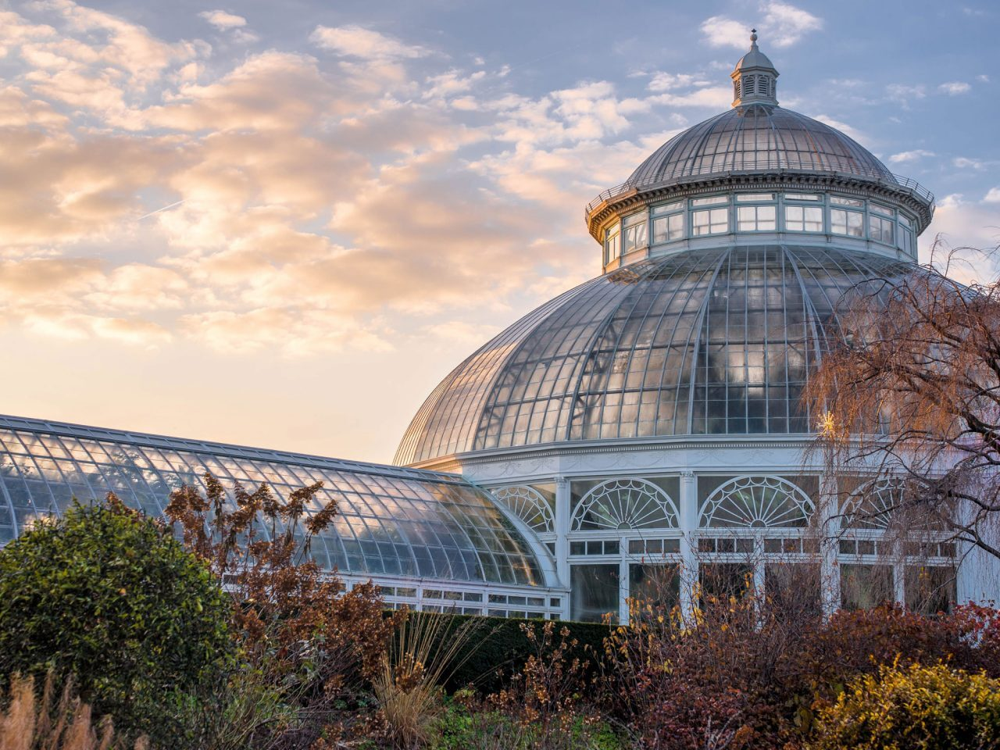

## New York Botanical Garden

The New York Botanical Garden is an advocate for the plant kingdom. The Garden pursues its mission through its role as a museum of living plant collections arranged in gardens and landscapes across its National Historic Landmark site; through its comprehensive education programs in horticulture and plant science; and through the wide-ranging research programs of the International Plant Science Center.

Find out more here [https://​www​.nybg​.org/](https://www.nybg.org/)

Established in 1891, The New York Botanical Garden (NYBG) is distinguished by the beauty of its landscape, collections, and gardens, and the scope and excellence of its programs in horticulture, education, and science. NYBG was inspired by an 1888 visit that eminent botanists Nathaniel Lord Britton and his wife, Elizabeth, took to the Royal Botanic Gardens, Kew, near London. The Brittons believed New York should have a great botanical garden to advance public understanding of plants, be a repository of rare and valuable specimens, and lead original research in botanical science. Because of its picturesque terrain, freshwater Bronx River, rock-cut gorge, and 50 acres of old-growth forest, the Garden was sited on the northern half of Bronx Park.

Today, the 250-acre Garden---the largest in any city in the United States---is a National Historic Landmark. In addition to the natural attributes that attracted the Brittons, NYBG encompasses 50 specialty gardens and collections comprising more than one million plants, the Nolen Greenhouses for Living Collections, and the Enid A. Haupt Conservatory, the nation's preeminent Victorian-style glasshouse. Highlights include the award-winning Peggy Rockefeller Rose Garden, considered among the world's most sustainable rose gardens; the Native Plant Garden, celebrating the diversity of northeastern North American plants; and 30,000 distinguished trees, many more than 200 years old. More than one million visitors annually enjoy the grounds, view innovative exhibitions, and participate in educational programs that are larger and more diverse than those of any other garden in the world.

From its earliest days, NYBG has also been driven by a mission to conduct basic and applied research on the plants of the world with the goal of protecting and preserving them. Currently, 100 Ph.D.-level scientists are engaged in 250 international collaborations in 49 countries. NYBG is one of the top two freestanding botanical gardens in the world where plant and fungal research is conducted, thanks to the resources of the International Plant Science Center, the William and Lynda Steere Herbarium, and the LuEsther T. Mertz Library. The second largest in the world, the Steere Herbarium houses 7.8 million plant specimens, representing all groups of plants and fungi from around the world, with strength in the flora of the Americas. The LuEsther T. Mertz Library is the largest botanical and horticultural library in the Western Hemisphere, with more than 11 million archival items spanning 10 centuries.

During the 129 years since its founding, NYBG has carefully stewarded a stunning urban oasis, created one of the world's most comprehensive plant research and conservation programs, amassed unrivaled research collections, and, as a living museum, taught millions of visitors of all ages to love and respect the plants of the world.

The New York Botanical Garden is committed to preserving and protecting the planet's biodiversity and natural resources and enhancing human well-being by educating, training, and empowering the next generation of Earth's caregivers---in partnership with both local and global communities.

Visit [New York Botanical Garden's website.](https://www.nybg.org/)

Located in: New York, NY, USA

### Associated WFO Contacts:

-   [Ana Maria Bedoya](mailto:) (TEN Focal)
-   [Mauricio Diazgranados](mailto:mdiazgranados@nybg.org) (Council Member)
-   [Fabian Michelangeli](mailto:fabian@nybg.org) (Taxonomic Working Group Co-Chair, TEN Focal)
-   [Wayt Thomas](mailto:wthomas@nybg.org) (TEN Focal)

### Associated Taxonomic Expert Networks (TENs):

-   [Melastomataceae - Melastomataceae.net](https://about.worldfloraonline.org/tens/melastomataceae-net)
-   [Picramniaceae](https://about.worldfloraonline.org/tens/picramniaceae)
-   [Podostemaceae - Riverweed Network](https://about.worldfloraonline.org/tens/podostemaceae)