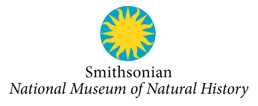

## Smithsonian National Museum of Natural History

The Smithsonian Institution is the world's largest museum, education, and research complex, with 19 museums and the National Zoo---shaping the future by preserving our heritage, discovering new knowledge, and sharing our resources with the world.

The Institution was founded in 1846 with funds from the Englishman James Smithson (1765--1829) according to his wishes ​"under the name of the Smithsonian Institution, an establishment for the increase and diffusion of knowledge." We continue to honor this mission and invite you to join us in our quest.

Find out more at [http://​nat​u​ral​his​to​ry​.si​.edu](http://naturalhistory.si.edu/)

Our mission is to promote understanding of the natural world and our place in it. The museum's collections tell the history of the planet and are a record of human interaction with the environment and one another.

As we all work to shape a sustainable world, this record becomes the starting point. It is our guidebook to how the future can look and work.

Because of the boundless curiosity of our researchers, the breadth and depth of our scientific collections, and our ability to inspire future generations of scientists, we have a vital role to play. Here people can both discover the world and learn to become better stewards of it.

On any given day, our scientists conduct research in our laboratories and at sites around the globe. Boundless curiosity drives them to explore Earth, the species that depend upon it, the cultures that inhabit it, and the forces that alter it. Their work underpins our understanding of critical issues of our time, from conservation to public health, climate change to food security.

We steward a collection of 145 million specimens and artifacts. Each one reflects a moment in space and time; in these moments we find Earth's story. And our researchers continue to glean critical new information from these objects. These discoveries about the past help us model and anticipate the future.

Our exhibits, our educational programs, and our staff and volunteers share our collections and the knowledge drawn from them with millions of visitors every year -- deepening their appreciation for science, the natural and cultural world, and the challenges of our time

Visit [Smithsonian National Museum of Natural History's website.](http://naturalhistory.si.edu/)

Located in: Washington, DC, USA

### Associated WFO Contacts:

-   [Robert J. Soreng](mailto:)
-   [Warren Wagner](mailto:sm) (Council Member)

### Associated Taxonomic Expert Networks (TENs):

-   [Poaceae](https://about.worldfloraonline.org/tens/grassbase)