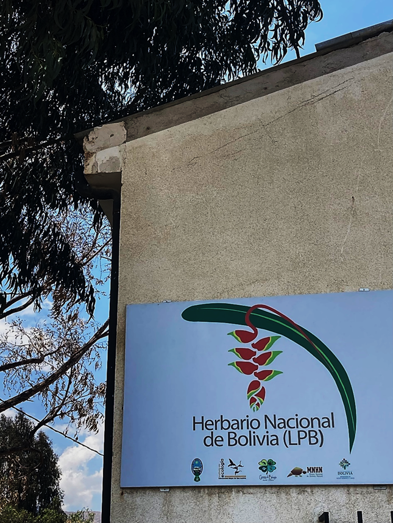

## Herbario Nacional de Bolivia (LPB)

The Herbario Nacional de Bolivia with the acronym LPB (referring to La Paz, Bolivia) was constituted on the basis of a collaboration agreement signed between the Universidad Mayor de San Andrés and the Academia Nacional de Ciencias de Bolivia in January 1984, and its creation was supported by the Organisation for Neotropical Flora. Both entities that assume the role of research and documentation of the Bolivian flora are the Instituto de Ecología through the plant ecology and botany unit at the University and it has also developed a living collection of plants under the Jardín Botánico La Paz mostly specialised in the flora of the dry inter-Andean valleys. While the executing counterpart is the Museo Nacional de Historia Natural. With this LPB agreement, the largest scientific botanical collection in the country was created with 330,000 herbarium specimens, which are managed in a Brahms database. Since LPB's creation, this herbarium has been located on the university campus as a national and international reference. 

The Herbario Nacional de Bolivia

Vascular plants are organised according to APG IV with the information gathered for the «Catálogo de las Briofítas de Bolivia (2009)», «Catálogo de las Plantas Vasculares de Bolivia (2014)», «Flora de las palmeras de Bolivia (2020)», among others. There are also collections of lichens, fungi, mosses & liverworts, ferns and related groups, gymnosperms, etc. Along this 40 years, LPB has a staff of seven permanent researchers, as well as 10--15 associate researchers and 20 undergraduate and master's thesis students.

Inside the LPB Herbarium

### LPB resources

-   [Sociedad Boliviana de Botánica](https://sbb.org.bo/herbarios/herbario-nacional-lpb/)
-   [FaceBook](https://www.facebook.com/herbariolpb/about/?_rdr)

Located in: La Paz, Bolivia

### Associated WFO Contacts:

-   [Mónica Moraes R.](mailto:) (Council Member)