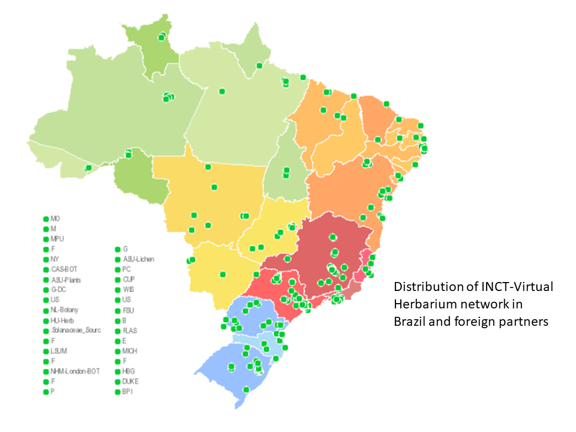
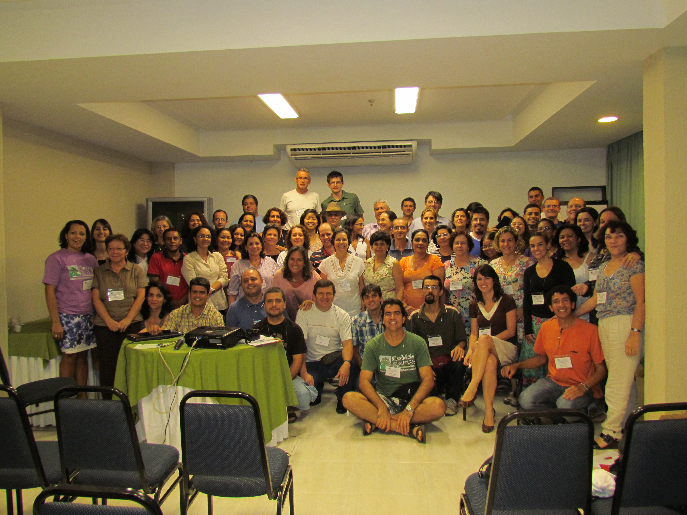
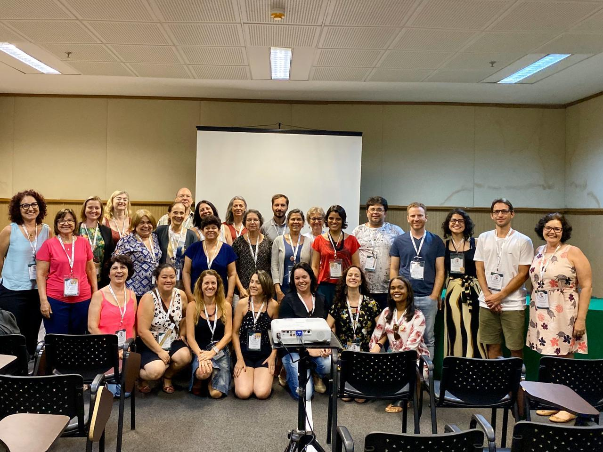

## Instituto Nacional de Ciência e Tecnologia (INCT) Virtual Herbarium

### Mission

The INCT-Virtual Herbarium provides a data infrastructure with open access, integrating information from Brazilian herbarium collections and from collections made in Brazil and deposited in other countries.

### Background

The National Institutes of Science and Technology (INCT) integrate a program that brings together the best and most prominent research groups active in areas of strategic importance for sustainable development in Brazil. One of those research groups, the INCT-Virtual Herbarium, has its coordinating center at the Federal University of Pernambuco, with 135 partner herbaria in all states of the country and 31 in Europe and USA. These herbaria are linked together in a network, providing data on the diversity of Brazilian algae, fungi, and vascular plants. ([http://​inct​.splink​.org​.br/​s​h​o​w​N​e​t​w​o​r​k​?​+​2​0​2​1​9​9​9​9​+​P​l​antas](http://inct.splink.org.br/showNetwork?+20219999+Plantas))

INCT herbaria network map

Brazil's plants and fungi are a scientific, economic and cultural heritage, which must be recognized scientifically, preserved, and sustainably used. Of the almost 47,000 algae, fungi and plant species currently known to occur in Brazil, more than half (55%) occur only in Brazil, and ca. 6% are already threatened with extinction (Flora do Brasil 2020). 

There are ca. 200 active herbaria in Brazil ([https://​www​.botan​i​ca​.org​.br/​c​a​t​a​l​o​g​o​-​d​a​-​r​e​d​e​-​b​r​a​s​i​l​e​i​r​a​-​d​e​-​h​e​r​b​a​rios/](https://www.botanica.org.br/catalogo-da-rede-brasileira-de-herbarios/)), which together hold more than eight million collections, predominantly dried mounted specimens, which represent 2.3% of the total specimens in collections around world. Most herbaria of the country are located in the south and southeastern regions where the largest collections are also situated. The National Museum, the oldest herbarium in Brazil, founded in 1831, has a collection estimated at 550,000 specimens including 7,092 nomenclatural types. Less than 20 Brazilian herbaria have more than 100,000 specimens, and the majority of the country's herbaria (almost 65%) have fewer than 20,000 specimens (Maia et al. 2015). 

Herbaria can share their data online individually, but with advancing information and communication technologies, the concept of a virtual herbarium has been broadened and today involves collaborating networks consisting of an e‑infrastruture of data and applications accessible to the public. The Virtual Herbarium thus defined is more sustainable and increases the use and importance of all the holdings for education, scientific development, and the implementation and monitoring of public policies (Canhos at al. 2015). 

At its beginning in 2009, the INCT-Virtual Herbarium brought together 25 Brazilian herbaria and the *species*Link network shared the information of 48 Brazilian plant and fungal databases online (one herbarium can share more than one data set, e.g. collections of plant, fungi, fruits, and wood), and that of two US herbaria. Today the project includes data from 135 Brazilian herbaria and 31 herbaria in other countries, which hold collections originating in Brazil and adjacent countries. This creates a national virtual herbarium with 232 data sets, sharing ca. 11 million records. This number reflects the work of many teams from herbaria which have studied the specimens, checked and interpreted the label data --- many hand-written, transcribed them into databases, and mirrored their own databases in the herbarium network of INCT-Virtual Herbarium. 

The INCT-Virtual Herbarium is not only a data aggregator but also an active and integrated community with common objectives. These include the free sharing of good quality data, the strengthening and recognition of the role of herbaria in documenting knowledge of the plants and fungi, personnel training, and the development of applications and tools for identifying knowledge gaps and to determine ecological niche models to help plan new collecting expeditions. 

Participants of the International Conference "INCT Virtual Herbarium of Flora and Funga and e-infrastructures for Biodiversity" held in Recife, Pernambuco, Brazil, in April 2012.

Meeting with curators during the 70th National Botany Congress, held in Maceió, in October 2019.

Visit [Instituto Nacional de Ciência e Tecnologia (INCT) Virtual Herbarium's website.](http://inct.florabrasil.net/)

Located in: Recife, Brazil

### Associated WFO Contacts:

-   [Leonor Costa Maia](mailto:) (Council Member)