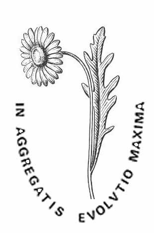
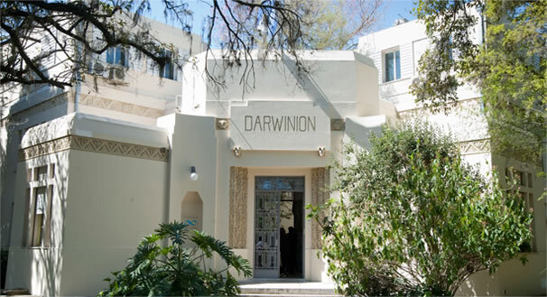

## Instituto de Botánica Darwinion

The Instituto de Botánica Darwinion was founded in 1911 by Dr. Cristóbal Hicken, a renowned scientist and member of the National Academy of Sciences, Argentina (ANCEFN). Formally funded by the ANCEFN since 1936, and as a joint institution with the National Council for Scientific and Technological Research (CONICET) since 1970, Darwinion Institute has been dedicated to botanical research, being one of the leader institutions in the study of the Argentinean Flora since its very foundation. After a century of growth and development, Darwinion Institute involves about 50 people, including researchers, technicians, and PhD students, producing original research in Systematics (both alpha and molecular), Structure and Development, Cytogenetics, Archaeobotany, Phyto- and Phylogeography of Vascular Plants. The herbarium houses about 750,000 vouchers, the library keeps 12,000 books and 30,000 periodical issues, the server center holds the ​"Catálogo de las Plantas Vasculares del Conosur" and ​"Flora Argentina" databases.

Find our more at [http://​www​.dar​win​.edu​.ar](http://www.darwin.edu.ar/)

Visit [Instituto de Botánica Darwinion's website.](http://www.darwin.edu.ar/)

Located in: Buenos Aires, Argentina

### Associated WFO Contacts:

-   [Fernando Zuloaga](mailto:) (Council Member)