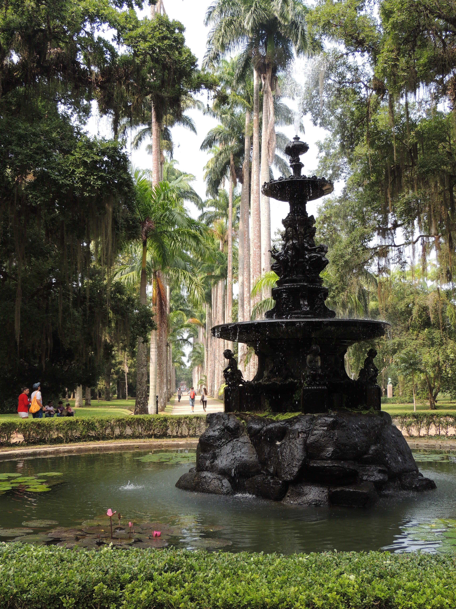
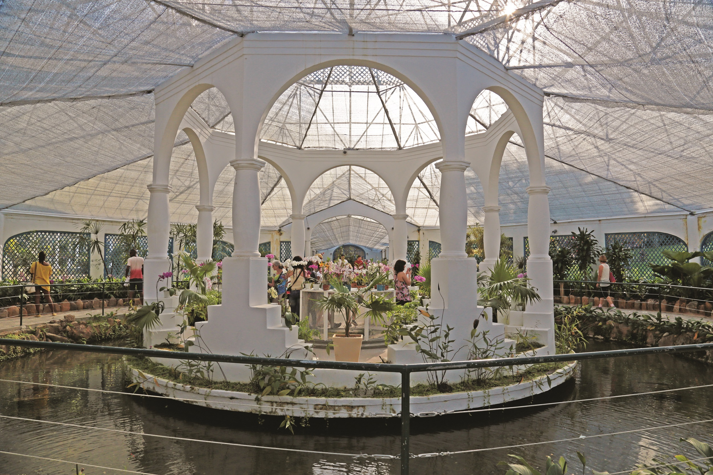
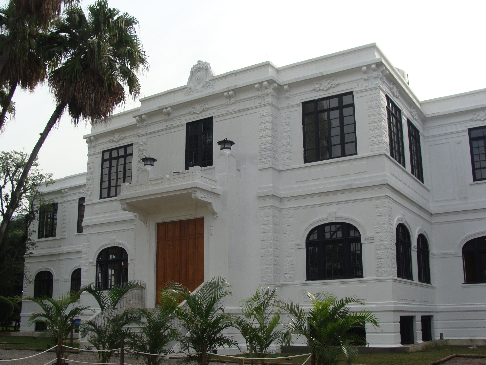

## Instituto de Pesquisas Jardim Botânico do Rio de Janeiro

The Rio de Janeiro Botanical Garden (JBRJ), under the Brazilian Ministry of Environment, is a research center in the fields of botany and biodiversity conservation. It also offers cultural and leisure activities, environmental education and a social and environmental responsibility program. Learn more at [gov​.br/jbrj](http://gov.br/jbrj)

JBRJ was created in 1808 as part of the Portuguese project of acclimatizing the so-called spices from the East. Nowadays, its mission is to promote, carry out and disseminate scientific research, with focus on Brazilian flora, aiming at the conservation and valuation of biodiversity, as well as carrying out activities that promote the integration of science, education, culture and nature.

Chafariz das Musas

JBRJ is famous for the exuberance and the scientific importance of its plant collection, as well as for the beauty of its landscapes. Its bicentennial history is expressed in its monuments, buildings and artworks. The Garden receives 1 million visitants a year, in average. They can walk along the alleys to see plants from all over the word, visit the greenhouses (Orchids, Bromelias, Ferns, Insectivorous Plants) and the thematic gardens and collections

Orquidario © Ana Huara

The herbarium (RB) has over 850,000 specimens of all plants and fungi groups, with approximately 20,000 new samples incorporated annually. The herbarium coordinates two major projects: the Herbário Virtual-Reflora, a partnership with other herbaria abroad and in Brazil, and the Flora do Brasil Online 2020 (Brazilian Flora Online 2020), which is publishing the descriptions and images of all the species of Brazilian plants and fungi recorded by scientists. It has also contributed to the WFO since 2012.

The National Center for Flora Conservation (CNCFlora), under JBRJ's Research Department, is a national reference in generation, coordination and dissemination of information on biodiversity and conservation of endangered flora, having released the Red Book of the Brazilian Flora in 2013.

Museu do Meio Ambiente © Raul Ribeiro

#### JBRJ Resources

-   [Website](http://www.jbrj.gov.br/)
-   [Facebook](https://facebook.com/JardimBotanicoRJ)
-   [Twitter](https://twitter.com/J_Botanico_RJ)
-   [Instagram](https://instagram.com/jardimbotanicorj)

Visit [Instituto de Pesquisas Jardim Botânico do Rio de Janeiro's website.](http://gov.br/jbrj)

Located in: Rio de Janeiro, Brazil

### Associated WFO Contacts:

-   [Eduardo Dalcin](mailto:) (Council Member, Taxonomic Working Group Member, Technical Working Group Member, Communications Working Group Member)
-   [Rafaela Forzza](mailto:) (Taxonomic Working Group Member)