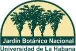
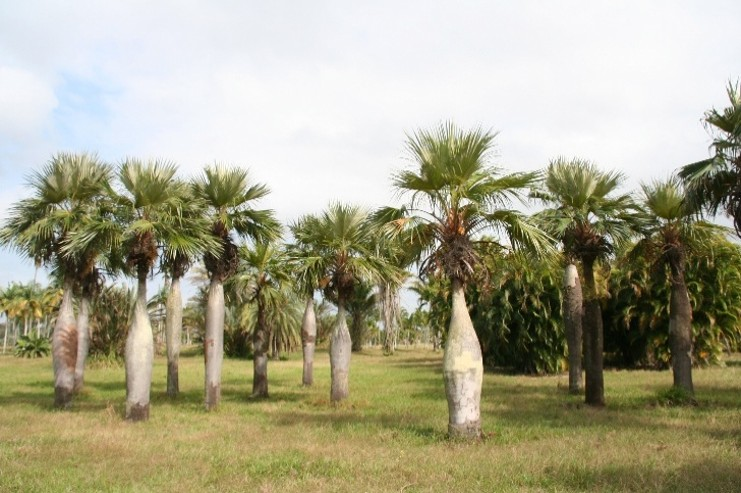
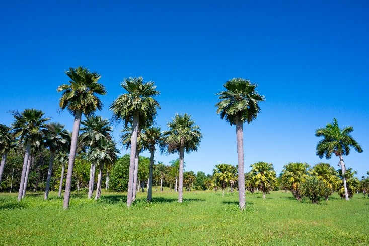
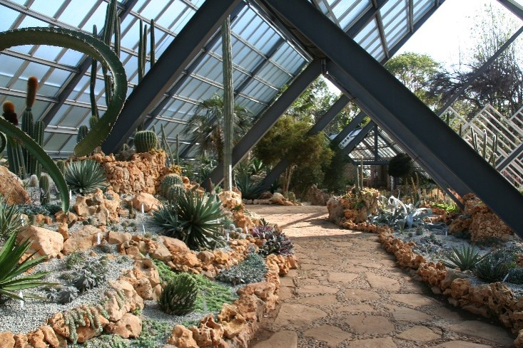
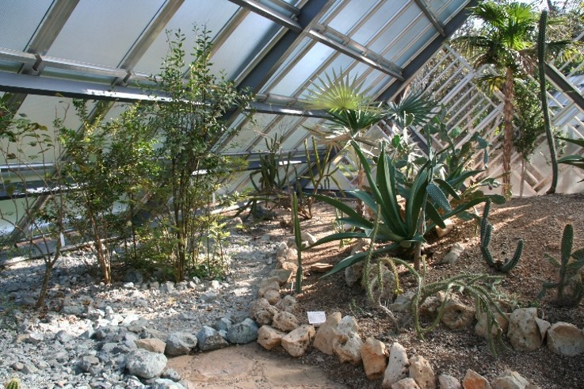
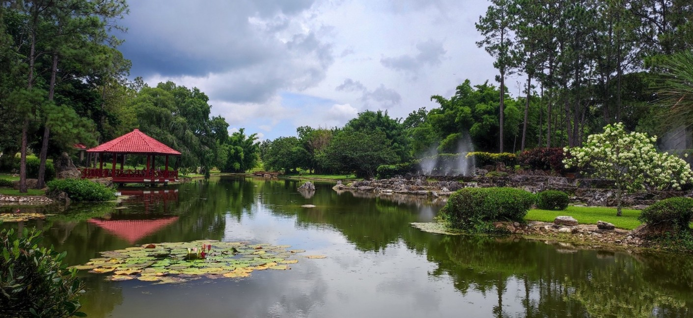
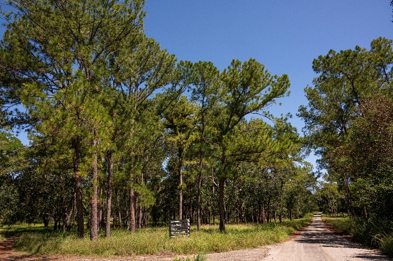
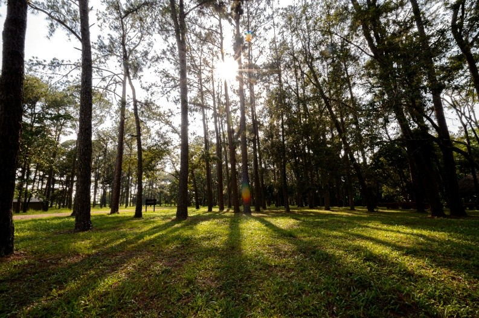
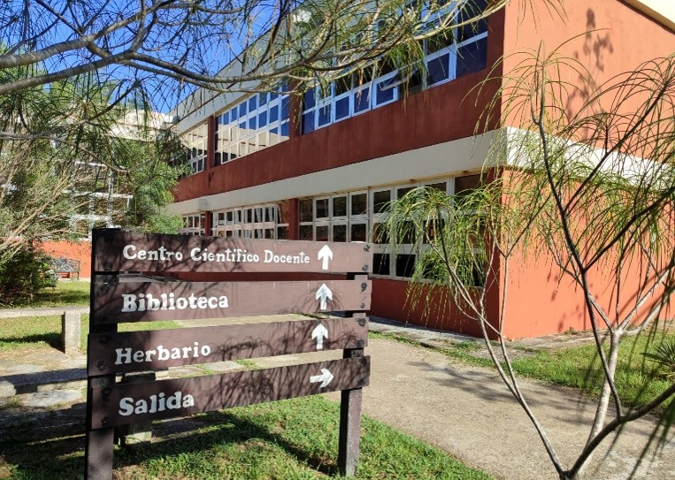
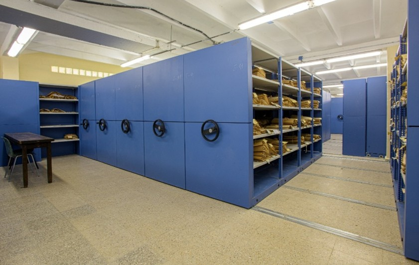

## Jardin Botanico Nacional de Cuba

### Spanish
El Jardín Botánico Nacional de Cuba pertenece a la Universidad de La Habana y fue fundado en 1968. Es la institución líder en el estudio, conservación y divulgación de la flora y los hongos de Cuba. Constituye, además, de un espacio de educación ambiental y recreación para el público, así como, un centro de referencia para la enseñanza de la botánica a todos los niveles en el país. 
Desde 1990 coordina la Red Nacional de Jardines Botánicos integrada por 13 instituciones en todo el país. Asimismo, preside el Comité Científico Nacional de la Flora de la República de Cuba, es responsable de su redacción y edición y ha contribuido en el 40% de los tratamientos incluidos. Publica, también, la Revista del Jardín Botánico Nacional, con más de 45 años de trayectoria.
Su Herbario "Prof. Dr. Johannes Bisse" (HAJB), fundado en 1902, es el segundo del país en cuanto a número de ejemplares. El HAJB constituye una base científica para el conocimiento de la biodiversidad, ya que resguarda cerca de 265 000 especímenes pertenecientes a diversos grupos de plantas, hongos, líquenes y algas, entre ellos alrededor de 1 000 ejemplares tipo. Sus colecciones se digitalizan de forma continua y se incorporan al sistema internacional de gestión de herbarios JACQ. 
El jardín alberga una de las bibliotecas especializadas en botánica más importantes del país, con un activo programa de canje con instituciones de todo el mundo y un proyecto en curso de digitalización de su patrimonio documental y fotográfico.
Desde el Jardín Botánico Nacional impulsa la Flora de Cuba en línea, desarrollada con acceso abierto y en colaboración con el Jardín Botánico y Museo Botánico de Berlín (Botanischer Garten und Botanisches Museum Berlin, BGBM). Al mismo tiempo, contribuye al trabajo del Grupo de Especialistas de Plantas Cubanas y al estudio y la conservación de la diversidad vegetal del país.
Como institución de referencia para el estudio de la flora del Caribe, mantiene vínculos de colaboración científica con universidades, jardines botánicos y centros de investigación cubanos y extranjeros, mediante proyectos conjuntos, intercambio de colecciones y programas de formación postgraduada. Asimismo, desarrolla docencia universitaria de pregrado en carreras de Ciencias Biológicas, postgrado en Botánica y forma horticultores y paisajistas. Esta labor docente es posible gracias a la excelencia del claustro de profesores e investigadores. 
Con cerca de 500 hectáreas, el Jardín Botánico Nacional reúne una de las colecciones vivas plantadas por el hombre más extensas del mundo. Organizadas en áreas fitogeográficas, sus colecciones representan la diversidad vegetal tropical de Cuba y de otras regiones del planeta como América, África, Asia y Oceanía. Entre ellas se destacan el Palmetum, los matorrales sobre serpentinita, el Jardín Japonés y los pabellones de exposición con cactáceas, suculentas y plantas de bosques húmedos. 
El jardín desempeña también un papel significativo en la producción de arbolado urbano y lidera la estrategia para el desarrollo y el programa del manejo del verde urbano de La Habana, sobre la base de soluciones basadas en la naturaleza.
Como miembro del Consorcio de la World Flora Online, el Jardín Botánico Nacional de Cuba aporta su conocimiento de la flora cubana, una de las más ricas y amenazadas del Caribe, al esfuerzo global por documentar y conservar la diversidad vegetal del planeta.

### English
The Jardín Botánico Nacional de Cuba belongs to the Universidad de La Habana and was founded in 1968. It is the leading institution for the study, conservation and dissemination of the flora and fungi of Cuba, and also serves as a space for environmental education and recreation for the public, as well as a reference centre for teaching botany at all levels in the country.
Since 1990, it has coordinated the Red Nacional de Jardines Botánicos, made up of 13 institutions across the country. It also chairs the Comité Científico Nacional de la Flora de la República de Cuba, is responsible for its drafting and editing, and has contributed 40% of the treatments included, and it publishes the Revista del Jardín Botánico Nacional, with more than 45 years of history.
Its Herbario "Prof. Dr. Johannes Bisse" (HAJB), founded in 1902, is the second largest in the country by number of specimens. The HAJB serves as a scientific foundation for understanding biodiversity, safeguarding close to 265,000 specimens belonging to various groups of plants, fungi, lichens and algae, including around 1,000 type specimens, with its collections continuously digitised and incorporated into the JACQ international herbarium management system.
The garden houses one of the most important specialised botanical libraries in the country, with an active exchange programme with institutions worldwide and an ongoing project to digitise its documentary and photographic heritage.
The Jardín Botánico Nacional also promotes Flora de Cuba en línea, developed with open access and in collaboration with the Botanic Garden and Botanical Museum Berlin (Botanischer Garten und Botanisches Museum Berlin, BGBM). At the same time, it contributes to the work of the Grupo de Especialistas de Plantas Cubanas and to the study and conservation of plant diversity in the country.
As a reference institution for the study of Caribbean flora, it maintains scientific collaboration ties with Cuban and foreign universities, botanical gardens and research centres, through joint projects, collection exchanges and postgraduate training programmes. It also provides undergraduate teaching in Biological Sciences degree programmes and postgraduate teaching in Botany, and trains horticulturists and landscapers, a body of teaching work made possible by the excellence of its faculty and researchers.
With close to 500 hectares, the Jardín Botánico Nacional holds one of the most extensive living plant collections planted by man anywhere in the world. Organised into phytogeographic areas, its collections represent the tropical plant diversity of Cuba and other regions of the planet such as the Americas, Africa, Asia and Oceania, with notable examples including the Palmetum, the shrublands on ultramafic soil, the Japanese Garden, and the exhibition pavilions with cacti, succulents and rainforest plants.
The garden also plays a significant role in urban tree production and leads the strategy for the development and management programme of urban green spaces in Havana, based on solutions grounded in nature.
As a member of the World Flora Online Consortium, the Jardín Botánico Nacional de Cuba contributes its knowledge of Cuban flora, one of the richest and most threatened in the Caribbean, to the global effort to document and conserve plant diversity on the planet.

Location: El Rocío street Km 3 1/2, ZC 19230, Calabazar, Boyeros, Havana.

Read more on the [Jardin Botanico Nacional de Cuba website](https://jbn.uh.cu/).

### Associated WFO Contacts:

-   [Banessa Falcon-Hidalgo](mailto:) (Council Member)

