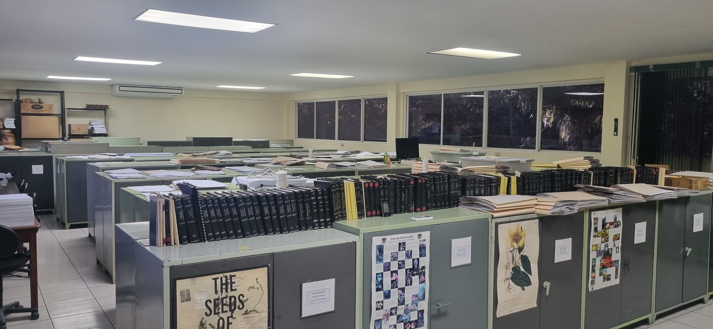
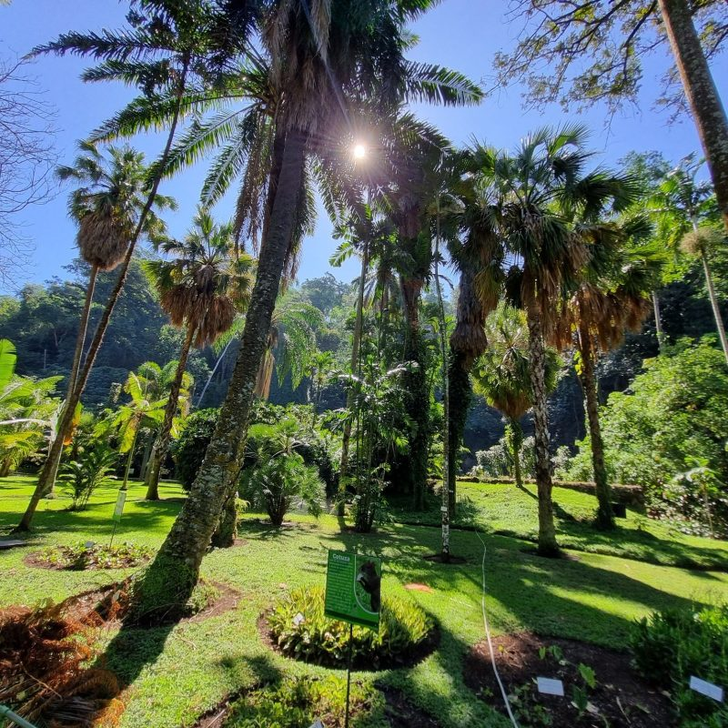
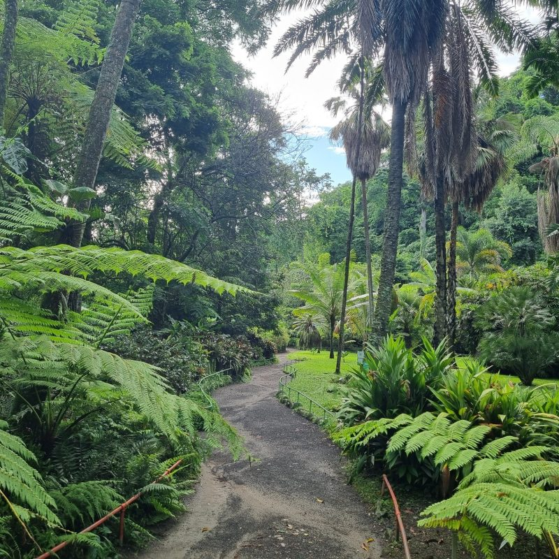
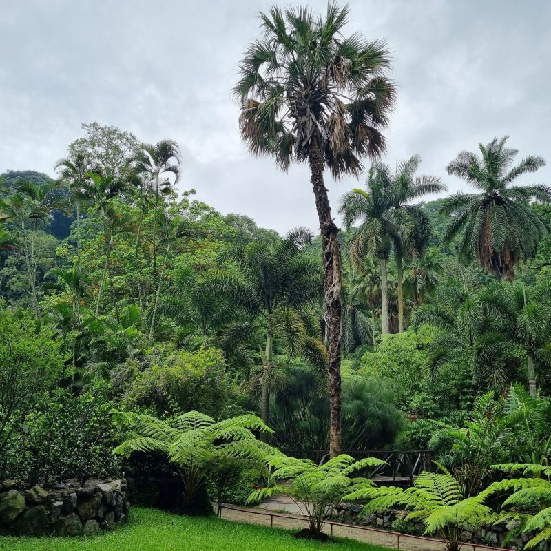

## Jardín Botánico La Laguna

The La Laguna Botanical Garden is located in the crater of a volcano that erupted approximately 2,200 years ago. Over time a lagoon formed in the bottom, but after the earthquake of San José on March 19, 1873 the water level dropped. Local farmers drained the remaining water pools to take advantage of the fertile soil and planted sugar cane, followed later by the development of a dairy industry. By 1912, the lagoon was completely dry and an intense process of industrialization took hold. Within the area was the house of the Deininger Family, who loved nature and collected plants from all over the world to grow in their garden. Years later, they decided to donate the land and turn it into a botanical garden open to the public. On July 13, 1976, the La Laguna Botanical Garden Association was legally constituted as a private, non-political, non-profit, non-religious entity responsible for conserving and managing the property, which opened to the public on December 22, 1978. 

The LAGU herbarium has a collection of more than 47,000 specimens, including angiosperms, Gymnosperms, Monocotyledons, Dicotyledons, Pteridophytes, Lichen and Bryophytes. These have been collected in various parts of El Salvador and are a valuable scientific resource.

View of Herbarium LAGU

El Jardín Botánico La Laguna, se encuentra ubicado justo en lo que fue un cráter volcánico que hizo erupción hace más de 2,200 años. Con el paso del tiempo se formó en el fondo una laguna que, tras el terremoto de San José, el 19 de marzo de 1873, su nivel bajo considerablemente; por lo tuvieron que drenar los pequeños espejos de agua para aprovechar el suelo y sembrar caña de azúcar, seguido del desarrollo de una industria lechera. Para 1912, el proceso de secado de la laguna había finalizado y dio paso a un intenso proceso de industrialización. Dentro de esta área, se encontraba la casa de la Familia Deininger quienes eran amantes de la naturaleza y tenían la afición de coleccionar plantas de todas partes del mundo para ambientar el jardín de su residencia. Años más tarde, decidieron donarla y convertirla en un jardín botánico. Fue así, que el 13 de julio de 1976 se constituyó legalmente la Asociación Jardín Botánico La Laguna como una entidad privada, apolítica, no lucrativa, ni religiosa; quienes, a la fecha, se encargan de conservarlo y administrarlo; fue abierto al público el 22 de diciembre de 1978.

El herbario LAGU cuenta con una colección de más de 47,000 especímenes entre las cuales destacan: Angiospermas, Gimnospermas, Monocotiledóneas, Dicotiledóneas, Pteridofitas, Líquenes y Briofitas. Provienen de diferentes zonas de El Salvador y constituyen una valiosa referencia para proyectos de investigación científica. 

Views of Jardín Botánic La Laguna

Visit [Jardín Botánico La Laguna's website.](https://www.jardinbotanico.org.sv/)

Located in: Urb Ind Plan de La Laguna Antgo Cusc, El Salvador

### Associated WFO Contacts:

-   [Roberto Escobar](mailto:) (Council Member)
-   [Dagoberto Rodríguez](mailto:)
-   [Juan Carlos Ruiz](mailto:)