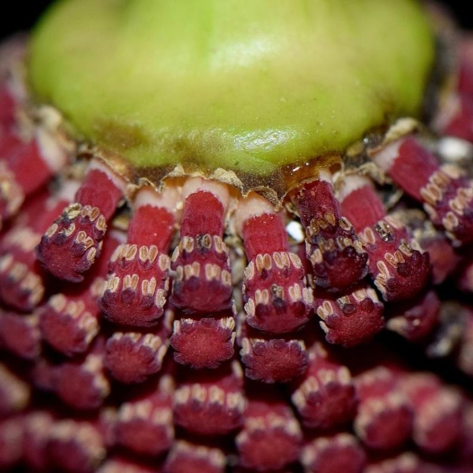
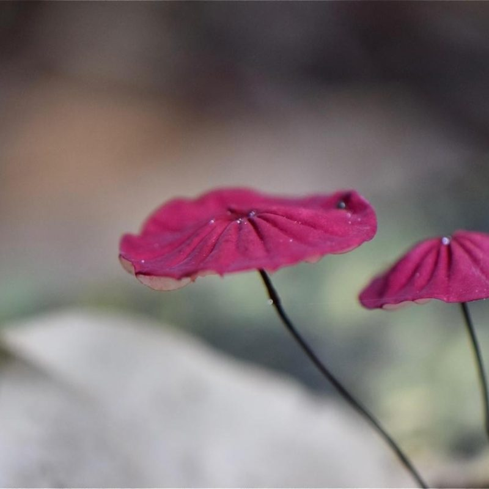
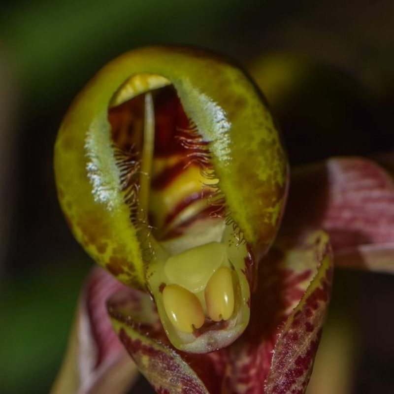
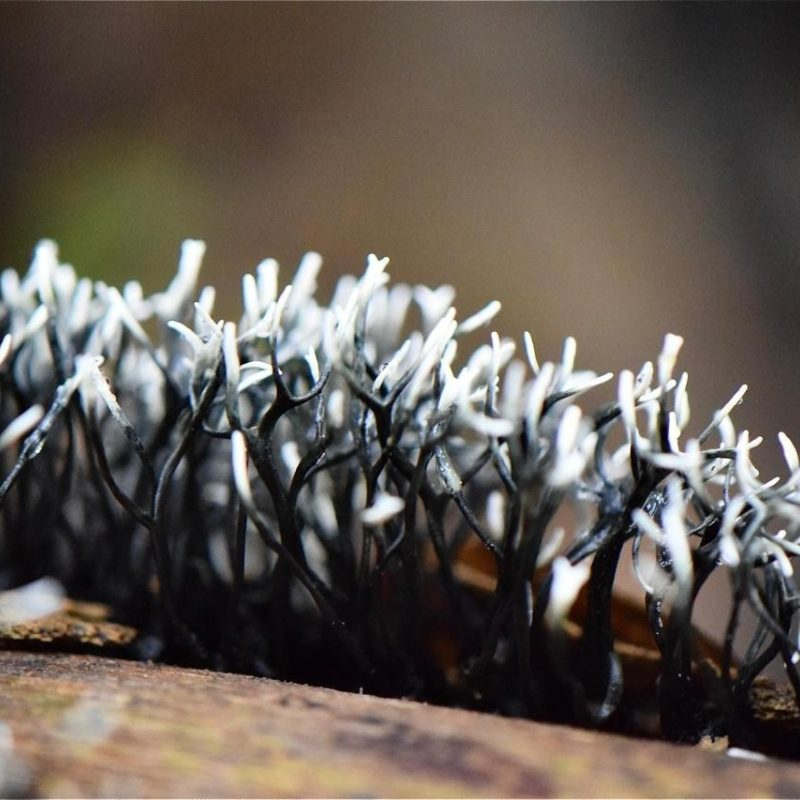
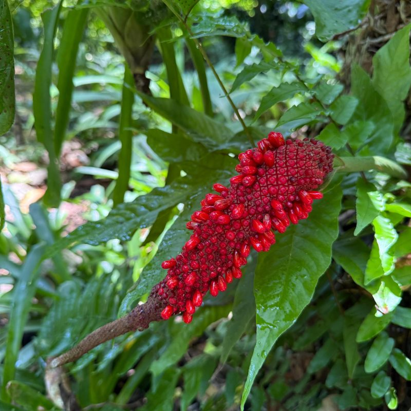
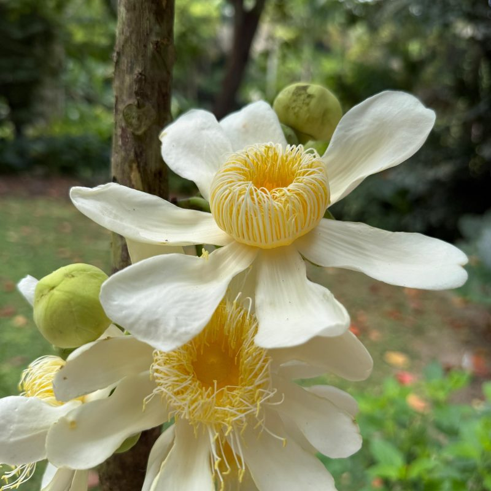
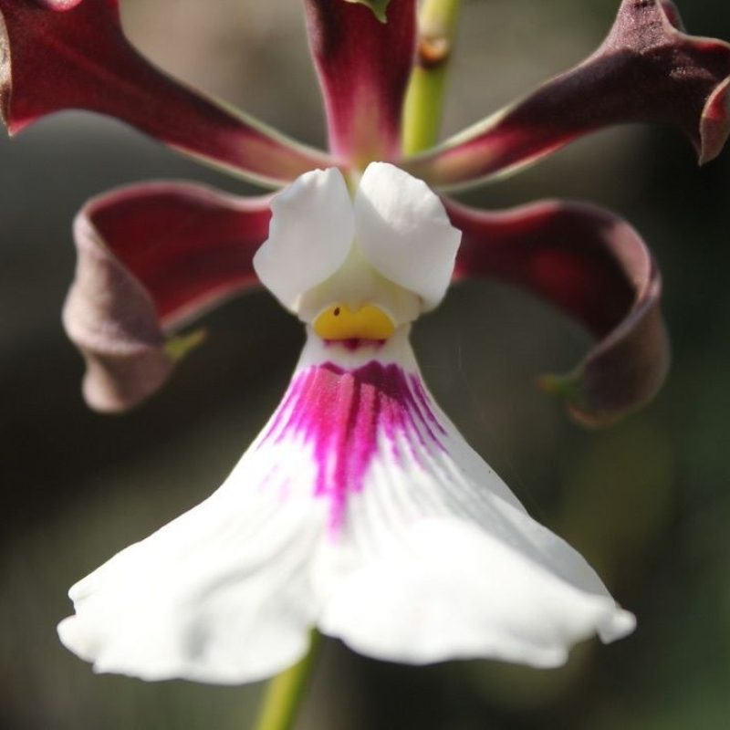
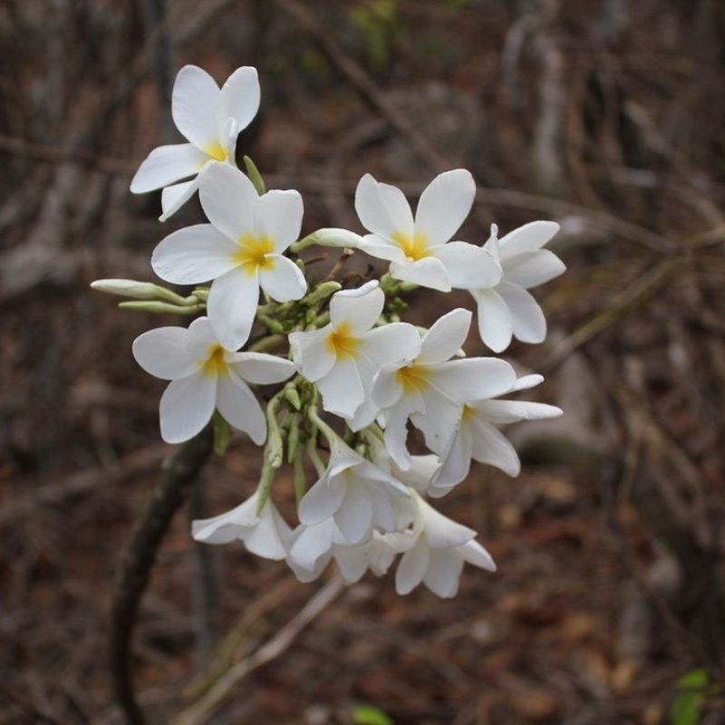

## Jardín Botánico de Cartagena Guillermo Piñeres

The Jardín Botánico de Cartagena ​"Guillermo Piñeres," located in Turbaco in the hills above Cartagena, Colombia, conserves around nine hectares of land, including three hectares of native tropical dry forest and six hectares of curated botanical collections nourished by a natural spring that provides water year-round. Recognized by Botanic Gardens Conservation International and Colombia's Ministry of Science as a certified botanical garden and science centre, it plays a vital role in research, conservation, and education about one of the country's most threatened ecosystems.

As a member of the World Flora Online (WFO) Consortium, the Cartagena Botanical Garden contributes regional expertise on Neotropical and Caribbean floras, especially those characteristic of tropical dry forest ecosystems. It leads the Online Flora of the Caribbean, a project that intends to document and make accessible the rich plant diversity of the Caribbean basin as part of the WFO. The garden strengthens the global taxonomic backbone by supplying floristic checklists, specimen data, images, and taxonomic insights from the Colombian Caribbean region. Its involvement also supports collective efforts to fill knowledge gaps in understudied plant groups and geographic areas, promoting global access to reliable biodiversity data for science, conservation, and education.

The garden maintains living collections that represent many native tree species*.* Within its forest reserve, permanent monitoring plots document ecological dynamics and carbon storage, contributing to regional and national studies on the restoration and resilience of tropical dry forests. Its nursery and propagation programs focus on developing techniques for the germination and cultivation of native species, supporting restoration and landscaping initiatives throughout northern Colombia.

Beyond research, the garden is an active hub for environmental education, public engagement, and species conservation. It conducts guided tours, workshops, and school programs to raise awareness of local flora and the importance of ecosystem restoration. Fieldwork and collaboration with universities and conservation organizations have led to the discovery of new insect species and to ongoing efforts to reintroduce the critically endangered cotton-headed tamarin.

Strategically located at the interface of tropical dry forest and Caribbean coastal ecosystems, the Cartagena Botanical Garden fills an important gap in global floristic coverage by representing an ecosystem often overshadowed by rainforests and montane habitats. Through its contributions to the World Flora Online, the garden enhances knowledge of Colombia's northern flora and strengthens global initiatives aimed at documenting and conserving the world's plant diversity.

GBIF hosted data portal: [https://​data​.jbgp​.org​.co](https://eur01.safelinks.protection.outlook.com/?url=https%3A%2F%2Fdata.jbgp.org.co%2F&data=05%7C02%7CAElliott%40rbge.org.uk%7Cca875d9822f94891480508de05d395f1%7Cbb63bb00175e46b7b7b3bc74158e4fd4%7C0%7C0%7C638954603791312443%7CUnknown%7CTWFpbGZsb3d8eyJFbXB0eU1hcGkiOnRydWUsIlYiOiIwLjAuMDAwMCIsIlAiOiJXaW4zMiIsIkFOIjoiTWFpbCIsIldUIjoyfQ%3D%3D%7C0%7C%7C%7C&sdata=syT%2BetqLtO8EWhwFmJWGAjZ6Z6zM5uio7enDbso0%2F9g%3D&reserved=0)

Images from Jardín Botánico de Cartagena Guillermo Piñeres

Visit [Jardín Botánico de Cartagena Guillermo Piñeres's website.](https://jbgp.org.co/)

Located in: Turbaco, Bolívar, Colombia

### Associated WFO Contacts:

-   [Maria Paula Contreras](mailto:) (Communications Working Group Member)
-   [Santiago Madriñan Restrepo](mailto:) (Council Member, Taxonomic Working Group Member)