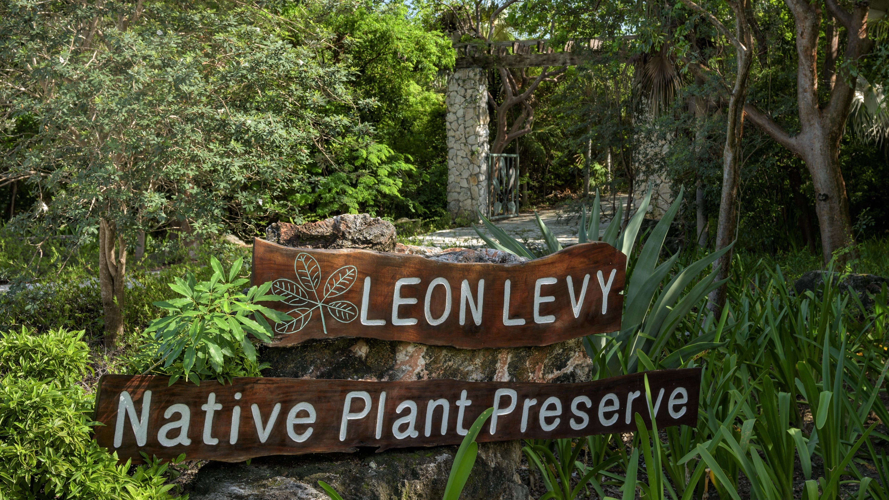

## Leon Levy Native Plant Preserve, Bahamas National Trust

Located in Governor's Harbour, Eleuthera, the Preserve is operated by the Bahamas National Trust. The Preserve is a living part of Bahamian history. It is the first national park on the island of Eleuthera. It is an environmental educational centre as well as a facility for the propagation of native plants and trees.

This 30-acre Preserve has been designed as a research centre for traditional bush medicine; a facility for the propagation of indigenous plants and trees; and an educational centre focusing on the importance of native vegetation to the biodiversity of The Bahamas.

The [Leon Levy Native Plant Preserve](http://www.levypreserve.org/) is the fulfillment of the vision of longtime residents Leon Levy and Shelby White, who loved the natural environment and way of life on Eleuthera. After Leon Levy's death in 2003, Shelby White wanted to celebrate her husband's devotion to the island while contributing to a better future for all Eleutherans.

Working with the Bahamas National Trust, she helped establish a plant preserve where Bahamians and visitors can now walk miles of trails through the native habitat, and view the beautiful orchids, the food and medicinal plants, and the hardwood trees that played an important role in the history of the island.

### Flora of The Bahamas and Eleuthera

The Preserve has created a digital flora that is searchable by scientific or common name. For each species there is a scientific description as well as images of flowers, fruits, leaves and bark. Of the 1400 vascular plant species known to the archipelago over 660 (~47 % of the flora) descriptions have been completed for the website.

As part of the Preserve's mission to showcase the flora of the Bahamas as part of its living collection, expeditions are organized to islands collecting seeds and whole specimens. There is a prioritized collections policy and an accessioning program that tracks the collections over time. The current number of species represented within the living collection is 410. The main priority for living collections are Bahamian endemic plant species, representatives of each genus and family.

Visit [Leon Levy Native Plant Preserve/Bahamas National Trust's website.](https://bnt.bs/explore/eleuthera/leon-levy-preserve/)

Located in: Governor's Harbour, Bahamas

### Associated WFO Contacts:

-   [Ethan Freid](mailto:) (Council Member, Taxonomic Working Group Member)