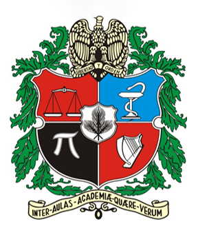
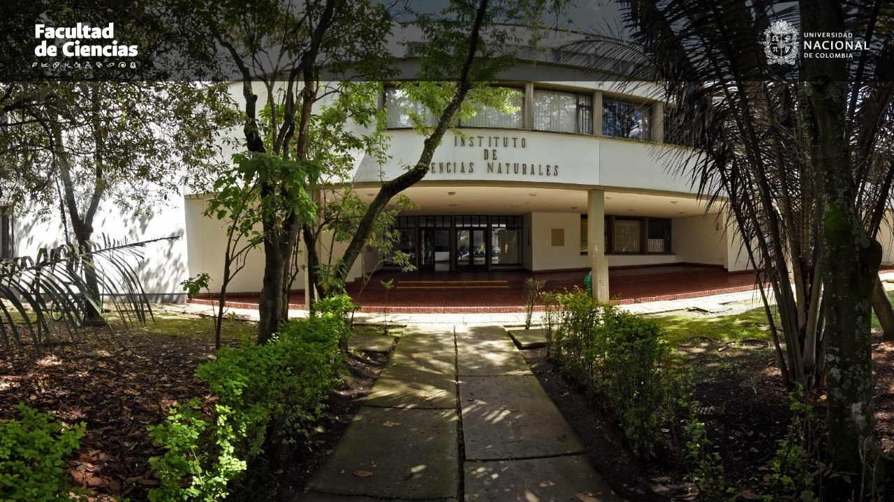

## Universidad Nacional de Colombia

The Universidad Nacional de Colombia was founded in 1867 and is the largest public university in Colombia. Its mission is manifold but includes the following points of articulation with World Flora Online: 

-   To study and enrich Colombia's cultural, natural and environmental heritage and contribute to their conservation.
-   To critically assimilate and generate knowledge in advanced fields of science, technology, art and philosophy.
-   To support and advise the Colombian government on scientific, technical, cultural and artistic issues, while maintaining autonomy over its academic and research endeavours.
-   To promote the development of Colombia's academic community and foment its articulation with the international community. 

La Universidad Nacional de Colombia fue creada en 1867 y es la universidad pública más grande de Colombia. Su misión incluye diversos aspectos entre los cuales existen los siguientes puntos de articulación con Flora Mundial en Línea:

-   Estudiar y enriquecer el patrimonio cultural, natural y ambiental de la nación, y contribuir a su conservación.
-   Asimilar críticamente y crear conocimiento en los campos avanzados de las ciencias, la técnica, la tecnología, el arte y la filosofía.
-   Prestar apoyo y asesoría al Estado en los órdenes científico y tecnológico, cultural y artístico, con autonomía académica e investigativa. Promover el desarrollo de la comunidad académica nacional y fomentar su articulación internacional.

View of the Instituto de Ciencias Naturales © Universidad Nacional de Colombia

The Institute of Natural Sciences (ICN) is an academic department within the Faculty of Sciences of the University's main campus, located in Bogotá. The ICN houses Colombia's largest and most representative biological collections, including the National Colombian Herbarium (COL). The ICN also publishes the monographic series Flora of Colombia, and the Catalogue of the Plants and Lichens of Colombia in both print and digital formats. These and other resources can be [accessed here](http://www.biovirtual.unal.edu.co/).

El Instituto de Ciencias Naturales (ICN) es un departamento académico de la Facultad de Ciencias de la sede principal de la Universidad, ubicada en Bogotá. El ICN alberga las colecciones biológicas más grandes y representativas de Colombia, incluyendo el Herbario Nacional Colombiano (COL). El ICN también publica la serie monográfica Flora de Colombia y el Catálogo de las Plantas y Líquenes de Colombia, tanto en formato impreso como digital. Estos y otros recursos pueden ser [consultados aquí](http://www.biovirtual.unal.edu.co/).

The mission of the ICN is to generate and communicate knowledge of the highest calibre on the Flora and Fauna of Colombia and their interactions with humans both past and present. This mission responds to the need to scientifically document the biodiversity and natural history of taxa that live within Colombian national territory, and to support the conservation and rational use of biodiversity by the country's diverse peoples through the development of research programs and the formation of highly qualified researchers.

La misión del instituto de Ciencias Naturales es generar y comunicar conocimiento del más alto nivel sobre la Flora y la Fauna de Colombia y sus relaciones pasadas y presentes con los grupos humanos. Esta misión se enmarca claramente en la necesidad de documentar científicamente la biodiversidad y la historia natural de sus componentes en el territorio colombiano, así como propender por su conservación y uso racional por parte de los diferentes grupos humanos, a través del desarrollo de programas de investigación y la formación de investigadores altamente calificados.

Visit [Universidad Nacional de Colombia's website.](http://unal.edu.co/)

Located in: Bogota, Colombia

### Associated WFO Contacts:

-   [Lauren Raz](mailto:lraz@unal.edu.co) (Council Co-Chair, TEN Focal, Taxonomic Working Group Member)

### Associated Taxonomic Expert Networks (TENs):

-   [Dioscoreaceae](https://about.worldfloraonline.org/tens/dioscoreaceae)
