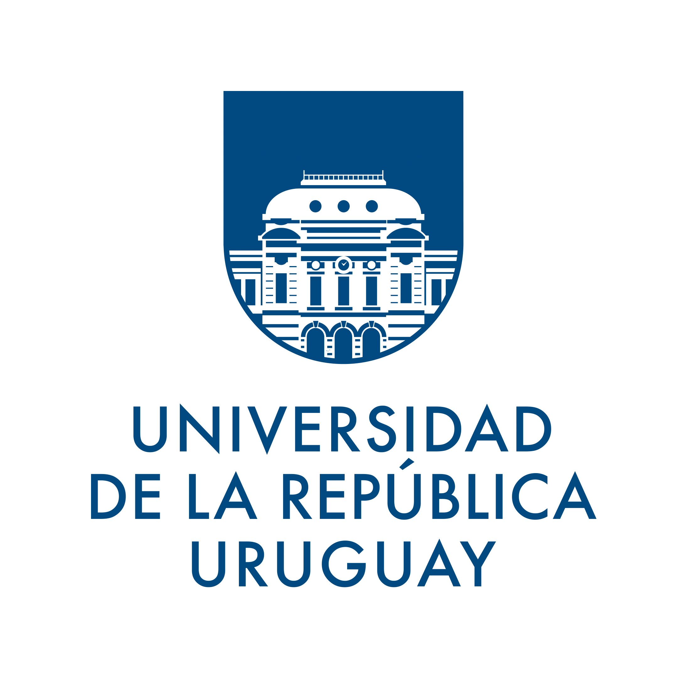
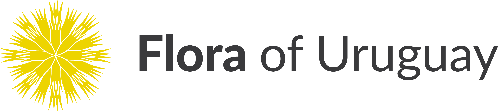

## Universidad de la República

The Universidad de la Rapública (Udelar) is Uruguay's leading institution for higher education and research. It has more than 11,500 faculty members, 6,500 staff, and over 160,000 students pursuing studies across all areas of knowledge and culture. It is a public, autonomous, and co-governed institution. The University offers more than 140 open and tuition-free undergraduate programs, along with over 130 master's and doctoral degrees. Founded on July 18, 1849, in Montevideo, it currently has a presence in 16 departments across the country, providing the academic and institutional foundation that enables inter-institutional initiatives such as Flora Uruguaya Online to thrive and expand.

[Flora Uruguaya Online](https://florauruguaya.org/) is the first digital platform dedicated to the vascular flora of the country, bringing together information on more than 3,000 native and naturalized species, supported by over 275,000 herbarium specimens. Developed under the leadership of the [School of Agronomy](https://portal.fagro.edu.uy/) -- Udelar, Flora Uruguaya Online is an inter-institutional project that involves the active participation of the [School of Chemistry](https://www.fq.edu.uy/), the [School of Sciences](https://www.fcien.edu.uy/), the [National Museum of Natural History](https://www.mna.gub.uy/innovaportal/v/3811/14/mecweb/museo-nacional-de-historia-natural), and the [Montevideo Botanical Garden](https://jardinbotanico.montevideo.gub.uy/), institutions that jointly contribute to the development and ongoing updating of this open and continuously growing resource.

Visit [Universidad de la República's website.](https://udelar.edu.uy/portal/)

Located in: Montevideo, Departamento de Montevideo, Uruguay