

[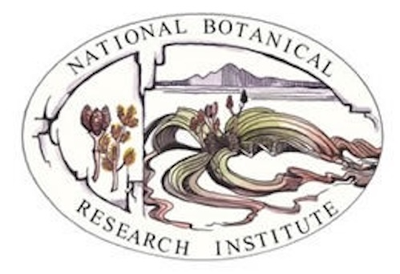](Africa/National_Botanical_Research_Institute,_National_Herbarium_of_Namibia.md)
.md)

[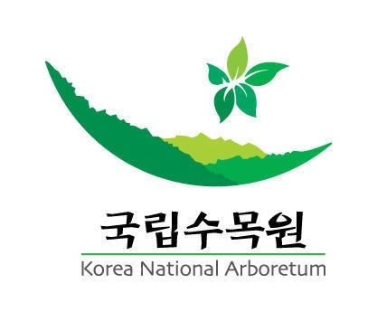](Asia-Temperate/Korea_National_Arboretum.md)

[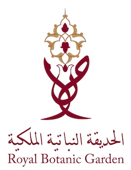](Asia-Temperate/Royal_Botanic_Garden,_Jordan.md)

[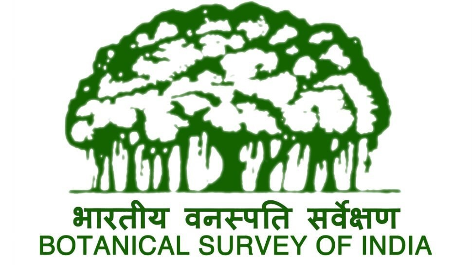](Asia-Tropical/Botanical_Survey_of_India.md)
[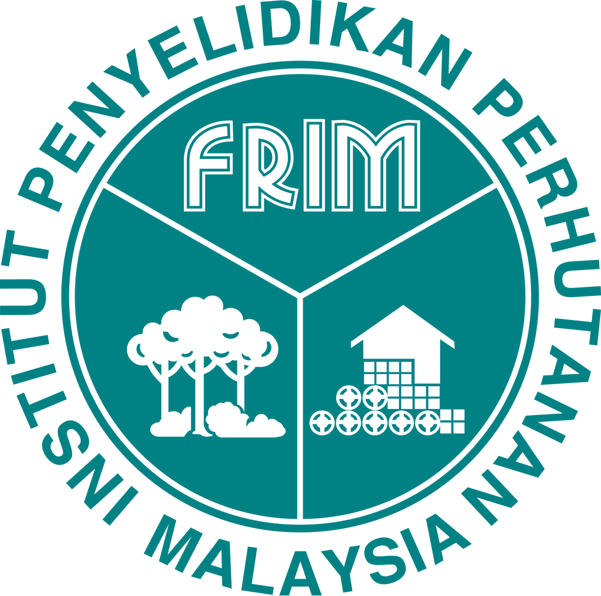](Asia-Tropical/Forest_Research_Institute_Malaysia.md)

[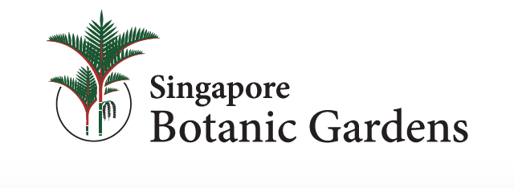](Asia-Tropical/Singapore_Botanic_Garden.md)
[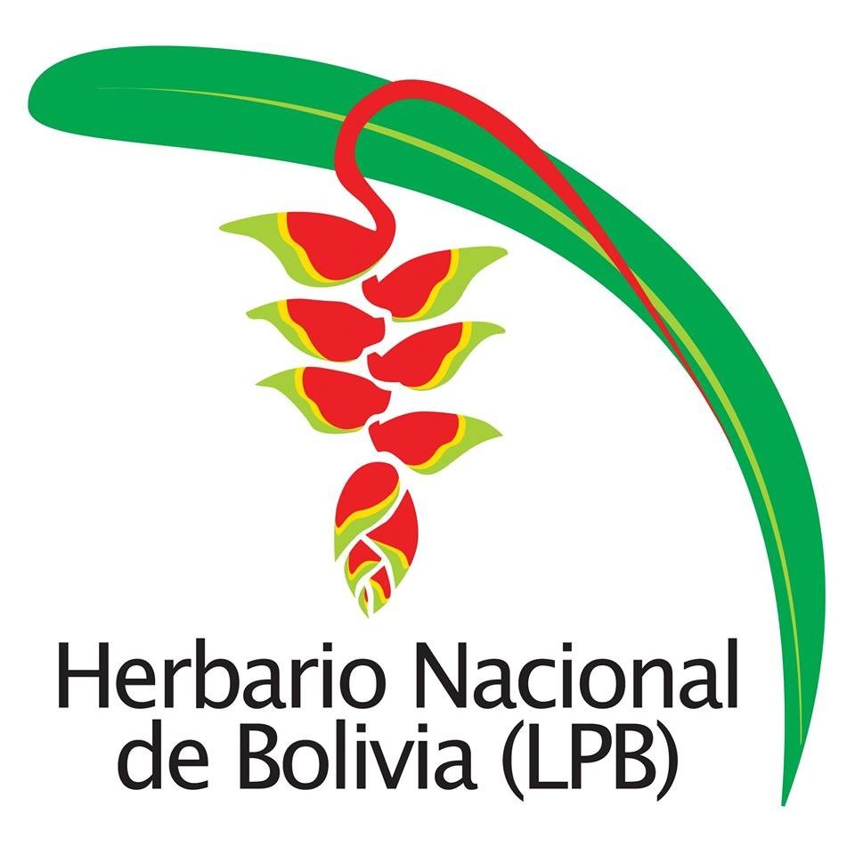](Southern_America/Herbario_Nacional_de_Bolivia_(LPB).md)

[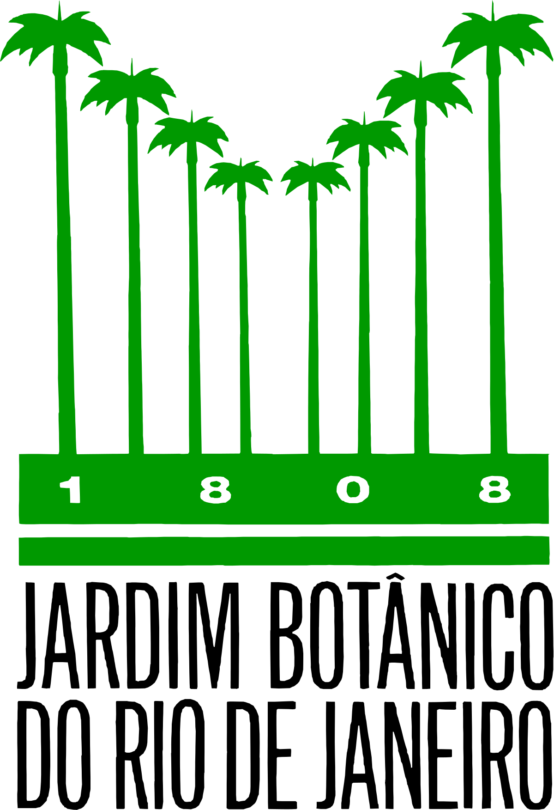](Southern_America/Instituto_de_Pesquisas_Jardim_Botânico_do_Rio_de_Janeiro.md)
_Virtual_Herbarium.md)
[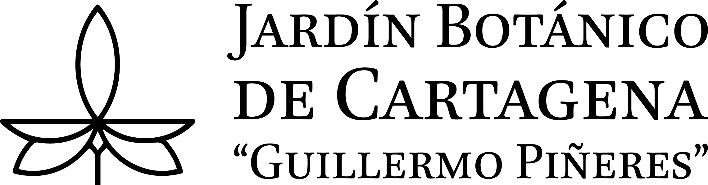](Southern_America/Jardín_Botánico_de_Cartagena_Guillermo_Piñeres.md)
[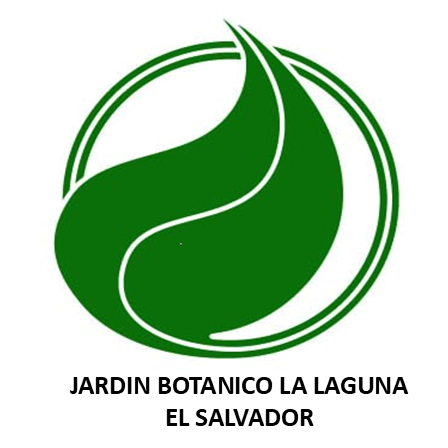](Southern_America/Jardín_Botánico_La_Laguna.md)

[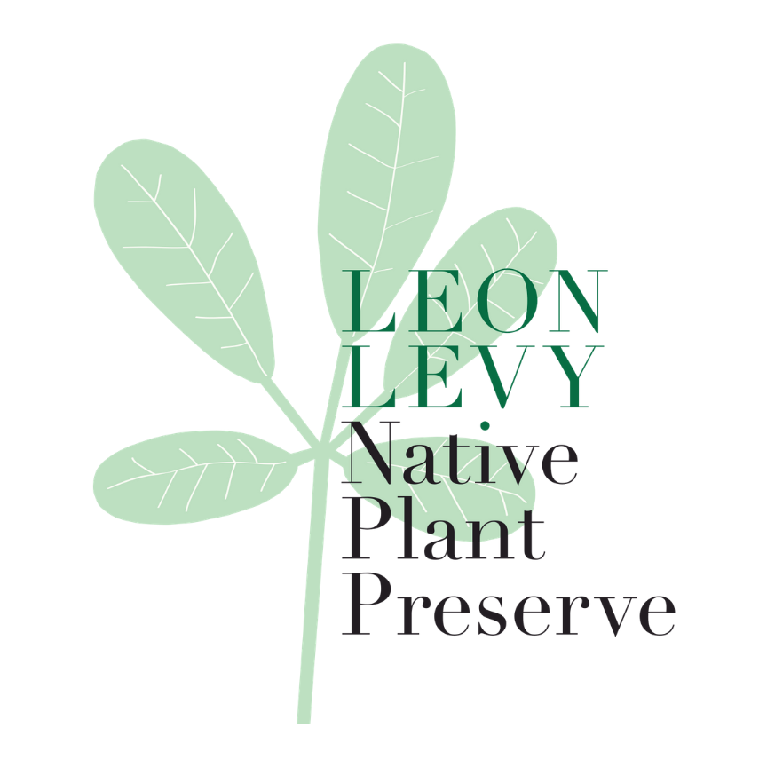](Southern_America/Leon_Levy_Native_Plant_Preserve,_Bahamas_National_Trust.md)
_of_Costa_Rica.md)

[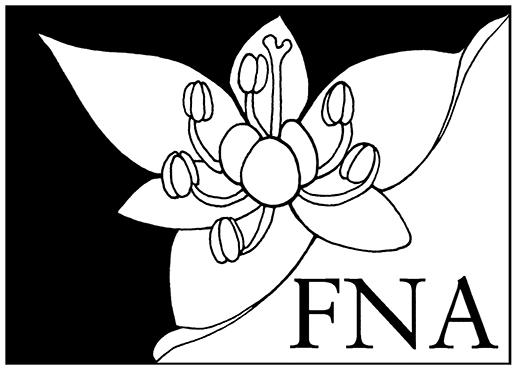](Northern_America/Flora_of_North_America_Association.md)
[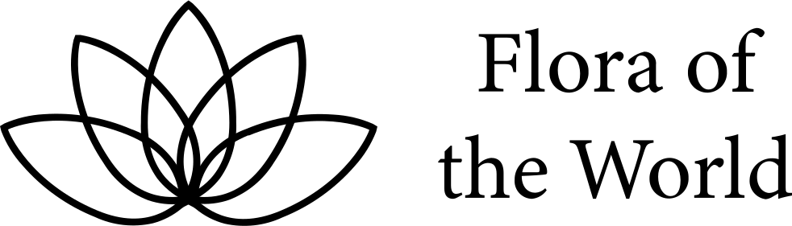](Northern_America/Flora_of_the_World_Foundation.md)
.md)

[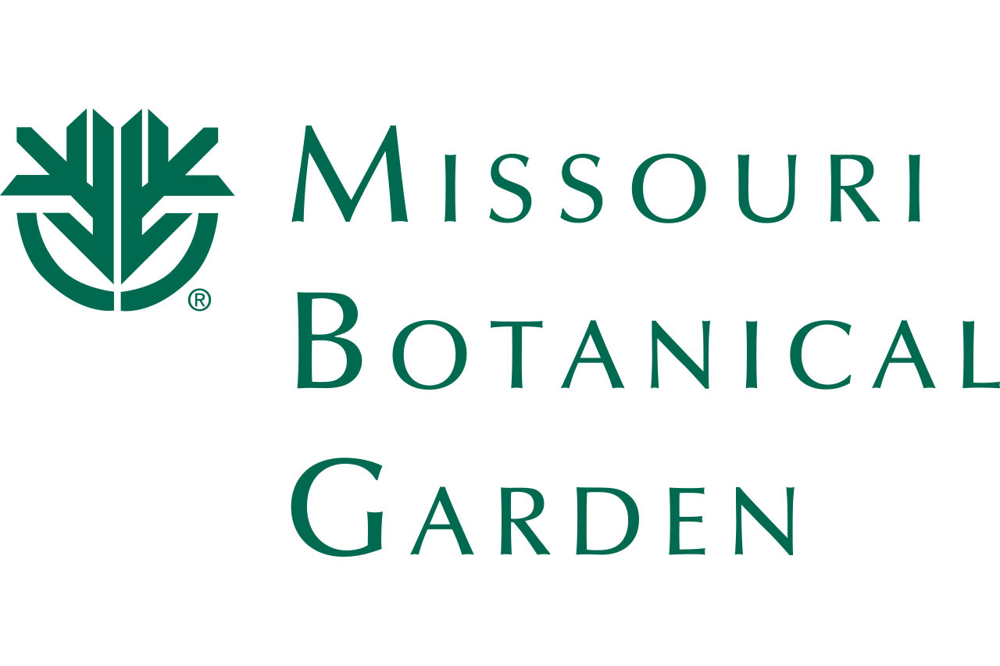](Northern_America/Missouri_Botanical_Garden.md)

[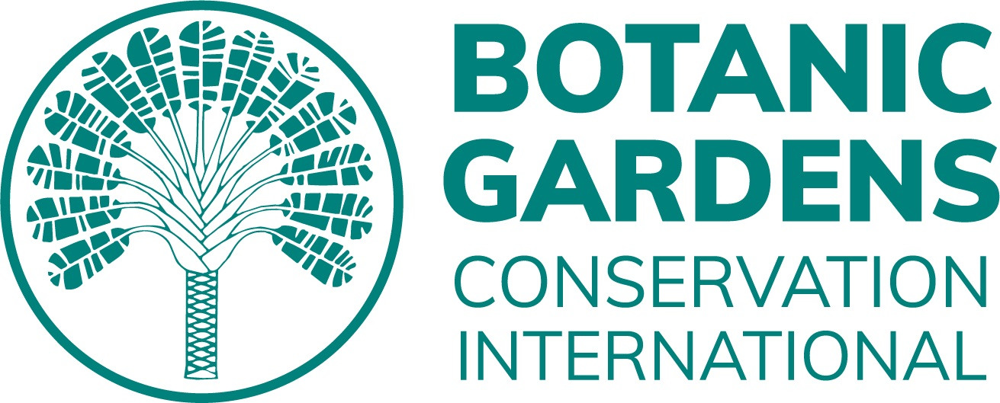](Global/Botanic_Gardens_Conservation_International_(BGCI).md)

[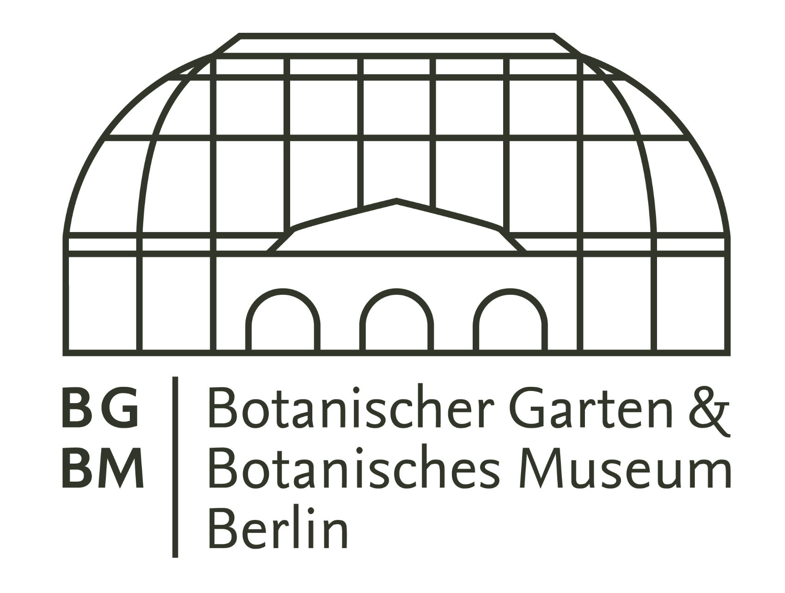](Europe/bgbm_logo.png)
[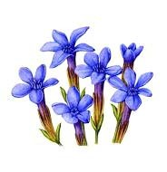](Europe/Botany_Department_of_Trinity_College_Dublin.md)

[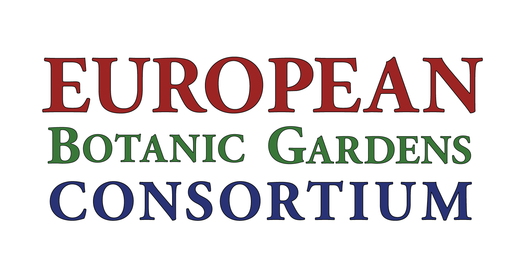](Europe/European_Botanic_Gardens_Consortium.md)
[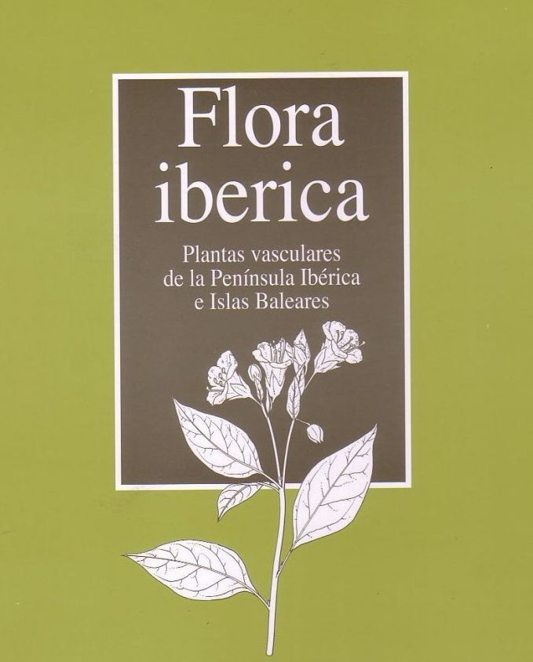](Europe/Flora_Ibérica:_Plantas_vasculares_de_la_Península_Ibérica_e_Islas_Baleares.md)

[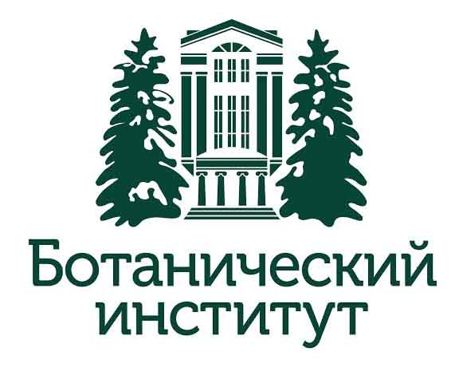](Europe/Komarov_Institute_of_Botany,_Russian_Academy_of_Sciences.md)

## Consortium Members

Consortium Members are the organisations that have signed the MOU which allows them representation on the World Flora Online Council. We currently have 61 botanic gardens and botanical institutes represented on the World Flora Online Council. We would always welcome additional Consortium Members to to help deliver the vision of a World Flora.

<!-- Consortium members will be listed below here -->

