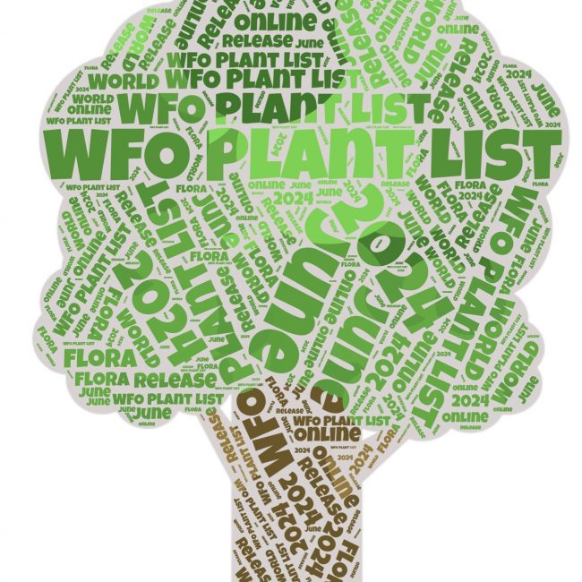

## WFO's June 2024 release

The June 2024 edition of the [WFO Plant List](https://about.worldfloraonline.org/plant-list/) and data release are now available, with improvements to nomenclatural data and updates to the classification from the global taxonomic community. Since the December 2023 edition, the WFO Plant List now includes:

-   40,209 additional names provided by [IPNI](https://www.ipni.org/), our Taxonomic Expert Networks (TENs), content providers or [WCVP](https://powo.science.kew.org/about-wcvp), and
-   1.39 million name records have classification, nomenclatural or other data improvements.

Updated family classifications have been provided by TENs for:

-   Asteraceae tribe Cichorieae has been updated with data supplied by [*Cichorieae* Systematics Portal](https://cichorieae.e-taxonomy.net/portal/), as part of a growing collaboration between the [Global Compositae Database](https://compositae.org/) and the *Cichorieae* Systematics Portal.
-   All Bryophytes have have been linked to Tropicos as nomenclator for mosses, hornworts and liverworts, which the equivalent of IPNI for vascular plants.
-   Commelinaceae has been updated using Rhakhis to manage their data.
-   Fabaceae now follows the Legume Checklist v.5 (2024), available at [https://​www​.legume​da​ta​.org/](https://www.legumedata.org/).
-   Gesneriaceae has had a full update with data supplied from the [Gesneriaceae Resource Centre](https://padme.rbge.org.uk/grc/ "https://eur01.safelinks.protection.outlook.com/?url=https%3A%2F%2Fpadme.rbge.org.uk%2Fgrc%2F)&data=05%7C02%7CMWatson%40rbge.org.uk%7Cc7654b4d5c914d095dc308dc9108e4e4%7Cbb63bb00175e46b7b7b3bc74158e4fd4%7C0%7C0%7C638544714590588775%7CUnknown%7CTWFpbGZsb3d8e").
-   Plumbaginaceae has been updated by the Caryophyllales Network. Please see: Malekmohammadi M, Koutroumpa K, Crespo MB, Domina G, Korotkova N, Akhani H, von Mering S, Borsch T, Berendsohn WG (2024) A taxonomic backbone for the Plumbaginaceae (Caryophyllales). PhytoKeys 243: 67--103. [https://​doi​.org/​1​0​.​3​8​9​7​/​p​h​y​t​o​k​e​y​s​.​2​4​3​.​1​22784](https://doi.org/10.3897/phytokeys.243.122784)
-   Neotropical Melastomataceae groups have been updated with data supplied.
-   There have been updates and improvements to: Apocynaceae, Asphodelaceae (tribe Aloeae), Begoniaceae, Cactaceae, Ericaceae, Putranjivaceae and Zingiberaceae, provided by the TENs responsible for these families.

Classification provided by RBG-Kew's WCVP are now as follows.

303 non-TEN families are now updated to WCVP as a default classification.

-   Since the December 2023 release the following 204 non TEN Families have been updated to follow WCVP version 12 (Jan 2024): Acanthaceae, Acoraceae, Actinidiaceae, Alstroemeriaceae, Aphloiaceae, Apodanthaceae, Araceae, Araliaceae, Aristolochiaceae, Balanopaceae, Balanophoraceae, Balsaminaceae, Barbeyaceae, Bataceae, Berberidaceae, Betulaceae, Biebersteiniaceae, Bignoniaceae, Bixaceae, Boryaceae, Bromeliaceae, Brunelliaceae, Burmanniaceae, Burseraceae, Butomaceae, Calceolariaceae, Canellaceae, Cannabaceae, Capparaceae, Cardiopteridaceae, Caryocaraceae, Celastraceae, Centroplacaceae, Cephalotaceae, Chrysobalanaceae, Circaeasteraceae, Cistaceae, Cleomaceae, Clethraceae, Clusiaceae, Colchicaceae, Combretaceae, Connaraceae, Coriariaceae, Cornaceae, Corynocarpaceae, Costaceae, Crossosomataceae, Ctenolophonaceae, Cunoniaceae, Curtisiaceae, Cynomoriaceae, Cyrillaceae, Daphniphyllaceae, Datiscaceae, Diapensiaceae, Dilleniaceae, Dirachmaceae, Elaeagnaceae, Elaeocarpaceae, Elatinaceae, Emblingiaceae, Eriocaulaceae, Erythroxylaceae, Escalloniaceae, Euphorbiaceae, Euphroniaceae, Eupteleaceae, Flagellariaceae, Fouquieriaceae, Gelsemiaceae, Gentianaceae, Geraniaceae, Gnetaceae, Goodeniaceae, Goupiaceae, Grossulariaceae, Grubbiaceae, Gunneraceae, Gyrostemonaceae, Heliconiaceae, Huaceae, Humiriaceae, Hydatellaceae, Hydrangeaceae, Hydrocharitaceae, Hydroleaceae, Hydrostachyaceae, Hypericaceae, Hypoxidaceae, Icacinaceae, Iridaceae, Iteaceae, Ixonanthaceae, Joinvilleaceae, Juglandaceae, Juncaceae, Juncaginaceae, Kirkiaceae, Koeberliniaceae, Lamiaceae, Lauraceae, Lecythidaceae, Lentibulariaceae, Liliaceae, Limnanthaceae, Linaceae, Linderniaceae, Loasaceae, Loganiaceae, Lophopyxidaceae, Lythraceae, Magnoliaceae, Marantaceae, Mazaceae, Melanthiaceae, Menispermaceae, Menyanthaceae, Metteniusaceae, Misodendraceae, Mitrastemonaceae, Monimiaceae, Montiniaceae, Moringaceae, Muntingiaceae, Myricaceae, Myristicaceae, Myrothamnaceae, Myrtaceae, Nelumbonaceae, Neuradaceae, Nitrariaceae, Nymphaeaceae, Oleaceae, Oncothecaceae, Opiliaceae, Orchidaceae, Orobanchaceae, Oxalidaceae, Paeoniaceae, Pandaceae, Paracryphiaceae, Paulowniaceae, Pedaliaceae, Penaeaceae, Pentadiplandraceae, Pentaphragmataceae, Pentaphylacaceae, Peraceae, Petrosaviaceae, Phrymaceae, Phyllanthaceae, Phyllonomaceae, Pittosporaceae, Plantaginaceae, Platanaceae, Podostemaceae, Polemoniaceae, Posidoniaceae, Potamogetonaceae, Primulaceae, Quillajaceae, Resedaceae, Restionaceae, Rhizophoraceae, Roridulaceae, Rosaceae, Rubiaceae, Sabiaceae, Salvadoraceae, Sarraceniaceae, Saururaceae, Schisandraceae, Schlegeliaceae, Scrophulariaceae, Setchellanthaceae, Simaroubaceae, Siparunaceae, Sladeniaceae, Smilacaceae, Stemonuraceae, Stilbaceae, Stylidiaceae, Surianaceae, Symplocaceae, Tecophilaeaceae, Tetramelaceae, Tetrameristaceae, Theaceae, Thymelaeaceae, Ticodendraceae, Tofieldiaceae, Tovariaceae, Triuridaceae, Trochodendraceae, Typhaceae, Ulmaceae, Vahliaceae, Velloziaceae, Verbenaceae, Vochysiaceae, Winteraceae, Xyridaceae and Zygophyllaceae. 

40% of accepted species in the WFO Plant List are covered by a TEN, the rest by WCVP.

Data cleaning and improvements to the data, facilitated by Rhakhis and Catalogue of Life ChecklistBank's validation checks, have reduced the number of known data issues by just over 4000. We continue to deduplicate as part of general curation, and have deduplicated 500 name pairs since the December release.

The WFO checklist data are available in four places:

-   The WFO Plant List section of the WFO website, [https://​wfo​plantlist​.org](https://wfoplantlist.org/ "Original URL: https://wfoplantlist.org/ Click to follow link."), is the main place to browse the data.
-   The WFO Plant List API, [https://​list​.world​flo​raon​line​.org](https://list.worldfloraonline.org/ "Original URL: https://list.worldfloraonline.org/ Click to follow link."), provides a machine readable version of the data and powers the version on the WFO website.
-   The Zenodo repository is under this DOI https://​doi​.org/​1​0​.​5​2​8​1​/​z​e​n​o​d​o​.​7​4​60141. This DOI is the one that should be used to refer to the WFO Plant List data. It will always resolve to the latest version of the data. Each version of the data also has its own DOI should it be necessary to cite a particular version. The June 2024 version's DOI [https://​doi​.org/​1​0​.​5​2​8​1​/​z​e​n​o​d​o​.​1​2​1​71908](https://doi.org/10.5281/zenodo.12171908 "Original URL: https://doi.org/10.5281/zenodo.12171908 Click to follow link.").
-   The data have been submitted to Checklist Bank (Catalogue of Life/​GBIF) https://​www​.check​list​bank​.org/​d​a​t​a​s​e​t​/​2​0​0​4​/​about and can be browsed and downloaded from there.

Since the December 2023 data release the WFO have welcomed two new TENs:

-   The Pteridophyte Phylogeny Group who will curate ferns and their allies, 
-   Vitaceae, the grape family.

-----

Published 20 June 2024.