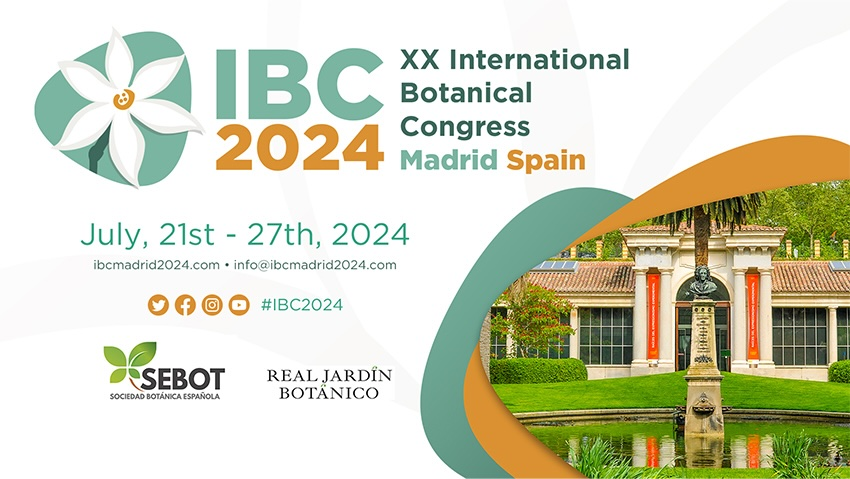

Between 21 and 27th July thousands of botanists from around the world will descend on Madrid for the XX International Botanical Congress. WFO will have a significant presence with a. workshop [World Flora Online: how to get involved](https://ibcmadrid2024.com/index.php?seccion=scientificArea&subSeccion=detailSubProgramme&id=636&idSub=1) on Monday 22nd (13.05-14.30) and a symposium [World Flora Online: developing taxonomic consensus for land plants supporting science, conservation and sustainable use](https://ibcmadrid2024.com/index.php?seccion=scientificArea&subSeccion=detailSymposiums&idCom=NjU=) on Wednesday (11.00-13.00).

Many symposia, workshops and individual talks have been organized by members of WFO TENs, showcasing their research and the benefits of being part of the global community that is the World Flora Online. 

Here is a listing summarising these activities -- if you are at the IBC please come along.

Date |Symposium | Notes
---- |--------- |------
Mon 22: 11.00-13.00 | Symposium. A10.13 | Apocynaceae --- on the way to a model family
Mon 22: 11.00-13.00 | Symposium. N117+18 | Systematics, phylogenetics, biogeography and evolution of Melastomataceae
Mon 22: 11.00-13.00 | Symposium. A10.08 | Sapindales: understanding angiosperm evolution by integration across data, space and time [includes Meliaceae]
Mon 22: 11.00-13.00 | Symposium. N111+12 | Towards integrated taxonomy. theory and practice I [Includes Solanaceae]
Mon 22: 13.05-14.30 | Workshop. N111+12 | World Flora Online: how to get involved
Mon 22: 14.35-16.35 | Symposium. A10.08 | Contrasting diversity patterns, biogeography, and conservation issues in northern and southern heathers (Ericeae, Ericaceae)
Mon 22: 14.35-16.30 | Symposium. N105+6 | Global Myrtaceae systematics: pure and applied perspectives for managing and conserving the earth's plant diversity [proposed TEN]
Mon 22: 17.00-19.00 | Symposium. A10.1 | Dissecting the evolution of sedges (Cyperaceae): perspectives from multiple lineages
Mon 22: 17.00-19.00 | Symposium. A10.08 | Current research in Boraginales [includes Boraginaceae subtribe Amsinckiinae]
Mon 22: 17.00-19.00 | Workshop: A10.13 | Cyperaceae Working Group meeting: introduction to the iSedge initiative
Tue 23: 11.00-13.00 | Symposium. A10.08 | Recent advances in the megadiverse legume subfamily Papilionoideae I [Fabaceae]
Tue 23: 14.35-16.35 | Symposium. A10.08 | Recent advances in the megadiverse legume subfamily Papilionoideae II [Fabaceae]
Tue 23: 14.35-16.35 | Symposium. N115.16 | The new value of scientific publications in the digital age. [includes WFO Plant List]
Tue 23: 14.35-16.35 | Symposium. A10.13 | Next generation Zingiberales: from taxonomy to evolution [includes Lowiaceae, Musaceae and Zingiberaceae]
Tue 23: 14.35-16.35 | Symposium. N117.18 | Systematics and evolution of Lamiales I [includes Gesneriaceae and proposed Bignoniaceae TEN]
Tue 23: 14.35-16.35 | Symposium | Systematics, evolution and diversification of Magnoliales (Annonaceae, Eupomatiaceae, Magnoliaceae, Myristicaceae)
Tue 23: 17.00-19.00 | Symposium. A9.12 | Solanaceae: biology, systematics and evolution I
Tue 23: 17.00-19.00 | Symposium. Neptuno | Carex: the evolution of a megadiverse genus tackled from multiple approaches I [Cyperaceae]
Tue 23: 17.00-19.00 | Symposium. N117.18 | Systematics and evolution of Lamiales II [includes Gesneriaceae and proposed Bignoniaceae TEN]
Tue 23: 17.00-19.00 | Symposium. N105+6 | Global Conoservation Consortia: integrated plant conservation on a global scale [Ericaceae]
Tue 23: 19.00-21.00 | Workshop. N113+14 | Plant Genomes Project: Progress and Perspective [includes Poaceae]
Wed 24: 11.00-13.00 | Symposium. A10.1 | Solanaceae: biology, systematics and evolution II
Wed 24: 11.00-13.00 | Symposium. A10.13 | The past, present, and future of palms (Arecaceae)
Wed 24: 11.00-13.00 | Symposium. N103 | World Flora Online: developing taxonomic consensus for land plants supporting science, conservation and sustainable use
Wed 24: 11.00-13.00 | Symposium. Neptuno | Carex: the evolution of a megadiverse genus tackled from multiple approaches II [Cyperaceae]
Wed 24: 14.35-19.00 | Workshop. A10.13 | WFO TEN Poaceae
Wed 24: 14.35-19.00 | Workshop. Neptuno | Apocynaceae -- Informal meeting welcoming all persons interested in the family
Wed 24: 14.35-19.00 | Workshop. N111+12 | The International Compositae Alliance (TICA) Meeting
Wed 24: 14.35-19.00 | Workshop. N115+16 | Pteridophyte Phylogeny Group II Workshop
Thu 25: 11.00-13.00 | Symposium. A10.08 | Phylogenomics and evolution of Gymnosperm
Thu 25: 11.00-13.00 | Symposium. N115+16 | Systematics, floristics, and conservation: facilitating data integration to promote sound science I [includes TEN groups, FNA]
Thu 25: 14.35-16.35 | Symposium. A10.1 | Cycads as emerging models in evolutionary biology and symbiosis
Thu 25: 14.35-16.35 | Symposium. A10.13 | Poales: from addressing global scale questions to unraveling the evolutionary secrets of neglected families [includes TEN groups, Poaceae]
Thu 25: 14.35-16.35 | Symposium. N115+16 | Systematics, floristics, and conservation: facilitating data integration to promote sound science II [includes Bryophytes]
Thu 25: 17.00-19.00 | Symposium. N111+12 | Legume systematics: from collaborative networks to genome sequencing [Leguminosae]
Thu 25: 17.00-19.00 | Symposium. N117+18 | Grassroots multidisciplinary and integrative research on the global diversity of the grasses (Poaceae) I
Thu 25: 17.00-19.00 | Symposium. A9.12 | Systematics, biogeography, adaptation and utilization of the grape family Vitaceae
Thu 25: 17.00-19.00 | Symposium. N117+18 | Grassroots multidisciplinary and integrative research on the global diversity of the grasses (Poaceae) I
Thu 25: 17.00-19.00 | Symposium. N115+16 | Systematics, floristics, and conservation: facilitating data integration to promote sound science III [includes TEN groups]
Fri 26: 11.00-13.00 | Symposium. N115+16 | Fern and lycophyte evolution: a phylogenomic perspective I
Fri 26: 11.00-13.00 | Symposium. A10.08 | Grassroots multidisciplinary and integrative research on the global diversity of grasses (Poaceae) II
Fri 26: 11.00-13.00 | Symposium. N113+14 | Synantherology reloaded: recent advances and the future of evolutionary studies in Compositae I
Fri 26: 14.35-16.35 | Symposium. N113+14 | Synantherology reloaded: recent advances and the future of evolutionary studies in Compositae II
Fri 26: 14.35-16.35 | Symposium. N115+16 | Fern and lycophyte evolution: a phylogenomic perspective II
Fri 26: 14.35-16.35 | Symposium. Colón | Taxonomy and evolution of bamboos in the phylogenomic era [TEN Poaceae]
Fri 26: 14.35-16.35 | Symposium. Neptuno | Systematics, evolution and diversification of Magnoliales (Annonaceae, Eupomatiaceae, Magnoliaceae, Myristicaceae) II
Fri 26: 17.00-19.00 | Symposium. Colón | Back to basics: using micro-morphology, anatomy and histology to investigate evolution in Bryophytes
Sat 27: 11.00-13.00 | Symposium. N111+14 | New insights on big plant genera 1: diversity & distribution [includes TEN groups]
Sat 27: 14.00-16.00 | Symposium. N111+14 | New insights on big plant genera 2: genomics & trait evolution [includes TEN groups]
