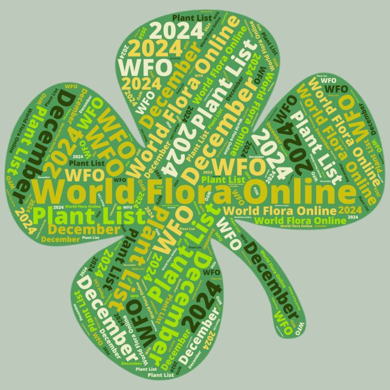

## WFO's December 2024 release

The December 2024 edition of the [WFO Plant List](https://about.worldfloraonline.org/plant-list/) and data release are now available, with improvements to nomenclatural data and updates to the classification from the global taxonomic community. Since the June 2024 edition, the WFO Plant List now includes:

-   21,531 additional names provided by [IPNI](https://www.ipni.org/), our Taxonomic Expert Networks (TENs), WFO Content providers, and [WCVP;](https://powo.science.kew.org/about-wcvp)
-   346,944 name records which have had classification or nomenclatural updates;
-   1.014 million synonym records;
-   A complete update to the pteridophyte classification by the Pteridophyte Phylogeny Group (PPG) and Michael Hassler's World Ferns;
-   a major update for Brassicaceae has been included using classification from BrassiBase.

This data release has been co-authored by 195 scientists who have contributed to the WFO's consensus classification.

Updated family classifications have been provided by TENs for:

-   Annonaceae where this family has had active curation in Rhakhis. A regional checklist is now in press, with the names linked with WFO-IDs.
-   Brassicaceae has been updated using data from [Brassibase](https://brassibase.cos.uni-heidelberg.de/) ahead of January special issue of the American Journal of Botany.
-   All Bryophytes, Hornworts and Liverwort families have had nomenclatural and classification updates.
-   Caryophyllales Network has provided updated classification for Cactaceae, Plumbaginaceae, Rhabdodendraceae, and Sarcobataceae. Droseraceae and Frankeniaceae have also had baseline curation. The recently published [Phylogenetics and morphological character evolution in the achyranthoid clade (Amaranthaceae)](https://doi.org/10.1002/tax.13284) will be incorporated into a future edition of the WFO Plant List.
-   The Cycad TEN as provided updated classification for Cycadaceae and Zamiaceae with links to their updated [World List of Cycads](https://www.cycadlist.org/) website.
-   The Ericaceae TEN has contributed to the [Systematics, natural history, and conservation of Erica (Ericaceae)](https://doi.org/10.3897/phytokeys.coll.216) topical issue in Phytokeys, with the WFO classification underpinning much of the work published in this issue.
-   The 52 Families of Ferns and Fern allies have had a full classification update provided by the Pteridophyte Phylogeny Group (PPG) and Michael Hassler's World Ferns.
-   Malpighiaceae has been updated to follow the recently published, [*A new classification system and taxonomic synopsis for Malpighiaceae (Malpighiales, Rosids) based on molecular phylogenetics, morphology, palynology, and chemistry*](https://doi.org/10.3897/phytokeys.242.117469) in Phytokeys.
-   Meliaceae has had a full classification update.
-   The Papaver tribe Papvereae has new membership and updated classification incorporating the remaining new combinations transferring names from *Papaver* to [*Oreomecon*](https://doi.org/10.3897/phytokeys.248.121011). There has been baseline curation of the remaining names in *Papaver*.
-   Putranjivaceae has had more curation and from which a fully WFO-linked checklist has been produced (in press).
-   There have also been updates and improvements to: Apocynaceae, Asphodelaceae (tribe Aloeae), Begoniaceae, Commelinaceae, Dioscoraceae, Ebenaceae, Ericaceae, Gesneriaceae, Solanaceae and Zingiberaceae, provided by the TENs responsible for these families.

Updates to the default classification used for the 305 non-TEN families are provided by RBG Kew's WCVP. Since the June 2024 release the following 17 non-TEN families have been updated to follow WCVP version 13 (May 2024): Alismataceae, Apiaceae, Apogonetonaceae, Areaceae, Araliaceae, Aristolochiaceae, Griseliniaceae, Hydrocharitaceae, Iridaceae, Juncaginaceae, Onagraceae, Piperaceae, Pittosporaceae, Potamogetonaceae, Saxifragaceae, Scheuzeriaceae, and Tofeldiaceae.

55% of accepted species in the WFO Plant List are covered by a TEN, the rest by WCVP.

Data cleaning and improvements to the data, facilitated by Rhakhis and Catalogue of Life ChecklistBank's validation checks, have reduced the number of known data issues by just over 3,000. We continue to deduplicate as part of general curation and have deduplicated nearly 1,000 name pairs since the June release, although the number of isonyms and homonyms continues to increase.

The WFO Plant List data are available in four places:

-   The WFO Plant List section of the WFO website, [https://​wfo​plantlist​.org](https://wfoplantlist.org/), is the main place to browse the data.
-   The WFO Plant List API, [https://​list​.world​flo​raon​line​.org](https://list.worldfloraonline.org/), provides a machine readable version of the data and powers the version on the WFO website.
-   The Zenodo repository is under DOI https://​doi​.org/​​1​0​.​5​2​8​1​/​z​e​n​o​d​o​.​7​4​60141. This DOI should be used when citing the WFO Plant List data in general as it will always resolve to the latest version of the data. Each edition of the WFO Plant List also has its own DOI should it be necessary to cite a  particular version. The December 2024 version​'s DOI [https://​doi​.org/​1​0​.​5​2​8​1​/​z​e​n​o​d​o​.​1​4​5​38251](https://doi.org/10.5281/zenodo.14538251). 
-   ChecklistBank (Catalogue of Life/​GBIF) [https://​www​.check​list​bank​.org/​d​a​t​a​s​e​t​/​2​0​0​4​/​about](https://www.checklistbank.org/dataset/2004/about) . The WFO Plant List can be browsed and downloaded from  there.

Since the June 2024 data release the WFO have welcomed six new TENs:

-   Acanthaceae
-   Brassicaceae
-   Malphigiaceae
-   Malvaceae
-   Myrtaceae
-   Salicaceae

-----

Published 21 December 2024.