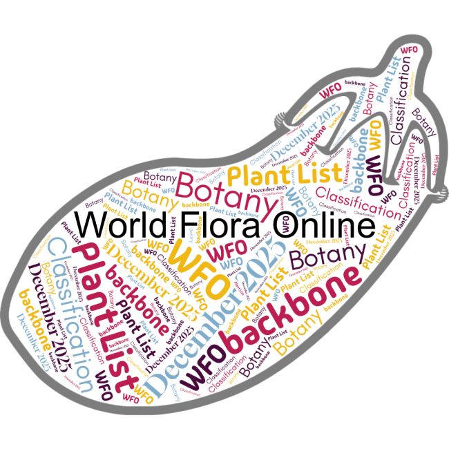

## WFO's December 2025 release

The December 2025 edition of the [WFO Plant List](https://about.worldfloraonline.org/plant-list/) and data release are now available, with improvements to nomenclatural data and updates to the classification from the global taxonomic community. Since the June 2025 edition, the WFO Plant List now includes:

-   7095 additional names were provided by [IPNI](https://www.ipni.org/), our Taxonomic Expert Networks (TENs) & WFO Content providers. 
    -   2097 (26%) of those additional records have been placed in the classification by TENs as accepted or as synonyms, the rest remain unplaced.
-   335,877 name records have had classification, nomenclatural or reference updates.

This data release has been co-authored by 290 scientists who have contributed to the WFO's consensus classification. Including 45 active editors in the WFO's Rhakhis curation tool.

Updates to the following family classifications have been made directly in Rhakhis by our TENS:

-   Acanthaceae
-   Annonaceae
-   Apocynaceae
-   Aristolochiaceae subfamily Hydnoroideae (Hydnoraceae)
-   Asphodelaceae (tribe Aloeae)
-   Boraginaceae
-   Buxaceae
-   The Caryophyllales Network has updated classification in Rhakhis for Cactaceae, Caryophyllaceae, Frankeniaceae & Tamariaceae.
-   Combretaceae
-   The Commelinales TEN  have curated parts of Commelinaceae
-   Convolvulaceae
-   Ebenaceae
-   Ericaceae
-   Fabaceae
-   Loasaceae
-   Mayacaceae
-   Meliaceae
-   Myrtaceae
-   Putranjivaceae
-   Solanaceae
-   Vitaceae
-   Zingiberaceae

The following classifications were updated using structured data provided by the TENs:

-   Brassicaceae provided a new update as to better align WFO to Brassibase.
-   Bryophyte, Hornwort and Liverwort backbone was realigned with provided by BryoNames.
-   Tribe Cichoriae (Asteraceae) provided updated classification for this tribe of Asteraceae via their [EDIT platform database](https://cichorieae.e-taxonomy.net/portal/).
-   Gesneriaceae updated to a new version.
-   Meliaceae provided additional corrections.\
Publications by our TENs

Kiefer, M., German, D.A., Kiefer, C. *et al.* Capacity building in crucifer research---from *BrassiBase* to a taxonomic expert network (*Brassi*TEN). *Plant Syst Evol* 311, 30 (2025). [https://doi.org/10.1007/s00606-025--01964‑z](https://doi.org/10.1007/s00606-025-01964-z)

Quintanar A., Barberá P., Elliott A., Harris D. J. (2025). THE PUTRANJIVACEAE OF THE WORLD: A CROSS-REFERENCED CHECKLIST OF THE GENERA AND SPECIES. Edinburgh Journal of Botany. 82 (Article 2058) 1--146. [https://​doi​.org/​1​0​.​2​4​8​2​3​/​E​J​B​.​2​0​2​5​.2058](https://doi.org/10.24823/EJB.2025.2058)

The General Curatorial Team (GCT) established at the September 2025 Council meeting, has begun curation of Tropaeolaceae. 

As part of the GCT workflow we are recording suggestions and decisions around classification changes that have been sent in as feedback from users. These are being tracked in a [GitHub repository](https://github.com/worldflora/wfo-general-curatorial-team/issues).

We have added a supra-generic classification for Orchids, in preparation to manage the curation of an Orchidaceae TEN that is being established.

Data cleaning and improvements to the data, were facilitated Rhakhis integrity reports and Catalogue of Life ChecklistBank's validation checks. We continue to deduplicate as part of general curation and have deduplicated a modest 50 name pairs since the June release. Fixed 340 homotypic names that were not in the same taxon, and resolved hundreds of authorship strings that would not parse correctly.

The WFO Plant List data are available in four places:

-   The WFO Plant List section of the WFO website, [https://​wfo​plantlist​.org](https://wfoplantlist.org/), is the main place to browse the data.
-   The WFO Plant List API, [https://​list​.world​flo​raon​line​.org](https://list.worldfloraonline.org/), provides a machine readable version of the data and powers the version on the WFO website.
-   The Zenodo repository is under DOI [https://​doi​.org/​​1​0​.​5​2​8​1​/​z​e​n​o​d​o​.​7​4​60141](https://doi.org/%E2%80%8B%E2%80%8B1%E2%80%8B0%E2%80%8B.%E2%80%8B5%E2%80%8B2%E2%80%8B8%E2%80%8B1%E2%80%8B/%E2%80%8Bz%E2%80%8Be%E2%80%8Bn%E2%80%8Bo%E2%80%8Bd%E2%80%8Bo%E2%80%8B.%E2%80%8B7%E2%80%8B4%E2%80%8B60141). This DOI should be used when citing the WFO Plant List data in general as it will always resolve to the latest version of the data. Each edition of the WFO Plant List also has its own DOI should it be necessary to cite a particular version. The December 2025 version​​'s DOI is [https://​doi​.org/​1​0​.​5​2​8​1​/​z​e​n​o​d​o​.​1​8​0​07552](https://doi.org/10.5281/zenodo.18007552).
-   The June 2025 data release had been viewed 3041 times and downloaded 2356 times during the 6‑month data cycle.
-   ChecklistBank (Catalogue of Life/​GBIF) [https://​www​.check​list​bank​.org/​​d​a​t​a​s​e​t​/​2​0​0​4​/​about](https://www.checklistbank.org/%E2%80%8Bd%E2%80%8Ba%E2%80%8Bt%E2%80%8Ba%E2%80%8Bs%E2%80%8Be%E2%80%8Bt%E2%80%8B/%E2%80%8B2%E2%80%8B0%E2%80%8B0%E2%80%8B4%E2%80%8B/%E2%80%8Babout) . The WFO Plant List can be browsed and downloaded from there.

Since the June 2025 data release the WFO have welcomed 3 new TENs:

-   Aristolochiaceae subfam. Hydnoroideae [Hydnoraceae]
-   Monimiaceae
-   Velloziaceae