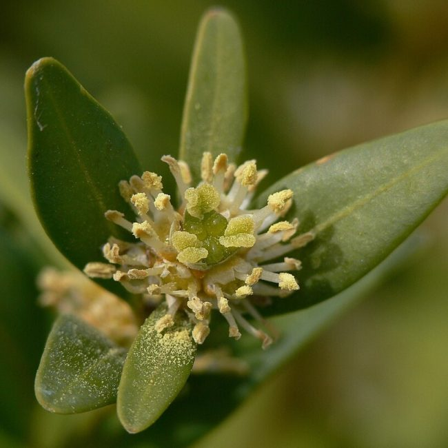

## La Red de Taxónomos Expertos del orden Buxales

La Red de Taxónomos Expertos del orden Buxales, liderada por Pedro A. González Gutiérrez recientemente completó un tratamiento global integral a nivel de especies que incluye una revisión sobre la tipificación. Con el 41% de los taxones del orden Buxales considerados amenazados, este trabajo proporciona información importante para contribuir a la conservación y a la investigación futura de este orden de plantas con flores que incluye algunas especies con importancia económica como ornamentales. 

Pueden leer más en el artículo publicado en la Revista del Jardín Botánico Nacional de Cuba en diciembre: [https://​revis​tas​.uh​.cu/​r​j​b​n​/​a​r​t​i​c​l​e​/​v​i​e​w​/​1​2​2​7​6​/​10685](https://eur01.safelinks.protection.outlook.com/?url=https%3A%2F%2Frevistas.uh.cu%2Frjbn%2Farticle%2Fview%2F12276%2F10685&data=05%7C02%7Caelliott%40rbge.org.uk%7Caaf89b8324584eff8f5d08de5aa893c8%7Cbb63bb00175e46b7b7b3bc74158e4fd4%7C0%7C0%7C639047877261377315%7CUnknown%7CTWFpbGZsb3d8eyJFbXB0eU1hcGkiOnRydWUsIlYiOiIwLjAuMDAwMCIsIlAiOiJXaW4zMiIsIkFOIjoiTWFpbCIsIldUIjoyfQ%3D%3D%7C0%7C%7C%7C&sdata=gk1mWzDTgLN5CbKpHH5fHRNQtQ2z2uxZB89Kd2kt94U%3D&reserved=0)\
________________________________________________________________________________________

The Buxales Taxonomic Expert Network, or TEN, led by Pedro González Gutiérrez recently completed a comprehensive species-level global treatment that includes a thorough revision on typification. With 41% of species of Buxales classified as endangered, this provides critical information to support conservation and future research for this order of flowering plants that includes some species of economic importance. 

You can read more in paper published in the Revista del Jardín Botánico Nacional de Cuba in December: [https://​revis​tas​.uh​.cu/​r​j​b​n​/​a​r​t​i​c​l​e​/​v​i​e​w​/​1​2​2​7​6​/​10685](https://eur01.safelinks.protection.outlook.com/?url=https%3A%2F%2Frevistas.uh.cu%2Frjbn%2Farticle%2Fview%2F12276%2F10685&data=05%7C02%7Caelliott%40rbge.org.uk%7Caaf89b8324584eff8f5d08de5aa893c8%7Cbb63bb00175e46b7b7b3bc74158e4fd4%7C0%7C0%7C639047877261393953%7CUnknown%7CTWFpbGZsb3d8eyJFbXB0eU1hcGkiOnRydWUsIlYiOiIwLjAuMDAwMCIsIlAiOiJXaW4zMiIsIkFOIjoiTWFpbCIsIldUIjoyfQ%3D%3D%7C0%7C%7C%7C&sdata=rYXUCqOl8lK%2BBWhGQib2k5USgg6VAWrFtke3mHFy8wQ%3D&reserved=0)
