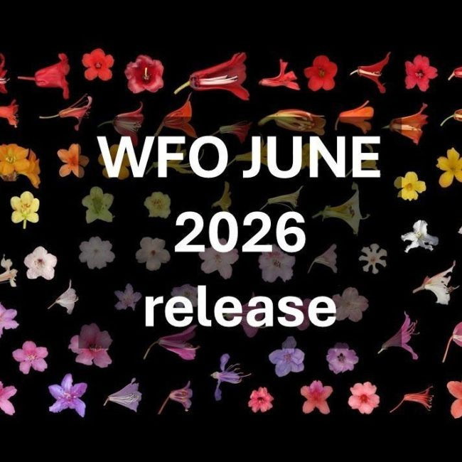

## WFO's June 2026 release

The June 2026 edition of the [WFO Plant List](https://about.worldfloraonline.org/plant-list/) and data release are now available, with improvements to nomenclatural data and updates to the classification from the global taxonomic community. Since the December 2025 edition, the WFO Plant List now includes:

-   7017 additional names were provided by [IPNI](https://www.ipni.org/), our Taxonomic Expert Networks (TENs) & WFO Content providers.
    -   2554 (36%) of those additional records have been placed in the classification by TENs as accepted or as synonyms, the rest remain unplaced.
-   167,737 name records have had classification, nomenclatural or reference updates.

This data release has been co-authored by 421 scientists who have contributed to the WFO's consensus classification. Including 55 active editors in the WFO's Rhakhis curation tool.

Updates to the following family classifications have had edits made directly in Rhakhis by our TENS:

-   Acanthaceae
-   Annonaceae
-   Apocynaceae
-   Asparagaceae Subfamily Scilloideae
-   Begoniaceae
-   Boraginales --- Boraginaceae, Cordiaceae, Heliotropiaceae, Hydrophyllaceae & Lennoaceae
-   Brassicaceae
-   Buxaceae/​Buxales
-   Caryophyllales -- Amaranthaceae, Caryophyllaceae, Chenopodiaceae
-   Commelinaceae
-   Convolvulaceae
-   Dipterocarpaceae
-   Ebenaceae
-   Fagaceae
-   Ferns and Allies -- Curation across 43 families with major curation in Blechnaceae, Dryopteridaceae, Lindsaeaceae, Lycopodiaceae, Polypodiaceae, Pteridaceae & Thelypteridaceae.
-   Hypericaceae --- Hypericum
-   Malvaceae
-   Melastomataceae
-   Meliaceae
-   Myrtaceae
-   Orchidaceae
-   Oxalidales --- Connaraceae, Cunoniaceae, Elaeocarpaceae, Oxalidaceae
-   Rubiaceae
-   Salicaceae
-   Solanaceae
-   Styracaceae
-   Vochysiaceae
-   Zingiberaceae

The following classifications were updated using structured data provided by the TENs:

-   Asteraceae --- provided updated classification for Arctotideae, Barnadesioideae, Dicomoideae, Gnaphalieae, Gochnatioideae, Gymnarrhenoideae Mutisioideae, Nassauvieae, [,](https://rhakhis-live.rbge.info/api/bulk_download.php?file_name=Pertyoideae.csv) Relhaniinae, Stifftioideae & Vernonioideae via the [Global Compositae Database](https://www.compositae.org/).
-   Tribe Cichoriae (Asteraceae) was updated with classification provided by the [*Cichorieae* Systematics Portal.](https://cichorieae.e-taxonomy.net/portal/)
-   Buxaceae provided classification via the new Buxales  [EDIT platform database](https://portal.cybertaxonomy.org/buxales/inicio).
-   Bryophyte, Hornwort and Liverwort backbone was realigned with data provided by [BryoNames](https://www.bryonames.org/).
-   Cyperaceae provided classification via [The Global Cyperaceae Database](http://cyperaceae.org/).
-   Fabaceae provided v.7 of their checklist, via the [Legume Data Portal](https://www.legumedata.org/) in collaboration with WCVP.
-   Gesneriaceae provided new classification via the [Gesneriaceae Resource Centre](https://padme.rbge.org.uk/grc/).
-   Hypericum received full curations via structured classification and Rhakhis based curation.
-   Nepenthaceae was updated via the Caryophyllales [EDIT platform database](https://caryophyllales.org/nepenthaceae/).

The General Curatorial Team (GCT) established at the September 2025 Council meeting has continued to expand curation efforts for non-Taxonomic Expert Network group. Editors have curated parts of Argophyllaceae, Escalloniaceae, Himantandraceae, Paracryphiaceae & Tropaeolaceae. Full curation of Geranium is complete and parts of Rubushave been curated.

As part of the GCT workflow we are recording suggestions and decisions around classification changes that have been sent in as feedback from users. These are being tracked in a [GitHub repository](https://github.com/worldflora/wfo-general-curatorial-team/issues).

Data cleaning and improvements to the data, were facilitated Rhakhis integrity reports and Catalogue of Life ChecklistBank's validation checks. We continue to deduplicate as part of general curation and have deduplicated 1234 name records (617 pairs) were deduplicated  name pairs since the June release.

The WFO Plant List data are available in four places:

-   The WFO Plant List section of the WFO website, [https://​wfo​plantlist​.org](https://wfoplantlist.org/), is the main place to browse the data.
-   The WFO Plant List API, [https://​list​.world​flo​raon​line​.org](https://list.worldfloraonline.org/), provides a machine readable version of the data and powers the version on the WFO website.
-   The Zenodo repository is under DOI [https://​doi​.org/​1​0​.​5​2​8​1​/​z​e​n​o​d​o​.​7​4​60141](https://doi.org/%E2%80%8B%E2%80%8B1%E2%80%8B0%E2%80%8B.%E2%80%8B5%E2%80%8B2%E2%80%8B8%E2%80%8B1%E2%80%8B/%E2%80%8Bz%E2%80%8Be%E2%80%8Bn%E2%80%8Bo%E2%80%8Bd%E2%80%8Bo%E2%80%8B.%E2%80%8B7%E2%80%8B4%E2%80%8B60141). This DOI should be used when citing the WFO Plant List data in general as it will always resolve to the latest version of the data. Each edition of the WFO Plant List also has its own DOI should it be necessary to cite a particular version. The June 2026 version​'s DOI is [https://​doi​.org/​1​0​.​5​2​8​1​/​z​e​n​o​d​o​.​2​0​7​82718](https://doi.org/10.5281/zenodo.20782718).
-   The December 2025 data release had been viewed 3662 times and downloaded 3697 times during the 6‑month data cycle.
-   ChecklistBank (Catalogue of Life/​GBIF) [https://​www​.check​list​bank​.org/​d​a​t​a​s​e​t​/​2​0​0​4​/](https://www.checklistbank.org/%E2%80%8B%E2%80%8Bd%E2%80%8Ba%E2%80%8Bt%E2%80%8Ba%E2%80%8Bs%E2%80%8Be%E2%80%8Bt%E2%80%8B/%E2%80%8B2%E2%80%8B0%E2%80%8B0%E2%80%8B4%E2%80%8B/)​about. The WFO Plant List can be browsed and downloaded from there.

Since the December 2025 data release the WFO have welcomed 4 new TENs:

-   Chrysobalanaceae
-   Orchidaceae
-   Rubiaceae